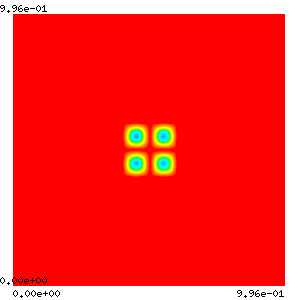

## At a Glance
<!-- (Expected # minutes to complete) %% temporarily omit -->


|Questions                 |Objectives                     |Key Points |
|How can gradients be computed for simulations? | Know PETSc/TAO's capability for adjoint and optimization | Adjoint enables dynamic constrained optimization |
|How difficult is it to use the adjoint method? | Understand ingredients needed  for adjoint calculation   | Jacobian is imperative |
|                          |Understand the concern of checkpointing     |Performance may depend on checkpointing at large scale |


**Note:** To begin this lesson...
```
cd {{site.handson_root}}/adjoint
```


## An Inverse Initial Value Problem

This code demonstrates how to solve an inverse initial value problem for a system of time-dependent PDEs on a 2D rectangular grid.
The goal is to determine an optimal initial condition that can minimizes the difference between the simulated result and the reference solution.
We will use this example to illustrate the performance considerations for realistic large-scale applications. In particular, we will show how to play with checkpointing and how to profile/tune the performance.

### Compile the code
The example [ex5opt_ic.c](https://bitbucket.org/petsc/petsc/src/master/src/ts/examples/tutorials/advection-diffusion-reaction/ex5opt_ic.c) can be compiled with

```
make ex5opt_ic
```
To clean the example, do
```
make clean
```

ATPESC participants do not need to compile code because binaries are available in the ATPESC project folder on Cooley.

### Command line options
You can determine the command line options available for this particular example by doing
```
./ex5opt_ic -help
```
and show the options related to TAO only by doing
```
./ex5opt_ic -help | grep tao
```

### Problem being solved

The underlying PDE models reaction and diffusion of two chemical species that can produce a variety of patterns. It is widely used to describe pattern-formation phenomena in biological, chemical and physical systems. The concentrations of the two species are calculated according to the equation

$$
\frac{d\mathbf{u}}{dt} = D_1 \nabla^2 \mathbf{u} - \mathbf{u} \mathbf{v}^2 +
\gamma(1 -\mathbf{u}) \\
\frac{d\mathbf{v}}{dt} = D_2 \nabla^2 \mathbf{v} + \mathbf{u} \mathbf{v}^2 -
(\gamma + \kappa)\mathbf{v}
$$

The spatial pattern for the time interval [0,200] seconds is shown in the following figure.

|Figure 1|
|:---:|
||

Given the pattern (observation) at the final time of the simulation, we want to determine the initial pattern that can minimize the difference between the simulated result and the observation.

$$
\text{minimize}_{X_0} \| X - X^{ref}\|
$$

### Run 1: Monitor solution graphically

```
mpiexec -n 4 ./ex5opt_ic -forwardonly -ts_type rk -ts_rk_type 3 -ts_max_steps 20 -ts_monitor -ts_monitor_draw_solution
```

* `-forwardonly` perform the forward simulation without doing optimization
* `-ts_type rk -ts_rk_type 3` changes the time stepping algorithm to a 3rd-order Runge-Kutta method
* `-ts_monitor_draw_solution` monitors the progress for the solution at each time step
* Add `-draw_pause -2` if you want to pause at the end of simulation to see the plot

### Run 2: Optimal checkpointing schedule
By default, the checkpoints are stored in binary files on disk. Of course, this may not be a good choice for large-scale applications running on high-performance machines where I/O cost is significant. We can make the solver use RAM for checkpointing and specify the maximum allowable checkpoints so that an optimal adjoint checkpointing schedule that minimizes the number of recomputations will be generated.

```
mpiexec -n 4 ./ex5opt_ic -ts_type rk -ts_rk_type 3 -ts_adapt_type none \
                     -ts_max_steps 10 -ts_monitor -ts_adjoint_monitor \
                     -ts_trajectory_type memory -ts_trajectory_max_cps_ram 3 \
                     -ts_trajectory_monitor -ts_trajectory_view -tao_max_it 1
```
* `-tao_max_it 1` forces the optimization to stop after one iteration so that we can focus on the output related to the adjoint checkpointing.
The output corresponds to the schedule depicted by the following diagram:


#### Questions


### Run 3: Monitor the optimization progress

```
mpiexec -n 4 ./ex5opt_ic -ts_type rk -ts_rk_type 3 -ts_adapt_type none -ts_max_steps 5 -ts_trajectory_type memory -ts_trajectory_solution_only 0 -tao_monitor -tao_view
  0 TAO,  Function value: 8.48202,  Residual: 7.02449
  1 TAO,  Function value: 1.72589,  Residual: 2.46827
  2 TAO,  Function value: 0.556599,  Residual: 1.75419
  3 TAO,  Function value: 0.181113,  Residual: 0.698038
  4 TAO,  Function value: 0.0919628,  Residual: 0.390951
  5 TAO,  Function value: 0.0330733,  Residual: 0.276822
  6 TAO,  Function value: 0.0137442,  Residual: 0.205942
  7 TAO,  Function value: 0.0032463,  Residual: 0.0925536
  8 TAO,  Function value: 0.000876358,  Residual: 0.0469696
  9 TAO,  Function value: 0.000172022,  Residual: 0.0205954
 10 TAO,  Function value: 2.32065e-05,  Residual: 0.00808249
 11 TAO,  Function value: 1.00524e-05,  Residual: 0.00695292
 12 TAO,  Function value: 2.19094e-06,  Residual: 0.00192488
 13 TAO,  Function value: 9.37506e-07,  Residual: 0.00115926
 14 TAO,  Function value: 2.79883e-07,  Residual: 0.000907609
 15 TAO,  Function value: 7.22e-08,  Residual: 0.000346602
 16 TAO,  Function value: 3.51499e-08,  Residual: 0.000184429
 17 TAO,  Function value: 1.48741e-08,  Residual: 0.000117587
 18 TAO,  Function value: 7.83221e-09,  Residual: 9.19265e-05
 19 TAO,  Function value: 2.14226e-09,  Residual: 4.54118e-05
 20 TAO,  Function value: 8.99022e-10,  Residual: 2.91421e-05
 21 TAO,  Function value: 3.28239e-10,  Residual: 2.06652e-05
 22 TAO,  Function value: 1.85795e-10,  Residual: 2.71364e-05
 23 TAO,  Function value: 1.14498e-10,  Residual: 2.32933e-05
 24 TAO,  Function value: 8.12369e-11,  Residual: 2.22391e-05
 25 TAO,  Function value: 1.87747e-11,  Residual: 7.85018e-06
 26 TAO,  Function value: 7.29614e-12,  Residual: 5.02828e-06
 27 TAO,  Function value: 1.72522e-12,  Residual: 1.07136e-06
 28 TAO,  Function value: 1.0259e-12,  Residual: 7.63383e-07
 29 TAO,  Function value: 1.72785e-13,  Residual: 3.91911e-07
 30 TAO,  Function value: 1.0509e-13,  Residual: 2.75909e-07
 31 TAO,  Function value: 4.02491e-14,  Residual: 1.7222e-07
 32 TAO,  Function value: 1.5385e-14,  Residual: 1.21345e-07
 33 TAO,  Function value: 3.20145e-15,  Residual: 7.81137e-08
 34 TAO,  Function value: 1.66953e-15,  Residual: 5.25802e-08
 35 TAO,  Function value: 3.39432e-16,  Residual: 3.16327e-08
 36 TAO,  Function value: 9.68078e-17,  Residual: 1.15783e-08
 37 TAO,  Function value: 8.23443e-17,  Residual: 1.68247e-08
 38 TAO,  Function value: 1.53356e-17,  Residual: 7.63537e-09
Tao Object: 4 MPI processes
  type: blmvm
  Gradient steps: 0
  Mat Object: (tao_blmvm_) 4 MPI processes
    type: lmvmbfgs
    rows=8192, cols=8192
      Scale type: diagonal
      Scale history: 1
      Scale params: alpha=1., beta=0.5, rho=1.
      Convex factors: phi=0., theta=0.125
      Max. storage: 5
      Used storage: 5
      Number of updates: 37
      Number of rejects: 0
      Number of resets: 1
  TaoLineSearch Object: 4 MPI processes
    type: more-thuente
    maximum function evaluations=30
    tolerances: ftol=0.0001, rtol=1e-10, gtol=0.9
    total number of function evaluations=0
    total number of gradient evaluations=0
    total number of function/gradient evaluations=1
    using variable bounds
    Termination reason: 1
  Active Set subset type: subvec
  convergence tolerances: gatol=1e-08,   steptol=0.,   gttol=0.
  Residual in Function/Gradient:=7.63537e-09
  Objective value=1.53356e-17
  total number of iterations=38,                          (max: 2000)
  total number of function/gradient evaluations=41,      (max: 4000)
  Solution converged:    ||g(X)|| <= gatol
```
* `-tao_draw_solution` can visualize the solution at each optimization iteration

#### Questions


### Run 4: Implicit time integration method
Now we switch to an implicit method ([Crank-Nicolson](https://en.wikipedia.org/wiki/Crank–Nicolson_method)) using fixed stepsize, which is the default setting in the code. At each time step, a nonlinear system is solved by the PETSc nonlinear solver `SNES`.
```
mpiexec -n 12 ./ex5opt_ic -ts_max_steps 5 -log_view -tao_monitor
```
* `-snes_monitor` can show the progress of `SNES`
* `-ts_monitor` can show the progress of `TS`
* `-log_view` prints a summary of the logging

A snippet of the summary:
```
...
Phase summary info:
   Count: number of times phase was executed
   Time and Flop: Max - maximum over all processors
                   Ratio - ratio of maximum to minimum over all processors
   Mess: number of messages sent
   Avg. len: average message length (bytes)
   Reduct: number of global reductions
   Global: entire computation
   Stage: stages of a computation. Set stages with PetscLogStagePush() and PetscLogStagePop().
      %T - percent time in this phase         %F - percent flop in this phase
      %M - percent messages in this phase     %L - percent message lengths in this phase
      %R - percent reductions in this phase
   Total Mflop/s: 10e-6 * (sum of flop over all processors)/(max time over all processors)
------------------------------------------------------------------------------------------------------------------------
Event                Count      Time (sec)     Flop                             --- Global ---  --- Stage ---   Total
                   Max Ratio  Max     Ratio   Max  Ratio  Mess   Avg len Reduct  %T %F %M %L %R  %T %F %M %L %R Mflop/s
------------------------------------------------------------------------------------------------------------------------

--- Event Stage 0: Main Stage

VecDot              1130 1.0 3.9795e-01 1.4 1.59e+06 1.0 0.0e+00 0.0e+00 1.1e+03  4  1  0  0  8   4  1  0  0  8    46
VecMDot             1919 1.0 5.9272e-01 2.0 5.40e+06 1.0 0.0e+00 0.0e+00 1.9e+03  5  4  0  0 14   5  4  0  0 14   106
VecNorm             3678 1.0 8.1644e-01 1.3 5.18e+06 1.0 0.0e+00 0.0e+00 3.7e+03  9  4  0  0 27   9  4  0  0 27    74
...
```

#### Questions




### Run 5: Scale up the problem
We use explicit Runge-Kutta methods for time integration, and increase the grid resolution to 512 X 512.
```
mpiexec -n 12 ./ex5opt_ic -ts_type rk -ts_rk_type 3 -ts_adapt_type none -ts_max_steps 5 -ts_trajectory_type memory -ts_trajectory_solution_only 0 -tao_monitor -da_grid_x 512 -da_grid_y 512
```

#### Questions



### Further information
Because this example uses `DMDA`, Jacobian can be efficiently approximated using finite difference with coloring. You can use the option `-snes_fd_color` to enable this feature.

## Out-Brief

We have used [PETSc](https://www.mcs.anl.gov/petsc/) to demonstrate the adjoint capability as an enabling technology for dynamic-constrained optimization. In particular, we investigated an inverse initial value porblem built on a time-dependent reaction-diffusion PDE.

We have shown the basic usage of the adjoint solver as well as functionalities that can facilitate rapid development, diagnosis and performance profiling.

## Further Reading

[PETSc Documentation](http://www.mcs.anl.gov/petsc/documentation/)

<!-- Insert space, horizontal line, and link to HandsOnLesson table -->

&nbsp;

---

[Back to all HandsOnLessons](../lessons.md)
