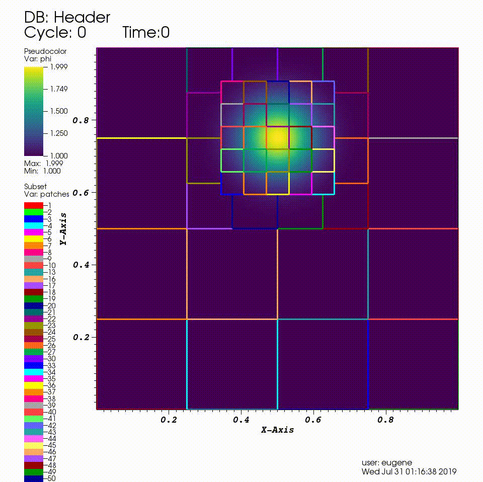
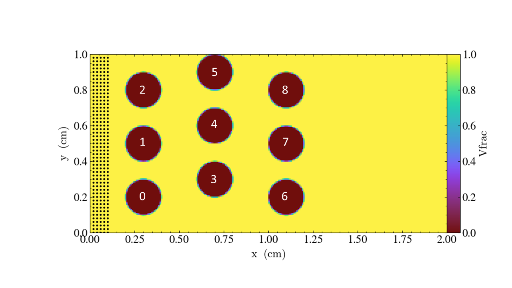

## At a Glance
<!-- (Expected # minutes to complete) %% temporarily omit -->

|Questions|Objectives|Key Points|
|What can I do with AMReX?|Understand that "AMR" means more<br>than just "traditional AMR"|AMR + EB + Particles|
|How do I get started?|Understand easy set-up|It's not hard to get started|
|How do I visualize AMR results?|Use Visit and Paraview for AMReX vis|Visualization tools exist for AMR data.|

## Example: Multi-Level Scalar Advection

### What Features Are We Using

* Mesh data 
* Dynamic AMR with subcycling

### The Problem

Consider a drop of dye (we'll define $$\phi$$ to be the concentration of dye) 
in a thin incompressible fluid that is spinning 
clock-wise then counter-clockwise with a prescribed motion.  We consider the dye to be a 
passive tracer that is advected by the fluid velocity.  The fluid is thin enough that we can model
this as two-dimensional motion.

In other words, we want to solve for $$\phi(x,y,t)$$ by evolving 

$$\frac{\partial \phi}{\partial t} + \nabla \cdot (\bf{u} \phi)  = 0$$

in time ($$t$$), where the velocity $${\bf{u}} = (u,v)$$ is a divergence-free field computed by defining

$$\psi(i,j) = \sin^2(\pi x) \sin^2(\pi y)  \cos (\pi t / 2) / \pi $$

and defining

$$u = -\frac{\partial \psi}{\partial y},  v = \frac{\partial \psi}{\partial x}.$$

In this example we'll be using AMR to resolve the scalar field since the location of the dye is
what we care most about.

To update the solution at each level, we call an advance routine that computes fluxes ($${\bf u} \phi$$)
on each face, and differences the fluxes to create the update to phi.  In this example the update happens in a Fortran
subroutine that operates on one grid of data at a time.  Here "lo()" and "hi()" are the bounds of the
one grid we are operating on, not of the entire domain.

Knowing how to synchronize the solution at coarse/fine boundaries is essential in an AMR algorithm;
here having the algorithm written in flux form allows straightforward "refluxing" at coarse-fine interfaces.

At each level:
```fortran
  ! Do a conservative update
  do    j = lo(2),hi(2)
     do i = lo(1),hi(1)
        phi_new(i,j) = phi_old(i,j) + &
             ( (flxx(i,j) - flxx(i+1,j)) * dtdx(1) &
             + (flxy(i,j) - flxy(i,j+1)) * dtdx(2) )
     enddo
  enddo
```

If "timeStep(lev,...)" is the routine that creates the fluxes and advances the solution at level "lev",
 then the subcycling in time algorithm looks like:
```C++
    if (lev < finest_level)
    {
        // recursive call for next-finer level
        for (int i = 1; i <= nsubsteps[lev+1]; ++i)
        {
            timeStep(lev+1, time+(i-1)*dt[lev+1], i);
        }

        if (do_reflux)
        {
            // update lev based on coarse-fine flux mismatch
            flux_reg[lev+1]->Reflux(*phi_new[lev], 1.0, 0, 0, phi_new[lev]->nComp(), geom[lev]);
        }

        AverageDownTo(lev); // average lev+1 down to lev
    }
```

Note that if "nsubsteps" is greater than 1, we are "subcycling" in time, ie using a smaller dt at
the finer levels.

### Running the Code

```
cd HandsOnLessons/amrex/AMReX_Advection_AmrCore
```

In this directory you'll see

```
main2d.ex -- the executable -- this has been built with MPI 

inputs_2d -- an inputs file
```

To run in serial, 

```
./main2d.ex inputs_2d
```

To run in parallel, for example on 4 ranks:

```
mpirun -n 4 ./main2d.ex inputs_2d
```

The following parameters can be set at run-time -- these are currently set in the inputs_2d
file but you can also set them on the command line.  

```
amr.max_time       =  2.0                # the final time (if max_time < max_steps * time_step)

amr.max_steps      = 1000000             # the maximum number of steps (if max_steps * time_step < max_time))

amr.n_cell         =  64   64   64       # number of cells at the coarsest AMR level in each coordinate direction

amr. max_grid_size = 32                  # the maximum number of cells in any direction in a single grid

amr.plot_int       = 10                  # frequency of writing plotfiles

adv.cfl            = 0.7                 # cfl number to be used for computing the time step

adv.phierr = 1.01  1.1  1.5              # regridding criteria  at each level

```

The base grid here is a square of 64 x 64 cells, made up of 4 subgrids each of size 32x32 cells.  
The problem is periodic in both the x-direction and y-direction.

We have hard-wired the code here to refine based on the magnitude of $$\phi$$.    Here we set the 
threshold level by level.  If $$\phi > 1.01$$ then we want to refine at least once; if $$\phi > 1.1$$ we
want to resolve $$\phi$$ with two levels of refinement, and if $$\phi > 1.5$$ we want even more refinement.

### Visualizing the Results



After you run the code you will have a series of plotfiles.  To visualize these we will use the
Visit package.

INSTRUCTIONS HERE

### Topics to Explore

* How does the load balancing distribute grids to MPI processes?   
  (You will want to visualize the "proc" variable in the plotfile)

* Is time to solution faster with subcycling or without?  Did the solution change at all?
  (Note we print the total time to solution at the end of the screen output of each run)

* What happens as you change the refinement criteria (i.e. use different values of $$\phi$$)?
  (You can edit these in inputs_2d)  

## Example: "Off to the Races"

### What Features Are We Using

* Mesh data with EB 
* Linear solvers (multigrid)
* Tracer Particles

### The Problem

Challenge: 

Imagine incompressible flow in a channel from left to right.  The inflow velocity on the left is $$u = 1$$. 

If there are no obstacles in the channel, the fluid will flow with speed 1 from left to right.

If you place obstacles in the channel, the fluid must flow around them.

Suppose your goal is to accelerate the fluid so that a tracer released near the inflow reaches the right side
as fast as possible.

You are given nine cylinders that you can place (or not) at specified locations.

You can use particles released near the inflow to measure the fastest configuration.

How many cylinders should you use, and where should you put them?


### Running the code

```
cd HandsOnLessons/amrex/AMReX_EB_MacProj
```


In this directory you'll see

```
main3d.ex -- the executable -- this has been built with MPI 

inputs_3d           -- domain size, size of grids, how many time steps, which obstacles...

particle_file       -- initial particle locations  (this name is given in the inputs_3d file)
```

To run in serial, 

```
./main3d.ex inputs_3d
```

To run in parallel, for example on 4 ranks:

```
mpirun -n 4 ./main3d.ex inputs_3d
```

The following parameters can be set at run-time -- these are currently set in the inputs_3d file.

```
n_cell = 128                             # number of cells in x-direction; we double this in the y-direction
max_grid_size = 64                       # the maximum number of cells in any direction in a single grid

plot_int = 10                            # frequency of writing plotfiles

particle_file = initial_particles_3d     # name of file where we specify the input positions of the particles

time_step = 0.001                        # we advance the particles with a fixed time step of this size

max_time = 10.0                          # the final time (if max_time < max_steps * time_step)

max_steps = 10000                        # the maximum number of steps (if max_steps * time_step < max_time))

obstacles = 0 1 2 3 4 5 6 7 8            # this is how we choose which obstacles to include
```

We define the cylinders with this numbering scheme



You can also set the parameters on the command line; for example,  

```
mpirun -n 4 ./main3d.ex inputs obstacles = 1 3 4 5 6 8
```

will run the problem with only six obstacles 

The output from your run should look something like this:

```
********************************************************************
 You specified 9 objects in the domain: 0 1 2 3 4 5 6 7 8
 ********************************************************************

********************************************************************
 First let's project the initial velocity to find
   the flow field around the obstacles ...
********************************************************************


********************************************************************
 Done!  Now let's advect the particles ...
********************************************************************

Timestep 0, Time = 0.001 and leading particle now at 0.101179325
Timestep 100, Time = 0.101 and leading particle now at 0.2444506795
Timestep 200, Time = 0.201 and leading particle now at 0.4330191808
Timestep 300, Time = 0.301 and leading particle now at 0.5611955983
Timestep 400, Time = 0.401 and leading particle now at 0.7422046938
Timestep 500, Time = 0.501 and leading particle now at 0.8955689091
Timestep 600, Time = 0.601 and leading particle now at 1.044585496
Timestep 700, Time = 0.701 and leading particle now at 1.225885881
Timestep 800, Time = 0.801 and leading particle now at 1.34851225
Timestep 900, Time = 0.901 and leading particle now at 1.45538891
Timestep 1000, Time = 1.001 and leading particle now at 1.558181566
Timestep 1100, Time = 1.101 and leading particle now at 1.659474158
Timestep 1200, Time = 1.201 and leading particle now at 1.760129699
Timestep 1300, Time = 1.301 and leading particle now at 1.860489498
Timestep 1400, Time = 1.401 and leading particle now at 1.960718531

********************************************************************
We have a winner...and the winning time is 1.431
********************************************************************
```

Note that if you want to figure out which is the fastest configuration, you'll 
need to run the code multiple times with different configurations and compare the
"winning times."   This is a good example of how we often don't run the 
simulation code in a "one and done" mode -- the simulation is often only one component 
of a science investigation or design process.

### Visualizing the Results

We'll use Paraview to visualize the results for this example. 

There are three types of data from the simulation that we want to load:

1. the EB representation of the cylinders
2. the flow field
3. the particle motion

Because the EB data and mesh data don't change, we load these separately from the particles.

Instructions to visualize the EB representation of the cylinders:

```
1. Start paraview
2. File --> Open ... select "eb.pvtp" (highlight it then click OK) 
3. Click green Apply button 
```

You should see cylinders with their axes in the z-direction.

Now to add the mesh field:

```
1. File --> Open ... make sure you are in the "AMReX_EB_MacProj" directory and double click on "plt.."
2. In the "Files of type:" window at the bottom select "All Files(*)"
3. Now highlight "Header" and click OK
4. You now have to select "VisitBoxlib3DReader" from the drop-down menu titled "Open Data With..." -- then click OK
5.  Click green Apply button 
```

This will display an outline of the grids (boxes)

```
1. With "Header" highlighted in the "Pipeline Browser" menu,
   click on "proc" and "vel" in the "Cell Arrays" menu 
2. Click green Apply button
3. Click on the "slice" icon -- three to the right of the calculator.
   This will create "Slice 1" in the Pipeline Browser which will be highlighted.
4. Click on "Z Normal"
5. Unclick the "Show Plane" button
6. Click green Apply button
7. Change the drop-down menu option (above the calculator row) from "vtkBlockColors" to "vel"
(We could also color the grid by "proc" -- the integer id of the processor owning that grid.)
```

Now to load the particles:

```
1. File --> Open ... make sure you are in the "AMReX_EB_MacProj" directory and highlight "plt.." 
   then click OK
2. With "plt0*" highlighted in the Pipeline Browser menu, click green Apply button
3. Click the "glyph" button (6 to the right of the calculator)
4. Under "Glyph Source" 
   * select "Sphere" instead of "Arrow"
   * set "Radius" to 0.01
6. Under "Scale" (down below "Glyph Source") set "Scale Factor" to 1 
7. Under "Masking" (down below "Scale") change "Glyph Mode" from "Uniform Spatial Distribution"
   to "All Points" 
8.  Click green Apply button 
```

You are now ready to play the movie!  See the "VCR-like" controls at the top. Click the play button.

For fun: if you want to color the particles, make sure "Glyph1" is highlighted, then 
change the drop-down menu option (above the calculator row) from "vtkBlockColors" to "cpu" --
if you have run with 4 processes then you will see the particles displayed with different colors.

Also note -- if you want to clean up your run directory before doing another run, you can
type "make pltclean" to remove the plt* and *.png files.  

## Example: AMReX-Pachinko

### What Features Are We Using

* EB for obstacles 
* Particle-obstacle and particle-wall collisions 

### The Problem

Have you ever played pachinko?  

A pachinko machine is like a vertical pinball machine. 

Balls are released at the top of the "playing field", and bounce off obstacles as they fall.

The object of the game is to "capture" as many balls as possible.

In the AMReX-Pachinko game you can release as many particles as you like at the top of the domain,
and the balls will freeze when they hit the bottom so you can see where they landed.

Your goal here is to see if you can cover the floor of the pachinko machine.

(Note that this is not completely realistic -- the balls here don't feel each other so they can overlap.)

### Running the Code

```
cd HandsOnLessons/amrex/AMReX_EB_Pachinko
```

In this directory you'll see

```
main3d.ex            -- the executable -- this has been built with MPI 

inputs_3d            -- domain size, size of grids, how many time steps, which obstacles...

initial_particles_3d -- initial particle locations  (this name is given in the inputs_3d file)
```

In this example there is no fluid (or other variable) stored on the mesh
but we still sort the particles according to our spatial decomposition of the domain.
If we run in parallel with 4 processors, we see the domain decomposition below -- this results
from using a z-order space-filling curve with the number of cells per grid as the cost function.

 <!-- .element height="20%" width="20%" -->

For now we freeze the obstacles (although if you look in the code it's not hard to figure out
how to change them!) but we can change the initial particle locations at run-time by editing the
initial_particles_3d file.

To run in serial, 

```
./main3d.ex inputs_3d
```

To run in parallel, for example on 4 ranks:

```
mpirun -n 4 ./main3d.ex inputs_3d
```

The following parameters can be set at run-time -- these are currently set in the inputs_3d file.
In this specific example we use only 4 cells in the z-direction regardless of n_cell.

```
n_cell = 125                          # number of cells in x-direction; we double this in the y-direction
max_grid_size = 25                    # the maximum number of cells in any direction in a single grid

plot_int = 10                         # frequency of writing plotfiles

particle_file = initial_particles_3d  # name of file where we specify the input positions of the particles

time_step = 0.001                     # we take a fixed time step of this size

max_time  = 3.0                       # the final time (if max_time < max_steps * time_step)
max_steps = 100000                    # the maximum number of steps (if max_steps * time_step < max_time))
```

You can also set values on the command line; for example,
```
mpirun -n 4 ./main3d.ex inputs_3d particle_file=my_file
```

will read the particles from a file called "my_file"

The output from your run should look something like this:

```
********************************************************************
 Let's advect the particles ...
   We'll print a dot every 10 time steps.
********************************************************************

.............................................................................................................................................................................................................................................................................................................

********************************************************************
We've finished moving the particles to time 3
That took 1.145916707 seconds.
********************************************************************
```

### Visualizing the Results

Again we'll use Paraview to visualize the results. 

Remember there are three types of data from the simulation that we want to load:

1. the EB representation of the cylinders
2. the flow field
3. the particle motion

Because the EB data and mesh data don't change, we load these separately from the particles.

Instructions to visualize the EB representation of the cylinders:

```
1. Start paraview
2. File --> Open ... select "eb.pvtp" (highlight it then click OK) 
3. Click green Apply button 
```

You should see cylinders with their axes in the z-direction.

Now to add the mesh field:

```
1. File --> Open ... make sure you are in the "AMReX_EB_Pachinko" directory and double click on "plt.."
2. In the "Files of type:" window at the bottom select "All Files(*)"
3. Now highlight "Header" and click OK
4. You now have to select "VisitBoxlib3DReader" from the drop-down menu titled "Open Data With..." -- then click OK
5.  Click green Apply button 
```

This will display an outline of the grids (boxes)

```
1. With "Header" highlighted in the "Pipeline Browser" menu,
   click on "proc" in the "Cell Arrays" menu 
2. Click green Apply button
3. Click on the "slice" icon -- three to the right of the calculator.
   This will create "Slice 1" in the Pipeline Browser which will be highlighted.
4. Click on "Z Normal"
5. Unclick the "Show Plane" button
6. Click green Apply button
7. Change the drop-down menu option (above the calculator row) from "vtkBlockColors" to "proc"
(We could also color the grid by "proc" -- the integer id of the processor owning that grid.)
```

Now to load the particles:

```
1. File --> Open ... make sure you are in the "AMReX_EB_Pachinko" directory and highlight "plt.." 
   then click OK
2. With "plt0*" highlighted in the Pipeline Browser menu, click green Apply button
3. Click the "glyph" button (6 to the right of the calculator)
4. Under "Glyph Source" 
   * select "Sphere" instead of "Arrow"
   * set "Radius" to 0.02 (or whatever you have set the particle_radius to in the inputs file
                           if you changed it)   
6. Under "Scale" (down below "Glyph Source") set "Scale Factor" to 1 
7. Under "Masking" (down below "Scale") change "Glyph Mode" from "Uniform Spatial Distribution"
   to "All Points" 
8. Click green Apply button 
```

You are now ready to play the movie!  See the "VCR-like" controls at the top. Click the play button.

For fun: if you want to color the particles, make sure "Glyph1" is highlighted, then 
change the drop-down menu option (above the calculator row) from "vtkBlockColors" to "cpu" --
if you have run with 4 processes then you will see the particles displayed with different colors.

Also note -- if you want to clean up your run directory before doing another run, you can
type "make pltclean" to remove the plt* and *.png files.

### Follow-up Questions

1. Why might it be important to have `n_cell` be a power of 2 in the "Race" example
but not in the "Pachinko" example?
  * In the "Race" example we use multigrid to solve for the flow field.

2. How different is the Pachinko code itself for 2D vs 3D?
  * Not very!  Search for the test on `AMREX_SPACEDIM` in the source files to see how few lines are different.

3. How could I make the parallel decomposition in the Pachinko example load balance
the particle work?
  * Use a cost function based on number of particles instead of number of grid cells.

### Suggested Evening Activities

1. In the "AMR 101" example, 
  * what quantities could I choose as refinement criteria besides the magnitude of phi?
  * what factors besides the refinement criteria define the size and shape of the grids?
    ( Hint: you might want to read this first: https://amrex-codes.github.io/amrex/docs_html/GridCreation.html )

2. In the "Off to the Races" example, 
  * what is the configuration of obstacles in which the first particle reaches the end-line in the shortest time?
  * does making the grid finer make the particles not get "stuck" on the obstacles?
  * would a different linear solver be faster?
        ( Hint: try adding "use_hypre = 1" to the inputs_3d file )

3. In the Pachinko example, 
 * how well can I control the final distribution of particles from the initial particle positions?
 * if I made the number of grids in the domain be different, how would that change the domain decomposition?
 * how could I modify the code to make the particles bounce off each other as well?  Does AMReX 
   have a way of doing that? 

### Further Reading

Download AMReX from github [here](https://www.github.com/AMReX-codes/amrex).

Look at the AMReX documentation/tutorials [here](https://amrex-codes.github.io/amrex/)

Read the Journal of Open Source Software (JOSS) paper [here](http://joss.theoj.org/papers/10.21105/joss.01370)

<!-- Insert space, horizontal line, and link to HandsOnLesson table -->

&nbsp;

---

[Back to all HandsOnLessons](../lessons.md)
