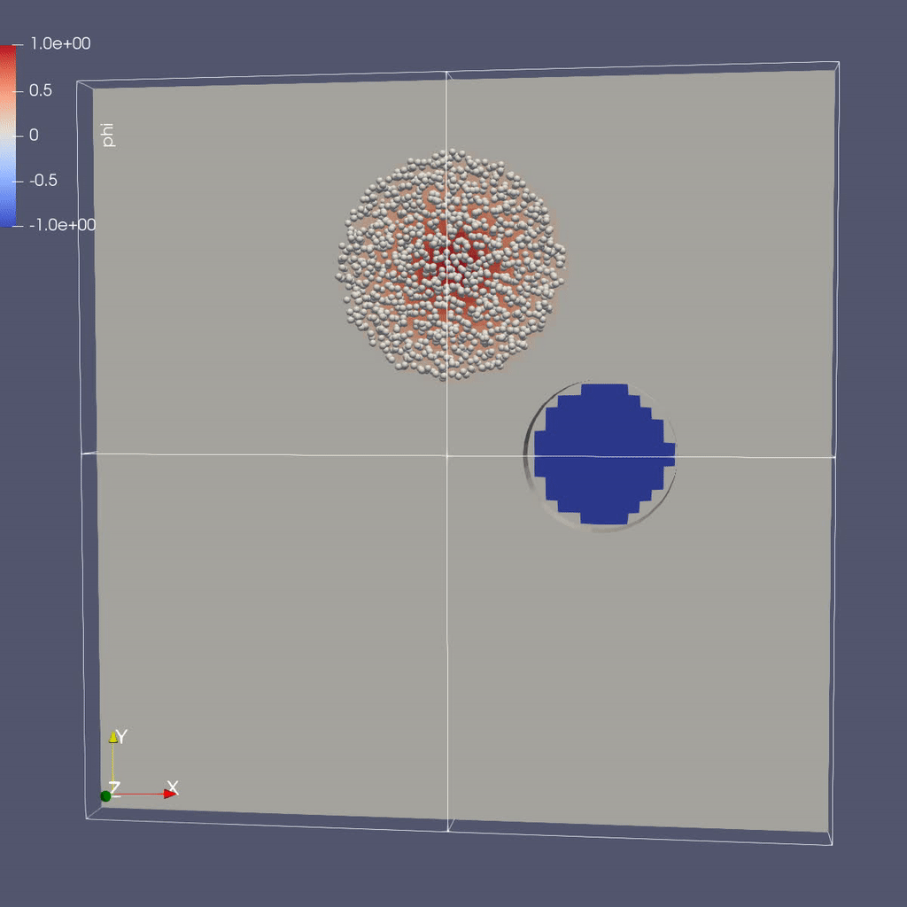

## At a Glance

<!-- (Expected # minutes to complete) %% temporarily omit -->

|Questions|Objectives|Key Points|
|What can I do with AMReX?|Understand that "AMR" means more<br>than just "traditional AMR"|AMR + EB + Particles|
|How do I get started?|Understand easy set-up|It's not hard to get started|
|What time-stepping do I use?|Understand the difference between subcycling and not|It's a choice|
|How do I visualize AMR results?|Use Visit and Paraview for AMReX vis|Visualization tools exist for AMR data.|

## Example: AMR101: Multi-Level Scalar Advection

### What Features Are We Using

* Mesh data 
* Dynamic AMR with and without subcycling

### The Problem

Consider a drop of dye (we'll define $$\phi$$ to be the concentration of dye) 
in a thin incompressible fluid that is spinning 
clock-wise then counter-clockwise with a prescribed motion.  We consider the dye to be a 
passive tracer that is advected by the fluid velocity.  The fluid is thin enough that we can model
this as two-dimensional motion; here we have the option of solving in a 2D or 3D computational domain.

In other words, we want to solve for $$\phi(x,y,t)$$ by evolving 

$$\frac{\partial \phi}{\partial t} + \nabla \cdot (\bf{u^{spec}} \phi)  = 0$$

in time ($$t$$), where the velocity $${\bf{u^{spec}}} = (u,v)$$ is a divergence-free field computed by defining

$$\psi(i,j) = \sin^2(\pi x) \sin^2(\pi y)  \cos (\pi t / 2) / \pi $$

and defining

$$u = -\frac{\partial \psi}{\partial y},  v = \frac{\partial \psi}{\partial x}.$$

Note that because $${\bf{u^{spec}}}$$ is defined as the curl of a scalar field, it is analytically divergence-free

In this example we'll be using AMR to resolve the scalar field since the location of the dye is
what we care most about.

### The AMR Algorithm

To update the solution in a patch at a given level, we compute fluxes ($${\bf u^{spec}} \phi$$)
on each face, and difference the fluxes to create the update to phi.   The update routine
in the code looks like

```cplusplus
  // Do a conservative update
  {
    phi_out(i,j,k) = phi_in(i,j,k) +
                ( AMREX_D_TERM( (flxx(i,j,k) - flxx(i+1,j,k)) * dtdx[0],
                              + (flxy(i,j,k) - flxy(i,j+1,k)) * dtdx[1],
                              + (flxz(i,j,k) - flxz(i,j,k+1)) * dtdx[2] ) );
  }
```

In this routine we use the macro AMREX_D_TERM so that we can write dimension-independent code; 
in 3D this returns the flux differences in all three directions, but in 2D it does not include
the z-fluxes.

Knowing how to synchronize the solution at coarse/fine boundaries is essential in an AMR algorithm;
here having the algorithm written in flux form allows us to either make the fluxes consistent between
coarse and fine levels in a no-subcycling algorithm, or "reflux" after the update in a subcycling algorithm.

The subcycling algorithm can be written as follows
```C++
void
AmrCoreAdv::timeStepWithSubcycling (int lev, Real time, int iteration)
{

    // Advance a single level for a single time step, and update flux registers
    Real t_nph = 0.5 * (t_old[lev] + t_new[lev]);
    DefineVelocityAtLevel(lev, t_nph);
    AdvancePhiAtLevel(lev, time, dt[lev], iteration, nsubsteps[lev]);

    ++istep[lev];

    if (lev < finest_level)
    {
        // recursive call for next-finer level
        for (int i = 1; i <= nsubsteps[lev+1]; ++i)
        {
            timeStepWithSubcycling(lev+1, time+(i-1)*dt[lev+1], i);
        }

        if (do_reflux)
        {
            // update lev based on coarse-fine flux mismatch
            flux_reg[lev+1]->Reflux(phi_new[lev], 1.0, 0, 0, phi_new[lev].nComp(), geom[lev]);
        }

        AverageDownTo(lev); // average lev+1 down to lev
    }

}
```

while the no-subcycling algorithm looks like
```C++
void
AmrCoreAdv::timeStepNoSubcycling (Real time, int iteration)
{
    DefineVelocityAllLevels(time);
    AdvancePhiAllLevels (time, dt[0], iteration);

    // Make sure the coarser levels are consistent with the finer levels
    AverageDown ();

    for (int lev = 0; lev <= finest_level; lev++)
        ++istep[lev];
}
```

### Running the Code

```
cd HandsOnLessons/amrex/AMReX_Amr101/Exec
```
Note that you can choose to work entirely in 2D or in 3D ... whichever you prefer.
The instructions below will be written for 3D but you can substitute the 2D executable.

In this directory you'll see

```
main2d.gnu.MPI.ex -- the 2D executable -- this has been built with MPI 

main3d.gnu.MPI.ex -- the 3D executable -- this has been built with MPI 

inputs -- an inputs file for both 2D and 3D
```

To run in serial, 

```
./main3d.gnu.MPI.ex inputs
```

To run in parallel, for example on 4 ranks:

```
mpiexec -n 4 ./main3d.gnu.MPI.ex inputs
```

The following parameters can be set at run-time -- these are currently set in the inputs
file but you can also set them on the command line.  

```
stop_time          =  2.0                # the final time (if we have not exceeded number of steps)
max_step           = 1000000             # the maximum number of steps (if we have not exceeded stop_time)

amr.n_cell         =  64  64   8         # number of cells at the coarsest AMR level in each coordinate direction

amr.max_grid_size  = 16                  # the maximum number of cells in any direction in a single grid

amr.plot_int       = 10                  # frequency of writing plotfiles

adv.cfl            = 0.9                 # cfl number to be used for computing the time step

adv.phierr = 1.01  1.1  1.5              # regridding criteria  at each level

```

The base grid here is a square of 32 x 32 x 8 cells, made up of 4 subgrids each of size 16x16x8 cells.  
The problem is periodic in all directions.

We have hard-wired the code here to refine based on the magnitude of $$\phi$$.    Here we set the 
threshold level by level.  If $$\phi > 1.01$$ then we want to refine at least once; if $$\phi > 1.1$$ we
want to resolve $$\phi$$ with two levels of refinement, and if $$\phi > 1.5$$ we want even more refinement.

Note that you can see the total runtime by looking at the line at the end of your run that says

```
Total Time: 
```

and you can check conservation of $$\phi$$ by checking the line that prints, e.g. 

```
Coarse STEP 8 ends. TIME = 0.007031485953 DT = 0.0008789650903 Sum(Phi) = 540755.0014
```

Here Sum(Phi) is the sum of $$\phi$$ over all the cells at the coarsest level.

Questions to answer:

```
1. How do the subcycling vs no-subycling calculations compare?
    a.   How many steps did each take at the finest level? Why might this not be the same?
    b.   How many cells were at the finest level in each case? Why might this number not be the same?

2  What was the total run time for each calculation?  Was this what you expected?

3. Was phi conserved (over time) in each case?
      a.  If you set do_refluxing = 0 for the subcycling case, was phi still conserved?
      b.  How in the algorithm is conservation enforced differently between subcycling and not?

4. How did the runtimes vary with 1 vs. 4 MPI processes?  
   We suggest you use a big enough problem here -- try running 

   mpiexec -n 1 ./main3d.ex inputs_for_scaling

   mpiexec -n 4 ./main3d.ex inputs_for_scaling

5. Why could we check conservation by just adding up the values at the coarsest level?
```

### Visualizing the Results

Here is a sample slice through a 3D run with 64x64x8 cells at the coarsest level and three finer levels (4 total levels).


After you run the code you will have a series of plotfiles.  To visualize these
we will use ParaView 5.8, which has native support for AMReX Grid, Particle,
and Embedded Boundary data (in the AMR 101 exercise we only have grid data).

#### Make a Movie with the ParaView 5.8 Script

To use the ParaView 5.8 python script, simply do the following to generate `amr101_3D.gif`:

```
$ make movie3D
```

If you run the 2D executable, make the 2D movie using:

```
$ make movie2D
```

Notes:

- To delete old plotfiles before a new run, do `rm -rf plt*`

- You will need `+ffmpeg` in your `~/.soft.cooley` file. If you do not already have it, do `soft add +ffmpeg` and then `resoft` to load it.

- You can do `realpath amr101_3D.gif` to get the movie's path on Cooley and then copy it to your local machine by doing `scp [username]@cooley.alcf.anl.gov:[path-to-gif] .`

#### Using ParaView 5.8 Manually

To do the same thing with ParaView 5.8 manually (if, e.g. you have the plotfiles on your local machine and want to experiment or if you connected ParaView 5.8 in client-server mode to Cooley):

```
1. File --> Open ... and select the collection of directories named "plt.." --> [OK]
2. From the "Open Data With..." dialog that pops up, select "AMReX/BoxLib Grid Reader" --> [OK]
3. Check the "phi" box in the "Cell Array Status" menu that appears
4. Click green Apply button
5. Click on the "slice" icon -- three to the right of the calculator
   This will create "Slice 1" in the Pipeline Browser which will be highlighted.
6. Click on "Z Normal"
7. Unclick the "Show Plane" button
8. Click green Apply button
9. Change the drop-down menu option (above the calculator row) from "vtkBlockColors" to "phi"
```

You are now ready to play the movie!  See the "VCR-like" controls at the top. Click the play button.

### Additional Topics to Explore

* What happens as you change the max grid size for decomposition?

* What happens as you change the refinement criteria (i.e. use different values of $$\phi$$)?
  (You can edit these in inputs)  

## Example: "AMR102: Advection of Particles Around Obstacles"

### What Features Are We Using

* Mesh data with EB 
* Linear solvers (multigrid)
* Particle-Mesh interpolation

### The Problem

Challenge: 

Recall our previous problem of the drop of dye in a thin incompressible fluid that is spinning 
clock-wise then counter-clockwise with a prescribed motion.  

Now instead of advecting the dye as a scalar quantity defined on the mesh (the
continuum representation), we define the dye as a collection of particles that
are advected by the fluid velocity.

Again the fluid is thin enough that we can model this as two-dimensional
motion; again we have the option of solving in a 2D or 3D computational domain.

To make things even more interesting, there is now an object in the flow, in this case a cylinder.
It would be very difficult to analytically specify the flow field around the object, so instead 
we project the velocity field so that the resulting field represents incompressible flow around the object.

### Projecting the Velocity for Incompressible Flow around the Cylinder

Mathematically, projecting the specified velocity field means solving  

$$\nabla \cdot (\beta \nabla \xi)  = \nabla \cdot \bf{u^{spec}}$$

and setting 

$$\bf{u} = \bf{u^{spec}} - \nabla \xi$$

To solve this variable coefficient Poisson equation, we use the native AMReX geometric multigrid solver.

Note that for this example we are solving everything at a single level for convenience,
but linear solvers, EB and particles all have full multi-level functionality.

In each timestep we compute the projected velocity field, advect the particles with this velocity, then interpolate the particles onto the mesh to determine $$\phi(x,y,z)$$.

### Particle-In-Cell Algorithm for Advecting $$\phi$$

We achieve conservation by interpreting the scalar $$\phi$$ as the number
density of physical dye particles in the fluid, and we represent these physical
particles by "computational" particles $$p$$. Each particle $$p$$ stores a
weight $$w_p$$ equal to the number of physical dye particles it represents.

This allows us to define particle-mesh interpolation that converts
$$\phi(x,y,z)$$ to a set of particles with weights $$w_p$$. First, we
interpolate $$\phi(x,y,z)$$ to $$\phi_p$$ at each particle location by
calculating:

$$\phi_p = \sum_i \sum_j \sum_k S_x \cdot S_y \cdot S_z \cdot \phi(i,j,k)$$

where in the above, $$S_{x,y,z}$$ are called shape factors, determined by the
particle-in-cell interpolation scheme we wish to use.

The simplest interpolation is nearest grid point (NGP), where $$S_{x,y,z} = 1$$
if the particle $$p$$ is within cell $$(i,j,k)$$ and $$S_{x,y,z} = 0$$
otherwise. An alternative is linear interpolation called cloud-in-cell (CIC),
where the shape factors are determined by volume-weighting the particle's
contribution to/from the nearest 8 cells (in 3D).

Once we have interpolated $$\phi(x,y,z)$$ to the particle to get $$\phi_p$$, we
scale it by the volume per particle to get the number of physical dye particles
that our computational particle represents. Here, $$n_{ppc}$$ is the number of
computational particles per cell.

$$w_p = \phi_p \cdot \dfrac{dx dy dz}{n_{ppc}}$$

To go back from the particle representation to the grid representation, we
reverse this procedure by summing up the number of physical dye particles in
each grid cell and dividing by the grid cell volume. This recovers the number
density $$\phi(x,y,z)$$.

$$\phi(i,j,k) = \dfrac{1}{dx dy dz} \cdot \sum_p S_x \cdot S_y \cdot S_z \cdot w_p$$

This approach is the basis for Particle-In-Cell (PIC) methods in a variety of
fields, and in this tutorial you can experiment with the number of particles
per cell and interpolation scheme to see how well you can resolve the dye
advection.

### Running the code

```
cd HandsOnLessons/amrex/Amr102/Exec
```



In this directory you'll see

```
main2d.gnu.MPI.ex -- the 2D executable -- this has been built with MPI 

main3d.gnu.MPI.ex -- the 3D executable -- this has been built with MPI 

inputs -- an inputs file for both 2D and 3D
```

As before, to run the 3D code in serial: 

```
./main3d.gnu.MPI.ex inputs
```

To run in parallel, for example on 4 ranks:

```
mpiexec -n 4 ./main3d.gnu.MPI.ex inputs
```

Similar to the last example, the following parameters can be set at run-time -- these are currently set in the inputs file.

```
stop_time =  2.0                         # the final time (if we have not exceeded number of steps)
max_step  = 200                          # the maximum number of steps (if we have not exceeded stop_time)

n_cell = 64                              # number of cells in x- and y-directions; z-dir has 1/8 n_cell (if 3D)

max_grid_size = 32                       # the maximum number of cells in any direction in a single grid

plot_int = 10                            # frequency of writing plotfiles

```

The size, orientation and location of the cylinder are specified in the inputs file as well:

```
cylinder.direction = 2                  # cylinder axis aligns with z-axis
cylinder.radius    = 0.1                # cylinder radius
cylinder.center    = 0.7 0.5 0.5        # location of cylinder center (in domain that is unit box in xy plane)

cylinder.internal_flow = false          # we are computing flow around the cylinder, not inside it
```

Here you can play around with changing the size and location of the cylinder.

The number of particles per cell and particle-mesh interpolation type are also specified in the inputs file:

```
n_ppc = 100                              # number of particles per cell for representing the fluid

pic_interpolation = 1                    # Particle In Cell interpolation scheme:
                                         # 0 = Nearest Grid Point
                                         # 1 = Cloud In Cell
```

You can vary the number of particles per cell and interpolation to see how they influence the smoothness of the phi field.

Questions to answer:

```
1. How does the solution in the absence of the cylinder compare to our previous solution (where phi was advected
   as a mesh variable)?

2. Note that at the very end we print the time spent creating the geometrical information. 
   How does this compare to the total run time?

3. Go back and run the AMR101 example with the same size box and amr.max_level = 1.  How does
   the total run time of the AMR101 code compare with the AMR102 code for 200 steps?
   What probably accounts for the difference?

4. Note that for the purposes of visualization, we deposited the particle weights onto the grid.
   Was phi conserved using this approach?
```

### Visualizing the Results

We'll use Paraview to visualize the results for this example. 

To use the Paraview python script, simply do:

```
$ make movie
```

(You will need `+ffmpeg` in your `.soft.cooley` file)

To do the same thing with the ParaView client-server interface to Cooley,
see the note below on how to set up the client-server interface for this tutorial.

There are three types of data from the simulation that we want to load:

1. the EB representation of the cylinder
2. the mesh data, which includes the velocity field and the processor ID
3. the particle motion

Because the EB data doesn't change, we load it separately from the particles.

Instructions to visualize the EB representation of the cylinders:

```
1. Start paraview
2. File --> Open ... select "eb.pvtp" (highlight it then click OK) 
3. Click green Apply button 
```

You should see cylinders with their axes in the z-direction.

Now to add the mesh field:

```
1. File --> Open ... make sure you are in the "AMReX_EB_MacProj" directory and double click on "plt.."
2. In the "Files of type:" window at the bottom select "All Files(*)"
3. Now highlight "Header" and click OK
4. You now have to select "VisitBoxlib3DReader" from the drop-down menu titled "Open Data With..." -- then click OK
5.  Click green Apply button 
```

This will display an outline of the grids (boxes)

```
1. With "Header" highlighted in the "Pipeline Browser" menu,
   click on "proc" and "vel" in the "Cell Arrays" menu 
2. Click green Apply button
3. Click on the "slice" icon -- three to the right of the calculator.
   This will create "Slice 1" in the Pipeline Browser which will be highlighted.
4. Click on "Z Normal"
5. Unclick the "Show Plane" button
6. Click green Apply button
7. Change the drop-down menu option (above the calculator row) from "vtkBlockColors" to "vel"
(We could also color the grid by "proc" -- the integer id of the processor owning that grid.)
```

Now to load the particles:

```
1. File --> Open ... make sure you are in the "AMReX_EB_MacProj" directory and highlight "plt.." 
   then click OK
2. With "plt0*" highlighted in the Pipeline Browser menu, click green Apply button
3. Click the "glyph" button (6 to the right of the calculator)
4. Under "Glyph Source" 
   * select "Sphere" instead of "Arrow"
   * set "Radius" to 0.01
6. Under "Scale" (down below "Glyph Source") set "Scale Factor" to 1 
7. Under "Masking" (down below "Scale") change "Glyph Mode" from "Uniform Spatial Distribution"
   to "All Points" 
8.  Click green Apply button 
```

You are now ready to play the movie!  See the "VCR-like" controls at the top. Click the play button.

For fun: if you want to color the particles, make sure "Glyph1" is highlighted, then 
change the drop-down menu option (above the calculator row) from "vtkBlockColors" to "cpu" --
if you have run with 4 processes then you will see the particles displayed with different colors.

Also note -- if you want to clean up your run directory before doing another run, you can
type "make pltclean" to remove the plt* and *.png files.  

## Example: AMReX-Pachinko

### What Features Are We Using

* EB for obstacles 
* Particle-obstacle and particle-wall collisions 

### The Problem

Have you ever played pachinko?  

A pachinko machine is like a vertical pinball machine. 

Balls are released at the top of the "playing field", and bounce off obstacles as they fall.

The object of the game is to "capture" as many balls as possible.

In the AMReX-Pachinko game you can release as many particles as you like at the top of the domain,
and the balls will freeze when they hit the bottom so you can see where they landed.

Your goal here is to see if you can cover the floor of the pachinko machine.

(Note that this is not completely realistic -- the balls here don't feel each other so they can overlap.)

### Running the Code

```
cd HandsOnLessons/amrex/AMReX_EB_Pachinko
```

In this directory you'll see

```
main3d.ex            -- the executable -- this has been built with MPI 

inputs_3d            -- domain size, size of grids, how many time steps, which obstacles...

initial_particles_3d -- initial particle locations  (this name is given in the inputs_3d file)
```

In this example there is no fluid (or other variable) stored on the mesh
but we still sort the particles according to our spatial decomposition of the domain.
If we run in parallel with 4 processors, we see the domain decomposition below -- this results
from using a z-order space-filling curve with the number of cells per grid as the cost function.

 <!-- .element height="20%" width="20%" -->

For now we freeze the obstacles (although if you look in the code it's not hard to figure out
how to change them!) but we can change the initial particle locations at run-time by editing the
initial_particles_3d file.

To run in serial, 

```
./main3d.ex inputs_3d
```

To run in parallel, for example on 4 ranks:

```
mpiexec -n 4 ./main3d.ex inputs_3d
```

The following parameters can be set at run-time -- these are currently set in the inputs_3d file.
In this specific example we use only 4 cells in the z-direction regardless of n_cell.

```
n_cell = 125                          # number of cells in x-direction; we double this in the y-direction
max_grid_size = 25                    # the maximum number of cells in any direction in a single grid

plot_int = 10                         # frequency of writing plotfiles

particle_file = initial_particles_3d  # name of file where we specify the input positions of the particles

time_step = 0.001                     # we take a fixed time step of this size

max_time  = 3.0                       # the final time (if max_time < max_steps * time_step)
max_steps = 100000                    # the maximum number of steps (if max_steps * time_step < max_time))
```

You can also set values on the command line; for example,
```
mpiexec -n 4 ./main3d.ex inputs_3d particle_file=my_file
```

will read the particles from a file called "my_file"

The output from your run should look something like this:

```
********************************************************************
 Let's advect the particles ...
   We'll print a dot every 10 time steps.
********************************************************************

.............................................................................................................................................................................................................................................................................................................

********************************************************************
We've finished moving the particles to time 3
That took 1.145916707 seconds.
********************************************************************
```

### Visualizing the Results

Again we'll use Paraview to visualize the results. 

As before, to use the Paraview python script, simply do:

```
$ make movie
```

(You will need `+ffmpeg` in your `.soft.cooley` file)

To do the same thing with the ParaView client-server interface to Cooley,
see the note below on how to set up the client-server interface for this tutorial.

Remember there are three types of data from the simulation that we want to load:

1. the EB representation of the cylinders
2. the mesh data, which includes just the processor ID for each grid
3. the particle motion

Because the EB data and mesh data don't change, we load these separately from the particles.

Instructions to visualize the EB representation of the cylinders:

```
1. Start paraview
2. File --> Open ... select "eb.pvtp" (highlight it then click OK) 
3. Click green Apply button 
```

You should see cylinders with their axes in the z-direction.

Now to add the mesh field:

```
1. File --> Open ... make sure you are in the "AMReX_EB_Pachinko" directory and double click on "plt.."
2. In the "Files of type:" window at the bottom select "All Files(*)"
3. Now highlight "Header" and click OK
4. You now have to select "VisitBoxlib3DReader" from the drop-down menu titled "Open Data With..." -- then click OK
5.  Click green Apply button 
```

This will display an outline of the grids (boxes)

```
1. With "Header" highlighted in the "Pipeline Browser" menu,
   click on "proc" in the "Cell Arrays" menu 
2. Click green Apply button
3. Click on the "slice" icon -- three to the right of the calculator.
   This will create "Slice 1" in the Pipeline Browser which will be highlighted.
4. Click on "Z Normal"
5. Unclick the "Show Plane" button
6. Click green Apply button
7. Change the drop-down menu option (above the calculator row) from "vtkBlockColors" to "proc"
(We could also color the grid by "proc" -- the integer id of the processor owning that grid.)
```

Now to load the particles:

```
1. File --> Open ... make sure you are in the "AMReX_EB_Pachinko" directory and highlight "plt.." 
   then click OK
2. With "plt0*" highlighted in the Pipeline Browser menu, click green Apply button
3. Click the "glyph" button (6 to the right of the calculator)
4. Under "Glyph Source" 
   * select "Sphere" instead of "Arrow"
   * set "Radius" to 0.02 (or whatever you have set the particle_radius to in the inputs file
                           if you changed it)   
6. Under "Scale" (down below "Glyph Source") set "Scale Factor" to 1 
7. Under "Masking" (down below "Scale") change "Glyph Mode" from "Uniform Spatial Distribution"
   to "All Points" 
8. Click green Apply button 
```

You are now ready to play the movie!  See the "VCR-like" controls at the top. Click the play button.

For fun: if you want to color the particles, make sure "Glyph1" is highlighted, then 
change the drop-down menu option (above the calculator row) from "vtkBlockColors" to "cpu" --
if you have run with 4 processes then you will see the particles displayed with different colors.

Also note -- if you want to clean up your run directory before doing another run, you can
type "make pltclean" to remove the plt* and *.png files.

### Further Reading

Download AMReX from github [here](https://www.github.com/AMReX-codes/amrex).

Look at the AMReX documentation/tutorials [here](https://amrex-codes.github.io/amrex/)

Read the Journal of Open Source Software (JOSS) paper [here](http://joss.theoj.org/papers/10.21105/joss.01370)

### Starting the ParaView Server on Cooley

To work with AMReX plotfiles locally you can use ParaView 5.6.1 with the instructions above.

On Cooley, to use ParaView 5.6.1 in client-server mode with AMReX plotfiles, we will need to start the ParaView server from the following path:

```
$ cd /projects/ATPESC2019/MathPackagesTraining/ParaView-5.6.1-MPI-Linux-64bit/bin
$ mpiexec -f $COBALT_NODEFILE -np 1 ./pvserver --server-port=8000
```

After the ParaView server starts, it will report which node and port it is listening on.

```
Waiting for client...
Connection URL: cs://cc054:8000
Accepting connection(s): cc054:8000
```

You can then connect to this ParaView server from your local ParaView 5.6.1 client using the Manual/Forward directions [here](https://www.alcf.anl.gov/user-guides/paraview-cooley)

<!-- Insert space, horizontal line, and link to HandsOnLesson table -->

&nbsp;

---

[Back to all HandsOnLessons](../lessons.md)
