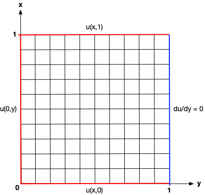
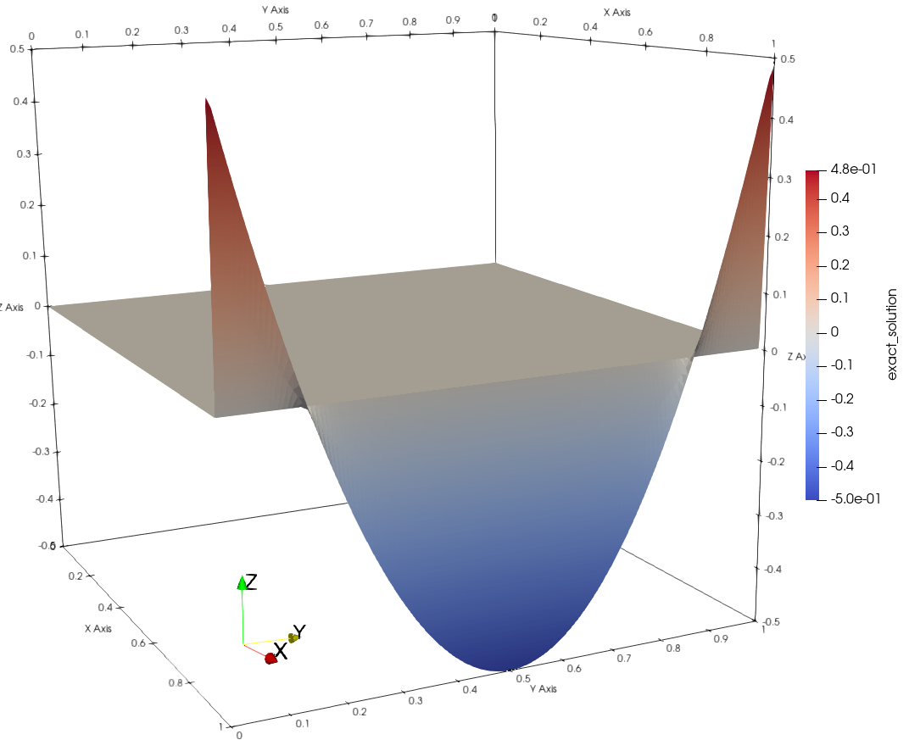
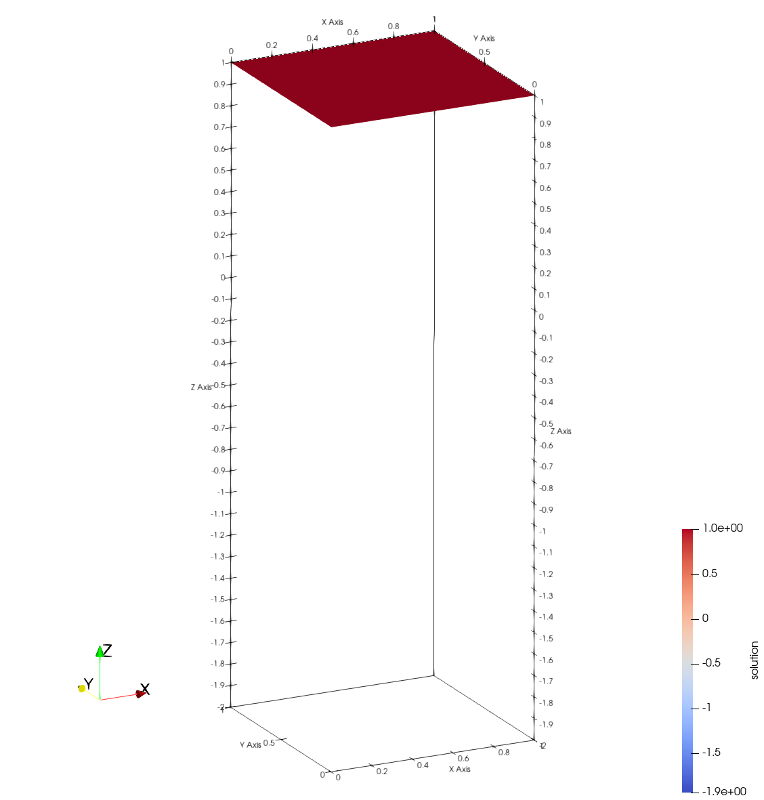
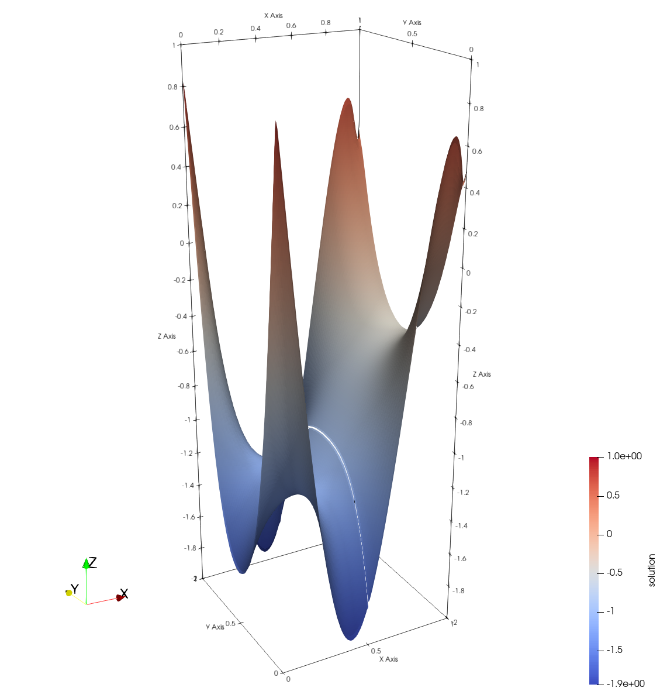

## At a Glance
<!-- (Expected # minutes to complete) %% temporarily omit -->

|Questions|Objectives|Key Points|
|1. What is PDE-constrained optimization?|Understand the basic principles|The PDE is imposed as an equality constraint for the optimization problem|
|2. What is the reduced-space formulation?|Separate the optimization and the PDE solution|The PDE states are removed from the optimization problem using the implicit function theorem|
|3. What is adjoint-based sensitivity analysis?|Compute gradients for functionals that depend on the solution of a PDE|The adjoint method can efficiently provide gradient information when the objective function relies on the solution of expensive PDEs|

**Note:** To run the application in this lesson
```
cd {{site.handson_root}}/boundary_control_tao
make
./boundary_control inputs -tao_monitor -tao_ls_type armijo -tao_fmin 1e-6 -tao_gatol 1e-12
```

## Brief Introduction to PDE-Constrained Optimization

PDE-constrained optimization algorithms seek to find the input variables or parameters (referred to as "control", 
"design" or "optimization" variables) that minimize (or maximize) a functional that depends on the solution of a 
partial differential equation (PDE). A general PDE-constrained optimization problem is stated as

$$
\min_{p, u} \quad f(p, u) \quad \text{subject to} \quad R(p, u) = 0,
$$

where $$p \in \mathbb{R}^n$$ are the optimization variables, $$u \in \mathbb{R}^m$$ are the PDE states, 
$$f(p, u): \mathbb{R}^{n \times m} \rightarrow \mathbb{R}$$ is the objective function, and 
$$R(p, u): \mathbb{R}^{n \times m} \rightarrow \mathbb{R}^m$$ are the state equations that represent the discretized 
PDE.

The above optimization statement is called the "full-space" method for PDE-constrained optimization, where the PDE 
solution variables $$u$$ are solved simultaneously with the optimization variables $$p$$. Consequently, the size of the 
optimization problem is $$n + m$$.

In the "reduced-space" formulation, the PDe constraint is removed from the optimization problem using the implicit 
function theorem, such that

$$\min_p \quad f(p, u(p)),$$

where the state or solution variables $$u$$ are now expressed as an implicit function of the optimization variables 
$$p$$. In practice, this means that every evaluation of the objective function $$f(p, u(p))$$ at a new $$p$$ point 
requires a complete solution of the state equations $$R(p, u) = 0$$ in order to compute the solution $$u(p)$$ that 
corresponds to that $$p$$ point. Consequently, the function evaluation becomes significantly more expensive, at the 
trade-off that the size of the optimization problem shrinks to $$n$$.

The reduced-space formulation can also be re-written as 

$$\min_p \quad f(p, u(p)) \quad \text{governed by} \quad R(p, u) = 0,$$

where the "governed by" notation describes the governing equations that relate the solution variables $$u$$ to the 
optimization variables $$p$$, but are not imposed as constraints in the optimization problem.

In this lesson, we focus on gradient-based optimization methods -- methods that utilize information about the 
sensitivity of the objective function with respect to its inputs. We begin by exploring the optimality conditions for 
this class of algorithms as applied to the PDE-constrained problem.

## Optimality Conditions

For full-space PDE-constrained optimization, the first-order optimality conditions are derived first by forming the 
Lagrangian

$$\mathcal{L}(p, u, \lambda) = f(p, u) + \lambda^T R(p, u),$$

where $$\lambda \in \mathbb{R}^m$$ are the Lagrange multipliers associated with the PDE constraint. Differentiating the 
Lagrangian with respect to all of its inputs yields the first-order optimality conditions (also called the 
Karush-Kuhn-Tucker conditions) that must be satisfied by the optimal solution:

$$\nabla_p \mathcal{L} = \frac{\partial f}{\partial p} + \lambda^T \frac{\partial R}{\partial p} = 0,$$

$$\nabla_u \mathcal{L} = \frac{\partial f}{\partial u} + \lambda^T \frac{\partial R}{\partial u} = 0,$$

$$\nabla_\lambda \mathcal{L} = R(p, u) = 0.$$

Newton-type optimization algorithms apply the Newton's method to the first-order optimality conditions to produce the 
Karush-Kuhn-Tucker (KKT) system,

{: width="50%"}

which is solved at every Newton iteration to produce the step direction $$(\Delta p, \Delta u, \Delta \lambda)$$. The 
step is then globalized using a line search or a trust region framework in order to avoid stationary points that are 
not the minimum. This approach converges the PDE states simultaneously with the optimization variables. This means that 
the PDE solution and the optimization are tightly coupled and the PDE constraint is not satisfied at intermediate steps.

The reduced-space variant of the above problem solves the KKT system with the following steps:

1. Solve $$\nabla_\lambda \mathcal{L} = R(p, u) = 0$$ at each new $$p$$ for $$u(p)$$. This is called the "state 
solution", i.e.: calculating the PDE state at $$p$$.

2. Substitute $$p$$ and $$u(p)$$ into $$\nabla_u \mathcal{L}$$ amd solve 
$$\left( \frac{\partial R}{\partial u} \right)^T \lambda = -\frac{\partial f}{\partial u}$$ for $$\lambda(p, u)$$. This 
is called the "adjoint solution" and the Lagrange multipliers are called the adjoint variables in the reduced-space 
formulation.

3. Substitute $$p$$, $$u(p)$$ and $$\lambda(p, u)$$ into $$\nabla_p \mathcal{L}$$ and solve 
$$\nabla_{p}^2 \mathcal{L} \Delta p = -\nabla_p \mathcal{L}$$ for the step direction $$\Delta p$$.

Note that the reduced-space steps avoid the computation of second derivative information in 
$$\nabla_{pu}^2 \mathcal{L}$$ and $$\nabla_{uu}^2 \mathcal{L}$$. Additionally, the PDE solver and the optimization 
algorithm are decoupled from each other. This comes at the cost of performing a full PDE solution for every objective 
function evaluation.

## Using TAO

Toolkit for Advanced Optimization (TAO) is a package of optimization algorithms and tools developed at Argonne National 
Laboratory and distributed with the [Portable Extensible Toolkit for Scientific Computing (PETSc)][4] library. It is 
primarily intended for continuous gradient-based optimization, and supports PDE-constrained problems using the 
reduced-space formulation.

Below is a TAO main file template that can be adapted to any PDE-constrained problem:

```c
#include "petsc.h"

typedef struct {
  int n; /* number of optimization variables */
} AppCtx;

PetscErrorCode FormFunctionGradient(Tao tao, Vec P, PetscReal *fcn,Vec G,void *ptr)
{
  PetscErrorCode ierr;
  AppCtx *user = (AppCtx*)ptr;

  /* Compute objective function and store in fcn */
  /* 1. Compute the states U(P) for the given P vector (i.e.: solve the PDE) */
  /* 2. Use P and U(P) to compute the objective function */

  /* Compute gradient and store in G */
  /* 1. Solve the adjoint system for the adjoint variables lambda(P, U(P)) */
  /* 2. Compute the gradient G = \nabla_p f using P, U(P), lambda(P, U(P)) */

  return 0;
}

int main(int argc, char *argv[])
{
  PetscErrorCode ierr;
  AppCtx user;
  Tao tao;

  /* Initialize problem and set sizes */

  ierr = PetscInitialize( &argc, &argv,(char *)0,help );if (ierr) return ierr;
  ierr = VecCreateMPI(PETSC_COMM_WORLD, user.n, user.N,  &X);CHKERRQ(ierr);
  ierr = VecSet(X, 0.0);CHKERRQ(ierr);

  ierr = TaoCreate(PETSC_COMM_WORLD, &tao);CHKERRQ(ierr);
  ierr = TaoSetType(tao, TAOBQNLS);CHKERRQ(ierr);
  ierr = TaoSetInitialVector(tao, X);CHKERRQ(ierr);
  ierr = TaoSetObjectiveAndGradientRoutine(tao, FormFunctionGradient, (void*) &user);CHKERRQ(ierr);
  ierr = TaoSetFromOptions(tao);CHKERRQ(ierr);
  ierr = TaoSolve(tao);CHKERRQ(ierr);

  ierr = VecDestroy(&X);CHKERRQ(ierr);
  ierr = TaoDestroy(&tao);CHKERRQ(ierr);
  ierr = PetscFinalize();
```

TAO calls the user-provided ``FormFunctionGradient()`` routine whenever the optimization algorithm needs to evaluate 
the objective and its gradient. The ``AppCtx`` structure contains any data the user has to preserve and propagate 
through for these computations.

## Example Problem: Boundary Control with the 2D Laplace Equation

The inverse problem for the boundary control case is given as

$$\min_p \quad \frac{1}{2}\int_0^1 (u(1, y) - u_{targ})^2 d y,$$

$$\text{governed by} \quad \frac{\partial^2 u}{\partial x^2} + \frac{\partial^2 u}{\partial y} = 0 \quad \forall \; x, y \in (0, 1),$$ 

$$p = \left[u(x, 0), u(0, y), u(x, 1) \right]^T \quad \text{and} \quad \frac{\partial u}{\partial x}\Bigr|_{x=1}.$$ 

where $$u_{targ}$$ is a target solution that we want to recover by controlling the bottom, left and top Dicihlet 
boundary terms with the optimization variables in $$p$$. In this example, we set the target solution to 
$$u_{targ} = 4(y - 0.5)^2 - 0.5$$.

| Representative Domain | Target Solution on Right Boundary |
|:-------------------------:|:-------------------------:|
|{:width="130%"|{:width="60%"}|

We use [AMReX][5] to solve the governing equation. The default domain is a 128x128 cell square and the edge size can be 
changed with the option flag `-nx <integer>`. Since the Laplace equation is self-adjoint, i.e. the Jacobian is 
symmetric, we can perform the adjoint solution by changing the right-hand-side vector for the forward solution.

The source code for this problem is available on GitHub under 
[AMReX-Codes/ATPESC-codes/TAO-of-AMReX](https://github.com/AMReX-Codes/ATPESC-codes/tree/master/TAO-of-AMReX). The 
problem can be compiled and run with:

```
cd {{site.handson_root}}/boundary_control_tao
make
./boundary_control inputs -tao_monitor -tao_ls_type armijo -tao_fmin 1e-6 -tao_gatol 1e-12
```

In this example, we will run the problem with different TAO configurations using command line options. Below is an 
overview of some of the available flags. For a complete list, please refer to the [TAO User Manual][6].

| Flag              | Available Options                    | Description                   |
|:-----------------:|:------------------------------------:|:-----------------------------:|
| `-tao_type`       | `bncg`, `bqnls`                      | Change the TAO algorithm type |
| `-tao_ls_type`    | `unit`, `armijo`, `more-thuente`     | Change the TAO line search type |
| `-tao_gatol`      | `1e-12` (real number)                | Set the absolute gradient norm tolerance for convergence |
| `-tao_fmin`       | `1e-6` (real number)                 | Set the absolute function value tolerance for convergence |
| `-tao_monitor`    | N/A                                  | Activates the iteration monitor for the TAO solution | 
| `-tao_ls_monitor` | N/A                                  | Activates the line search monitor within each TAO iteration |
| `-nx`             | `128` (integer)                      | Set the number of cells on each edge of the square domain |
| `-fd`             | N/A                                  | Disable the adjoint method and turn on the finite difference method for the gradient |

### Results

Running the above command produces the output below with information from TAO about the optimization.

```
AMReX (19.08) initialized
  0 TAO,  Function value: 0.00564792,  Residual: 4.57574e-08
  1 TAO,  Function value: 0.00564792,  Residual: 4.57574e-08
  2 TAO,  Function value: 0.000351831,  Residual: 6.72001e-09
  3 TAO,  Function value: 0.000104118,  Residual: 4.5399e-09
  4 TAO,  Function value: 4.39909e-06,  Residual: 5.62804e-10
  5 TAO,  Function value: 3.20011e-06,  Residual: 3.18434e-10
  6 TAO,  Function value: 2.90562e-06,  Residual: 3.67294e-10
  7 TAO,  Function value: 2.82687e-06,  Residual: 3.54986e-10
  8 TAO,  Function value: 2.74912e-06,  Residual: 3.45265e-10
  9 TAO,  Function value: 2.74912e-06,  Residual: 3.45265e-10
 10 TAO,  Function value: 2.5271e-06,  Residual: 1.99102e-10
 11 TAO,  Function value: 2.41122e-06,  Residual: 1.43435e-10
 12 TAO,  Function value: 2.10344e-06,  Residual: 8.34685e-11
 13 TAO,  Function value: 1.78759e-06,  Residual: 1.11393e-10
 14 TAO,  Function value: 1.30814e-06,  Residual: 8.4585e-11
 15 TAO,  Function value: 1.10837e-06,  Residual: 9.14759e-11
 16 TAO,  Function value: 1.08865e-06,  Residual: 9.52258e-11
 17 TAO,  Function value: 8.87623e-07,  Residual: 1.29118e-10
TaoSolve() duration: 1316289 microseconds
[The  Pinned Arena] space (MB) used spread across MPI: [8 ... 8]
AMReX (19.08) finalized
```

In this case, we have specified an absolute function value tolerance of $$10^{-6}$$ (with `-tao_fmin 1e-6`) and an 
absolute gradient tolerance of $$10^{-12}$$ (with `-tao_gatol 1e-12`). We can see in the convergence information that 
the optimization terminated based on the function value. We can further validate this further by running the problem 
with the `-tao_view` argument and inspecting the printed convergence reason: `Solution converged:    Minf --  f < fmin`.

We can also visualize the AMReX solution using Paraview, with the initial solution ($$u_0 = 1.0$$) on the right and the 
final solution on the left. The final solution captures the target solution at the right edge ($$x = 1$$) accurately by 
manipulating the Dirichlet boundaries on the bottom ($$y=0$$), left ($$x=0$$) and top ($$y=1$$) edges. Note that the 
missing line in the final solution surface is a visualization artifact.

Initial Solution             |  Final Solution
:-------------------------:|:-------------------------:
{:align="middle"} | {:align="middle"}

### Hands-on Activities

1. Change problem size with `-nx <size>` (default is 128) and evaluate its impact on performance. Now disable the 
adjoint solution and enable the finite difference gradient with `-fd`. Change problem size again and evaluate both 
convergence and iteration speed.

2. Run the problem in parallel using `mpiexec -np 4 ./boundary_control ...`. AMReX and PETSc can seamlessly scale up 
the problem without changing the source code.

3. Change TAO algorithm to the nonlinear conjugate gradient method using `-tao_type bncg`. Compare convergence with the 
default method (`bqnls` -- quasi-Newton line search). Change the line search type (using `-tao_ls_type`) and 
convergence tolerances (using `-tao_fmin` and `-tao_gatol`) to help the problem converge.

4. Change the initial starting point and see if the solution converges to a different local minimum. The default 
starting point is Dirichlet values set to $$1.0$$ for all controlled boundaries (bottom, left and top). You can either 
choose a different constant value, or try to impose a more complicated starting point by manipulating the vector data 
element-by-element.

5. Change the target solution in `boundary_control.cpp`. You can define any 1D function for `utarg` with the 
y-coordinate as the input variable.

```
amrex::Real TargetSolution(amrex::Real* coords)
{
    amrex::Real y = coords[1];
    amrex::Real utarg = 4.*(y-0.5)*(y-0.5) - 0.5;
    return utarg;
}
```

For each of these tasks, you can inspect the solution at each iteration by opening the AMReX plot files in [VisIt][6] 
or [ParaView][7]. If you use ParaView, you must use the latest v5.7.0 RC1 version with support for the AMReX grid 
format. 2D solutions in ParaView can be converted to 3D surface representations first by using the "Cell to Point Data" 
filter, and then applying the "Warp by Scalar" filter.

## Take-Away Messages

* PDE-constrained optimization does not need to be intimidating!
    - PETSc/TAO provides interfaces and algorithms that work with reduced-space formulations.
    - PETSc/TAO can compute gradients automatically with finite differencing.
    - PETSc data structures are easy to couple with most PDE solvers (e.g., AMReX).
* The adjoint method is ideal for sensitivity analysis in PDE-constrained problems.
    - Computational cost is (mostly) independent of the number of optimization variables.
    - Some PDE solvers already have the necessary building blocks.
    - Possible to take implementation shortcuts in self-adjoint problems.
* PETSc/TAO offers parallel optimization algorithms for large-scale problems.
    - Optimization data is duplicated from user-generated PETSc vectors.
    - User has full control over parallel distribution and vector type.

## Further Reading

- [PETSc manual](https://www.mcs.anl.gov/petsc/petsc-current/docs/manual.pdf)  
- [TAO manual](https://www.mcs.anl.gov/petsc/petsc-current/docs/tao_manual.pdf)
- [PETSc/TAO website](https://www.mcs.anl.gov/petsc)
- [AMReX documentation](https://amrex-codes.github.io/amrex/docs_html)

[1]: https://en.wikipedia.org/wiki/Quasi-Newton_method
[2]: https://en.wikipedia.org/wiki/Broyden–Fletcher–Goldfarb–Shanno_algorithm
[3]: https://books.google.com/books?id=VbHYoSyelFcC&dq=Nonlinear+Optimization+Nocedal&source=gbs_navlinks_s
[4]: http://www.mcs.anl.gov/petsc
[5]: https://amrex-codes.github.io/amrex/
[6]: https://www.mcs.anl.gov/petsc/petsc-current/docs/tao_manual.pdf
[7]: https://wci.llnl.gov/simulation/computer-codes/visit/
[8]: https://www.paraview.org
