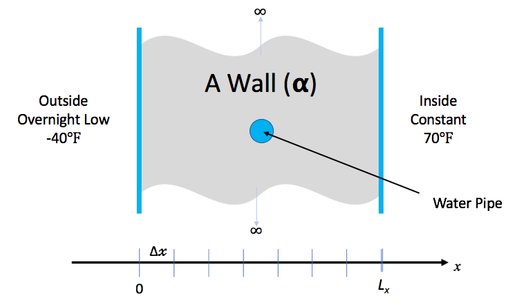
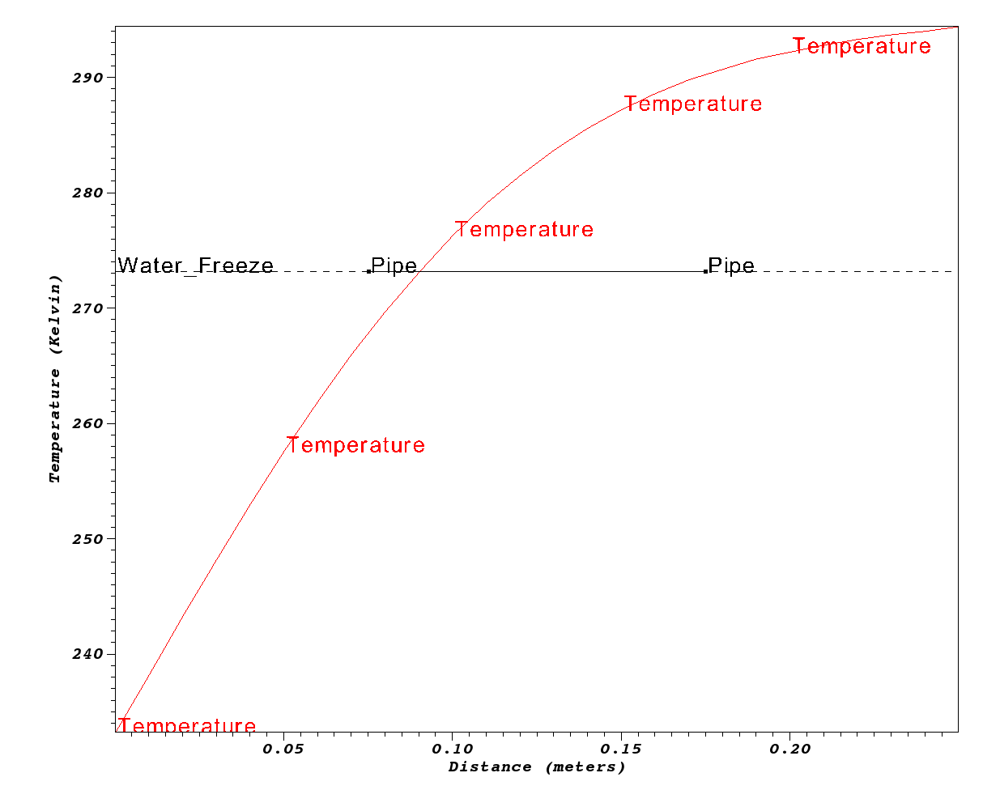

## At a Glance

|Questions|Objectives|Key Points|
|:--------|:---------|:---------|
|What is a numerical algorithm?|Implement a simple numerical algorithm.<br>Use it to solve a simple science problem.|Numerical Packages are used<br>to solve scientific problems involving [PDEs.][PDE]|
|What is [discretization][DISC]?|Introduce basic concepts in solving continuous<br>[PDEs][PDE] using discrete computations.|_Meshing_ (or [discretization][DISC]) is an<br>important first step.|
|How can numerical packages<br>help me with my software?|Understand the value numerical packages<br>offer in developing science applications|Numerical packages offer: rigorous/vetted numerics<br>greater generality, extreme scalability and more...|

#### To begin this lesson

* [Open the Answers Form]({{page.answers_google_form}})
* Go to the directory for the hand-coded `heat` application
```
cd {{ site.handson_root }}/hand_coded_heat
```

## A Simple Science Question

Lets say you live in a house with exterior walls made of a single material of thickness, $$L_x$$.
Inside the walls are some water pipes as pictured below.



You keep the inside temperature of the house always at 70 degrees F. But, there is an
overnight storm coming. The outside temperature is expected to drop to -40 degrees F for 15.5
hours. Will your pipes freeze before the storm is over?

### Governing Equations

In this lesson, we demonstrate the implementation and use of a hand-coded
(e.g., does not use any numerical packages) C-language application to
model the one dimensional _heat_ conduction equation through a wall as
pictured here ...

In general, heat [conduction](https://en.wikipedia.org/wiki/Thermal_conduction) is governed
by the partial differential ([PDE][PDE])...

$$\frac{\partial u}{\partial t} - \nabla \cdot \alpha \nabla u = 0$$

where _u_ is the temperature _through_ the wall at spatial positions, _x_, and times, _t_, \\( \alpha \\),
is the _thermal diffusivity_
of the material(s) comprising the wall. This equation is known as the
_Diffusion Equation_ and also the [_Heat Equation_](https://en.wikipedia.org/wiki/Heat_equation).

### Simplifying Assumptions

To make the problem tractable for this short lesson, we make some simplifying assumptions...

1. The wall can be treated as _homogenous_ in material. In effect, we ignore the fact that
   part of the wall has a pipe filled with water running through it.
1. The thermal diffusivity of the wall material, \\( \alpha \\)
   is constant for all _space_ and _time_.
1. The only heat _source_ is from initial and/or boundary conditions.
1. We will deal only with the _one dimensional_ problem in _Cartesian coordinates_. That is
   heat along the dimension _through_ the wall between inside and outside.
1. We will _[discretize][DISC]_ with constant spacing in both space, $$\Delta x$$ and time, $$\Delta t$$.

In this case, the [PDE][PDE], above, simplifies too the one dimensional heat equation...

$$\frac{\partial u}{\partial t} = \alpha \frac{\partial^2 u}{\partial x^2}$$

## Discretization

The equation above is a _continuous_,
[partial differential equation (PDE)][PDE]
In order to write a computer program to solve this equation, numerically, the first thing
we need to consider is how to _[discretize][DISC]_
the equation into a form suitable for numerical computation.

Using [difference equations][DIFF] as approximations for derivatives,
we can discretize, independently, the left- and right-hand sides of
equation 2. For the left-hand side, we can approximate the first derivative
of _u_ with respect to time, _t_, by the forward difference equation...

$$\frac{\partial u}{\partial t} \Bigr\vert_{t_{k+1}} \approx \frac{u_i^{k+1}-u_i^k}{\Delta t}$$

We can approximate the right-hand side of equation 2 with
the second derivative of _u_ with respect to space, _x_, by the centered difference equation...

$$\alpha \frac{\partial^2 u}{\partial x^2}\Bigr\vert_{x_i} \approx \alpha \frac{u_{i-1}^k-2u_i^k+u_{i+1}^k}{\Delta x^2}$$


Setting equations 3 and 4 equal to each other and re-arranging terms, we
arrive at the following update scheme for producing the temperatures at
the next time, _k+1_, from temperatures at the current time, _k_, as

$$u_i^{k+1} = ru_{i+1}^k+(1-2r)u_i^k+ru_{i-1}^k$$

where \\( r=\alpha\frac{\Delta t}{\Delta x^2} \\)

{% include qanda
    question='Is there anything in this numerical treatment that looks like a _mesh_?'
    answer='
In the process of discretizing the PDE, we have defined a fixed spacing in x
and a fixed spacing in t as shown in the figure here

[](heat_mesh.png){:align="middle"}

This is essentially a uniform mesh. Later lessons
here address more sophisticated discretizations in space and in time which
depart from these often inflexible fixed spacings.
                                                                          
                                                                          
                                                                          
                                                                          
                                                                          
' %}

Note that this equation now defines the value of _u_ at time _k+1_
in terms of values of _u_ at time _k_ .  This is an example of an
[_explicit_](https://en.wikipedia.org/wiki/Explicit_and_implicit_methods)
numerical method known as the
_[Forward-Time, Centered-Space (FTCS)](https://en.wikipedia.org/wiki/FTCS_scheme)_
 algorithm. As an explicit method, it has some nice properties:

* They are easy to implement.
* They typically require minimal memory.
* They are easy to parallelize.

---

## Exercise #1: Implement the FTCS Algorithm (2-3 mins)

```
% ls
Double.H	crankn.C	ftcs.C		heat.H		tools		utils.C
args.C		exact.C		heat.C		makefile	upwind15.C
```

The function, `solution_update_ftcs`, is defined in `ftcs.C` without its body.

```c
static bool             // false if unstable, true otherwise
solution_update_ftcs(
    int n,              // # of temperature samples in space
    Double *uk1,        // new temperatures @ t = k+1
    Double const *uk0,  // old/last temperatures @ t = k
    Double alpha,       // thermal diffusivity
    Double dx,          // spacing in space, x
    Double dt,          // spacing in time, t
    Double bc_0,        // boundary condition @ x=0
    Double bc_1         // boundary condition @ x=Lx
)
{
```
{% include qanda
    question='Using eq. 5, implement the body of this function'
    answer='
```
    Double const r = alpha * dt / (dx * dx);

    // Sanity check for stability
    if (r > 0.5) return false;

    // Update the solution using FTCS algorithm
    for (int i = 1; i < n-1; i++)
        uk1[i] = r*uk0[i+1] + (1-2*r)*uk0[i] + r*uk0[i-1];

    // Impose boundary conditions for solution indices i==0 and i==n-1
    curr[0  ] = bc_0;
    curr[n-1] = bc_1;

    return true;
```
                                                                      
                                                                      
                                                                      
                                                                      
' %}

```
}
```

Edit `ftcs.C` and implement the FTCS numerical algorithm by coding the body of this function.

## Exercise #2: Build and Test the Application (1 min)

To compile the code you have just written...

```
make
```

#### Getting `--help` from the `heat` Application

Run the command...

```
% ./heat --help
```

And observe the output...

```
Usage: ./heat <arg>=<value> <arg>=<value>...
    runame="heat_results"               name to give run and results dir (char*)
    prec="double"                       precision half|float|double|quad (char*)
    alpha=0.2           material thermal diffusivity (sq-meters/second) (double)
    lenx=1                                     material length (meters) (double)
    dx=0.1                  x-incriment. Best if lenx/dx==int. (meters) (double)
    dt=0.004                                      t-incriment (seconds) (double)
    maxt=2         >0:max sim time (seconds) | <0:min l2 change in soln (double)
    bc0=0                     boundary condition @ x=0: u(0,t) (Kelvin) (double)
    bc1=1               boundary condition @ x=lenx: u(lenx,t) (Kelvin) (double)
    ic="const(1)"               initial condition @ t=0: u(x,0) (Kelvin) (char*)
    alg="ftcs"                            algorithm ftcs|upwind15|crankn (char*)
    savi=0                                   save every i-th solution step (int)
    save=0                              save error in every saved solution (int)
    outi=100                      output progress every i-th solution step (int)
    noout=0                                       disable all file outputs (int)
```

* The values each argument is assigned on the left are the *default* values the
  application uses when the associated argument is not specified on the command line.
* See the [note below](#icarg) regarding more information on the `ic` argument to
  specify a variety of initial conditions.

#### A Simple Sanity Check Run
As a sanity check, lets just run the application with no arguments and see what
happens...
```
% ./heat
    runame="heat_results"
    prec="double"
    alpha=0.2
    lenx=1
    dx=0.1
    dt=0.004
    maxt=2
    bc0=0
    bc1=1
    ic="const(1)"
    alg="ftcs"
    savi=0
    save=0
    outi=100
    noout=0
Iteration 0000: last change l2=0.0909091
Iteration 0100: last change l2=2.42918e-06
Iteration 0200: last change l2=4.86446e-07
Iteration 0300: last change l2=1.00929e-07
Iteration 0400: last change l2=2.09483e-08
Iteration 0500: last change l2=4.41684e-09
Counts: Adds:24500, Mults:25001, Divs:1005, Bytes:176
```
Before running, the application dumps its command-line arguments so the user can
see what parameters it was passed to run. In this case, you are seeing the default
values. It then runs the problem as defined by the command-line arguments and
saves result files to the directory specified by the `runame=` argument.

To list the most recently created entries in the current director, run the following
command...
```
% ls -1t | head -n 1
heat_results
```

The entry `heat_results` is a directory containing some files created by the
application. To determine what kind of files they are, run the following
command...

```
% file heat_results/*.*
heat_results/clargs.out:                    ASCII text
heat_results/heat_results_soln_00000.curve: ASCII text
heat_results/heat_results_soln_final.curve: ASCII text
```
For this simple application, the results are uncomplicated. They are ASCII
text files containing two columns of data. To see an example, run the command

```
% cat heat_results/heat_results_soln_final.curve
# Temperature
       0        0
     0.1   0.1039
     0.2   0.2073
     0.3   0.3101
     0.4   0.4119
     0.5   0.5125
     0.6   0.6119
     0.7   0.7101
     0.8   0.8073
     0.9   0.9039
       1        1
```

The first column is each spatial position, $$x_{i}$$ and the second column is the
temperature, _u_, at that spatial position. The name of the file indicates the 
_time_ of the solution data stored therein.

### Testing The heat Application

Before we use our new application to solve our simple science question, how can we assure
ourselves that the code we have written is not somehow seriously broken?



We know, maybe even intuitively, that if we maintain constant temperatures at
$$A @ x=0$$ and $$B @ x=L_x$$, then after a long time (e.g. when the solution
reaches _[steady state](https://en.wikipedia.org/wiki/Steady_state)_), we
expect it to be a simple linear variation between temperatures A and B. For
example, observe what happens after a long time in the one dimensional example
below.


{% include qanda
    question='Construct a suitable command-line to easily confirm a linear steady state'
    answer='Since the default length is 1 and the default boundary conditions are 0 and 1,
            we just need to run the problem for a long time. But, to be a little more
            thorough, it is even better to start with a random initial condition too.
```
% ./heat dx=0.25 maxt=100 ic="rand(125489,100,50)" runame=test
```
' %}

{% include qanda
    question='How do you confirm results after a long time are a linear steady state?'
    answer='Examine the initial and final results file and confirm even a random input
            still yields a final result where $$u=x_{i}$$ for all rows of the results file
```
% cat test/test_soln_00000.curve
# Temperature
       0    69.09
    0.25    143.6
     0.5     96.3
    0.75    52.61
       1    131.6
% cat test/test_soln_final.curve
# Temperature
       0        0
    0.25     0.25
     0.5      0.5
    0.75     0.75
       1        1
```
                                                                                
                                                                                
                                                                                
                                                                                
                                                                                
                                                                                
' %}


## Exercise #3: Use Applicaton to Model Science Problem of Interest

Lets now use our `heat` application to model our simple science question.

### Additional Information / Assumptions

|Material|Thermal Diffusivity<br>(sq-meters/second)|
|Wood|$$8.2 \times 10^{-8}$$|
|Adobe Brick|$$2.7 \times 10^{-7}$$|
|Common (red) Brick|$$5.2 \times 10^{-7}$$|

* Outside temp has been same as inside temp for a long time, 70 degrees F
* Night/Storm will last 15.5 hours @ -40 degrees F
* Walls are 0.25 meters thick wood and pipe is 0.1 meters in diameter
* Pipe will freeze if center point drops below freezing.

**Note:** An all too common issue in simulation applications is being sure data is
input in the correct units. Take care!



## Exercise #4: Analyze Results and Do Some Science

Its time to use the results from our simulation to answer the science question of interest.
Below we plot results

```
make plot PTOOL=gnuplot RUNAME=wall
```

Depending on your situation, the above command may or may not produce a plot looking like below.

{:width="400"}



## Custom Coded Solutions are a Slippery Slope

We all like to write code and build useful tools. However, it is all too easy
to see the unfamiliar as an impediment rather than enabler in reaching our sience goals.
However, this is a slippery slope. We often start with relatively simple goals
and over time wish to evolve our software solutions to ever more challenging
science problems.

Examine the lines of code of the _complete application_ here

```
$ wc -l *.[Ch]
  125 args.C     # User interface
   94 crankn.C   # Alternative solver
   88 Double.H   # Performance tracking
   38 exact.C    # Testing support
   24 ftcs.C     # FTCS solver
  222 heat.C     # Main
   19 heat.H     # Modularization
   27 upwind15.C # Alternative solver
  151 utils.C    # Utilities, I/O, Data Formats
  788 total
```

Developing generally useful science applications involves many considerations and software
engineering challenges.

* More than just one spatial dimension
* More complex geometric shapes and non-cartesian coordinate systems
* Heat sources and radiation
* Laminated, anisotropic or non-linear materials
* Much larger objects involving billions of discretization points and requiring scalability in all phases of the solution.
* Parallelism such as MPI, and/or, GPU and/or many core and/or various parallel runtimes
* Alternative and interoperable discretizations, solvers, time-integrators, optimizers
* An agile and sustainable software design and implementation addressing understandability of code, with encapsulation
of complexities, robustness, efficiency, scalability, portability, reproducibility, rigorous testing, etc.

When we employ numerical packages, many of these issues are addressed for us allowing us to
focus more of our effort on the software engineering involved in developing
applications that address our science questions of interest.

----

## Evening Hands On Session

### Short / Quick Follow-on Questions





### Determine Optimum Wall Thicknesses

What are the minimum thicknesses of walls of Wood, Adobe and Common brick
to prevent the pipes from freezing?

When you are done, go to `Intro->Submit A Show Your Work` using the hands-on
activity name _Optimized Walls_ and upload evidence of your completed solution.

### Compare FTCS, Crank-Nicholson and Upwind15 Algorithms (5 points)

#### [Crank-Nicolson](https://en.wikipedia.org/wiki/Crank–Nicolson_method) Discretization

Using the [Crank-Nicolson](https://en.wikipedia.org/wiki/Crank–Nicolson_method) discretization,
we arrive at the following discretization of equation 2...

$$-ru_{i+1}^{k+1}+(1+2r)u_i^{k+1}-ru_{i-1}^{k+1} = ru_{i+1}^k+(1-2r)u_i^k+ru_{i-1}^k$$

where

$$r= \alpha \frac{\Delta t}{2 \Delta x^2}$$

In equation 7, the solution at spatial position _i_ and time _k+1_
now depends not only on values of u at time _k_ but also on other
values of u at time _k+1_.
This means each time we advance the solution in time we must
solve a linear system; in other words we must solve for all of the
values at time _k+1_ in one step.
This is an example of an
[_implicit_](https://en.wikipedia.org/wiki/Explicit_and_implicit_methods) method.
In this case, the system of equations is
[_tri-diagonal_](https://en.wikipedia.org/wiki/Tridiagonal_matrix_algorithm) --
since each update for u at _i_ only uses u at _i-1_ , _i_ and _i+1_ --
so it is easier to implement than a general matrix solve but is still more complicated
than an explicit update.

The code to implement this method is more involved because it involves
doing a tri-diagonal solve. It is in `crankn.C`. It involves code that
sets up and LU factors the initial matrix. Then, the LU factored matrix
is used on each solution timestep to solve for the new temperatures.

Run the same problems using each of these algorithms and observe total
memory usage and operation counts (printed at the end) and provide your
explanations for them and in comparison with the FTCS method.

When you are done, go to `Intro->Submit A Show Your Work` using the hands-on
activity name _Crank-Nicholson_ and upload evidence of your completed solution.

### Use The Application to Solve The Pipeline Problem (5 points)

{:width="500"}

An pipeline carrying Ethenol-85 (E85) runs between a manure processing
facility and a kerosene production factory. In the unlikely event that
both facilities experience catastrophic explosion (burning methane at
the manure facility and burning kerosene at the kerosene facility),
that _briefly_ increases the local air temperature on both sides of
the pipe to the burning temperature of the respective materials, determine
the minimum thermal diffusivity of the material used to coat/insulate the pipe
to prevent the E-85 from exploding. Assume the pipe is 36 inches in
diameter.

When you are done, go to `Intro->Submit A Show Your Work` using the hands-on
activity name _Pipeline_ and upload evidence of your completed solution.

### Modify the Application to Support Two Materials (10 points)

Using [other research](http://www.ams.org/journals/mcom/1960-14-072/S0025-5718-60-99228-0/S0025-5718-60-99228-0.pdf),
modify the application to work for a composite wall composed of two materials.

When you are done, go to `Intro->Submit A Show Your Work` using the hands-on activity
name _Composite Wall_ and upload evidence of your completed solution.

---

##### A note about the `ic=` argument to `heat`{:icarg}

The initial condition argument, `ic`, handles a few interesting cases

Constant, `ic="const(V)"`

: Set initial condition to constant value, `V`

Ramp, `ic="ramp(L,R)"`

: Set initial condition to a linear ramp having value `L` @ x=0 and `R` @ x=$$L_x$$.

Step, `ic="step(L,Mx,R)"`

: Set initial condition to a step function having value `L` for all x<Mx and value `R` for all x>=Mx.

Random, `ic="rand(S,B,A)"`

: Set initial condition to random values in the range [B-A,B+A] using seed value `S`.

Sin, `ic="sin(Pi*x)"`

: Set initial condition to $$sin(\pi x)$$.

Spikes, `ic="spikes(C,A0,X0,A1,X1,...)"`

: Set initial condition to a constant value, `C` with any number of _spikes_ where each spike is the pair, `Ai` specifying the spike amplitude and `Xi` specifying its position in, x.

[PDE]: https://en.wikipedia.org/wiki/Partial_differential_equation
[DISC]: https://en.wikipedia.org/wiki/Discretization
[DIFF]: https://en.wikipedia.org/wiki/Finite_difference#Forward,_backward,_and_central_differences
