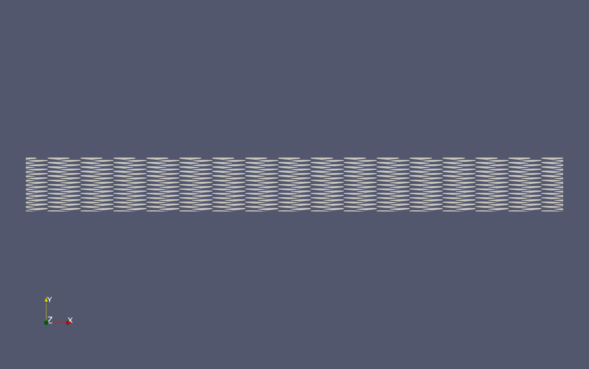

## At a Glance

|Questions|Objectives|Key Points|
|How do we choose a suitable Krylov solver?|Know when to use CG or GMRES.|CG works for spd matrix and preconditioner. GMRES works for unsymmetric systems, but requires more memory.|
|How do we choose a preconditioner?|Know common sparse preconditioners.|As the size of the linear system grows, most iterative methods will require increasing number of iterations.|
|How can we improve efficiency of the solver?|Understand the basic components of multigrid.|For certain common problem classes, multigrid methods require a constant number of iterations and constant work per unknown.|

### To begin this lesson

* [Open the Answers Form](https://docs.google.com/forms/d/e/1FAIpQLSet4PY6wpTjGwAbo-fywgo7muexTE_Q9blWBMTBVV0vVwzejQ/viewform?usp=sf_link){:target="_blank"}
```
cd {{site.handson_root}}/krylov_amg
```

## The Problem Being Solved

We consider the Poisson equation

$$-\Delta u = f$$

on a square mesh of size $$n_x \times n_y$$ with Dirichlet boundary conditions $$u = 0$$.

It is discretized using central finite differences, leading to a symmetric positive (spd) matrix.

## The Example Source Code

For this lesson, we will be using the executable `MueLu_Stratimikos.exe` from the MueLu package of Trilinos which allows us to test a variety of solvers and preconditioners.

WHERE WILL THE EXECUTABLE BE LOCATED?

For the first part of the lesson, we will be running on a single MPI rank, so no need to ask for a massive allocation.

The executable takes several command line arguments that influence the linear system that is generated on the fly or read in from file.
A complete set of options will be printed by typing
```
./MueLu_Stratimikos.exe --help
```
The most important ones are:
```
Usage: ./MueLu_Stratimikos.exe [options]
  options:
  --help                               Prints this help message
  --nx                   int           mesh points in x-direction.
                                       (default: --nx=100)
  --ny                   int           mesh points in y-direction.
                                       (default: --ny=100)
  --nz                   int           mesh points in z-direction.
                                       (default: --nz=100)
  --matrixType           string        matrix type: Laplace1D, Laplace2D, Laplace3D, ...
                                       (default: --matrixType="Laplace2D")
  --xml                  string        read parameters from an xml file
                                       (default: --xml="stratimikos_ParameterList.xml")
  --yaml                 string        read parameters from a yaml file
                                       (default: --yaml="")
  --matrix               string        matrix data file
                                       (default: --matrix="")
  --rhs                  string        rhs data file
                                       (default: --rhs="")
  --coords               string        coordinates data file
                                       (default: --coords="")
  --nullspace            string        nullspace data file
                                       (default: --nullspace="")
```

Solvers (such as CG and GMRES) and preconditioners (such as Jacobi, Gauss-Seidel and multigrid) are configured via parameter files.

Trilinos supports both XML and YAML files.
In what follows, we will be modifying modifying `stratimikos_ParameterList.xml` to explore a variety of solvers and preconditioners.

By default, the XML file `stratimikos_ParameterList.xml` is read.
If you want to keep track of your changes and work with different input files, this default can be overridden with `--xml=another-file.xml`.


## Running the Example

### Set 1 - Krylov solver, no preconditioner

The default Krylov method is GMRES, and no preconditioner is used.
Run
```
./MueLu_Stratimikos.exe
```

#### Expected Behavior/Output

You should see output like this:

```
========================================================
Xpetra::Parameters
 Linear algebra library: Tpetra
Galeri::Xpetra::Parameters<int>
 Matrix type: Laplace2D
 Problem size: 10000 (100x100)
Processor subdomains in x direction: 1
Processor subdomains in y direction: 1
Processor subdomains in z direction: -1
========================================================
Galeri complete.
========================================================

  *******************************************************
  ***** Belos Iterative Solver:  Pseudo Block Gmres
  ***** Maximum Iterations: 100
  ***** Block Size: 1
  ***** Residual Test:
  *****   Test 1 : Belos::StatusTestImpResNorm<>: (2-Norm Res Vec) / (2-Norm Prec Res0), tol = 1e-08
  *******************************************************
  Iter   0, [ 1] :    1.000000e+00
  Iter   1, [ 1] :    2.667840e-01
  Iter   2, [ 1] :    9.630585e-02
  Iter   3, [ 1] :    4.716414e-02
  Iter   4, [ 1] :    2.601988e-02
  Iter   5, [ 1] :    1.595708e-02
  Iter   6, [ 1] :    1.036451e-02
  Iter   7, [ 1] :    7.145844e-03
  Iter   8, [ 1] :    5.142773e-03
  Iter   9, [ 1] :    3.818838e-03
  Iter  10, [ 1] :    2.934358e-03
  Iter  11, [ 1] :    2.327132e-03
  Iter  12, [ 1] :    1.887747e-03
  Iter  13, [ 1] :    1.533947e-03
  Iter  14, [ 1] :    1.249840e-03
  Iter  15, [ 1] :    1.026678e-03
  Iter  16, [ 1] :    8.508437e-04
  Iter  17, [ 1] :    7.139002e-04
  Iter  18, [ 1] :    6.095116e-04
  Iter  19, [ 1] :    5.267792e-04
  Iter  20, [ 1] :    4.605673e-04
  Iter  21, [ 1] :    4.060881e-04
  Iter  22, [ 1] :    3.587923e-04
  Iter  23, [ 1] :    3.206265e-04
  Iter  24, [ 1] :    2.881254e-04
  Iter  25, [ 1] :    2.601520e-04
  Iter  26, [ 1] :    2.361561e-04
  Iter  27, [ 1] :    2.148650e-04
  Iter  28, [ 1] :    1.962584e-04
  Iter  29, [ 1] :    1.795979e-04
  Iter  30, [ 1] :    1.647752e-04
  Iter  31, [ 1] :    1.510336e-04
  Iter  32, [ 1] :    1.381126e-04
  Iter  33, [ 1] :    1.266867e-04
  Iter  34, [ 1] :    1.165070e-04
  Iter  35, [ 1] :    1.074754e-04
  Iter  36, [ 1] :    9.948513e-05
  Iter  37, [ 1] :    9.235956e-05
  Iter  38, [ 1] :    8.581441e-05
  Iter  39, [ 1] :    7.984624e-05
  Iter  40, [ 1] :    7.453272e-05
  Iter  41, [ 1] :    7.196591e-05
  Iter  42, [ 1] :    6.928686e-05
  Iter  43, [ 1] :    6.657443e-05
  Iter  44, [ 1] :    6.387575e-05
  Iter  45, [ 1] :    6.120425e-05
  Iter  46, [ 1] :    5.852310e-05
  Iter  47, [ 1] :    5.586336e-05
  Iter  48, [ 1] :    5.324640e-05
  Iter  49, [ 1] :    5.066589e-05
  Iter  50, [ 1] :    4.822835e-05
  Iter  51, [ 1] :    4.590083e-05
  Iter  52, [ 1] :    4.361577e-05
  Iter  53, [ 1] :    4.140468e-05
  Iter  54, [ 1] :    3.925937e-05
  Iter  55, [ 1] :    3.718955e-05
  Iter  56, [ 1] :    3.519377e-05
  Iter  57, [ 1] :    3.324371e-05
  Iter  58, [ 1] :    3.131167e-05
  Iter  59, [ 1] :    2.944434e-05
  Iter  60, [ 1] :    2.768790e-05
  Iter  61, [ 1] :    2.603053e-05
  Iter  62, [ 1] :    2.450479e-05
  Iter  63, [ 1] :    2.311998e-05
  Iter  64, [ 1] :    2.185368e-05
  Iter  65, [ 1] :    2.074036e-05
  Iter  66, [ 1] :    1.978885e-05
  Iter  67, [ 1] :    1.897970e-05
  Iter  68, [ 1] :    1.828365e-05
  Iter  69, [ 1] :    1.768024e-05
  Iter  70, [ 1] :    1.712668e-05
  Iter  71, [ 1] :    1.661157e-05
  Iter  72, [ 1] :    1.612929e-05
  Iter  73, [ 1] :    1.567208e-05
  Iter  74, [ 1] :    1.522580e-05
  Iter  75, [ 1] :    1.477677e-05
  Iter  76, [ 1] :    1.430758e-05
  Iter  77, [ 1] :    1.380182e-05
  Iter  78, [ 1] :    1.324124e-05
  Iter  79, [ 1] :    1.261394e-05
  Iter  80, [ 1] :    1.194621e-05
  Iter  81, [ 1] :    1.162435e-05
  Iter  82, [ 1] :    1.138018e-05
  Iter  83, [ 1] :    1.119328e-05
  Iter  84, [ 1] :    1.100671e-05
  Iter  85, [ 1] :    1.081077e-05
  Iter  86, [ 1] :    1.062132e-05
  Iter  87, [ 1] :    1.042180e-05
  Iter  88, [ 1] :    1.022048e-05
  Iter  89, [ 1] :    1.000587e-05
  Iter  90, [ 1] :    9.782121e-06
  Iter  91, [ 1] :    9.553433e-06
  Iter  92, [ 1] :    9.324356e-06
  Iter  93, [ 1] :    9.093214e-06
  Iter  94, [ 1] :    8.863016e-06
  Iter  95, [ 1] :    8.625018e-06
  Iter  96, [ 1] :    8.370087e-06
  Iter  97, [ 1] :    8.095293e-06
  Iter  98, [ 1] :    7.810039e-06
  Iter  99, [ 1] :    7.515709e-06
  Iter 100, [ 1] :    7.221948e-06
  Passed.......OR Combination ->
    Failed.......Number of Iterations = 100 == 100
    Unconverged..(2-Norm Res Vec) / (2-Norm Prec Res0)
                 residual [ 0 ] = 7.22195e-06 > 1e-08
```

#### Examining Results

We observe the following:
- We constructed a 2D Laplace problem on a square mesh of 100 x 100 nodes, resulting in a linear system of 10000 unknowns.
- We have set two termination criteria for the solve: 100 iterations or a reduction of the residual norm by 8 orders of magnitude.
- The solve failed, since we reached 100 iterations, but only reduced the residual norm by a factor of 7e-06.

#### Question and Answer Boxes

Modify the input file to use the conjugate gradient method.
The "Solver Type" parameter to use is "Pseudo Block CG".
Rerun.





In order to check the last answer, run with CG and GMRES using
```
/usr/bin/time -v ./MueLu_Stratimikos.exe --matrixType=Laplace3D
```
and compare the "Maximum resident set size".

IS THERE A BETTER WAY OF CHECKING PEAK MEMORY?

---

### Set 2 - Krylov solver, simple preconditioners

We now explore some simple (and quite generic) options for preconditioning the problem.

By default, the "Preconditioner Type" parameter was set to "None", meaning no preconditioning.
Use "Ifpack2" instead.
(Ifpack2 is another Trilinos package which provides a number of different simple preconditioners.)

Moreover, have a look at the configuration for Ifpack2.
```
<ParameterList name="Ifpack2">
  <Parameter name="Prec Type" type="string" value="relaxation"/>
  <ParameterList name="Ifpack2 Settings">
    <Parameter name="relaxation: type" type="string" value="Gauss-Seidel"/>
    <Parameter name="relaxation: sweeps" type="int" value="1"/>
  </ParameterList>
</ParameterList>
```
This means that a single sweep of Gauss-Seidel is used.

Rerun the code.



Switch the "relaxation: type" from "Gauss-Seidel" to "Symmetric Gauss-Seidel".
This corresponds to one forward and one backward sweep of Gauss-Seidel.

Rerun to verify that the solver is now converging.

We can strengthen the preconditioner by increasing the number of symmetric Gauss-Seidel sweeps we are using as a preconditioner.

Switch "relaxation: sweeps" to 3 and rerun.

Now, we will check whether we have created a scalable solver strategy.
Record the number of iterations for different problem sizes by running
```
./MueLu_Stratimikos.exe --nx=50 --ny=50
./MueLu_Stratimikos.exe --nx=100 --ny=100
./MueLu_Stratimikos.exe --nx=200 --ny=200
```
(This means that we are running the same 2D Laplace problem as above, but on meshes of size 50x50, etc.)



The number of iterations taken by CG scales with the square root of the condition number $$\kappa(PA)$$ of the preconditioned system, where $$P$$ is the preconditioner.



---

### Set 3 - Krylov solver, multigrid preconditioner

The reason that the Gauss-Seidel preconditioner did not work well is that it effectively only reduces error locally, but not globally.
We hence need a global mechanism of error correction, which can be provided by adding one or more coarser grids.

Switch the "Preconditioner Type" to "MueLu", which is an algebraic multigrid package in Trilinos, and run
```
./MueLu_Stratimikos.exe --nx=50 --ny=50
./MueLu_Stratimikos.exe --nx=100 --ny=100
./MueLu_Stratimikos.exe --nx=200 --ny=200
```



The cost of a single mat-vec scales with the number of unknowns because the number of entries per row is bounded and small.
Since the number of iterations is constant, we (experimentally) have verified that multigrid has optimal complexity.
This means that any changes that we will make from here on can only lead to a constant factor improvement.

#### Understanding information about the multigrid preconditioner

Let''s look a little more closely at the output from the largest example.  Rerun:
```
./MueLu_Stratimikos.exe --nx=200 --ny=200
```
The multigrid summary provides the following information:

    - The number of multigrid levels created, including the linear system of interest
    - The smoother used on each level
    - Matrix statistics for each level (rows, number of nonzeros, number of processors)
    - The multigrid cycle type
    - Operator complexity  (given by the formula $$\frac{\Sigma_0^L nnz(A_i)}{nnz(A_L)}$$)
    - Smoother complexity

The operator complexity is given by the formula $$\frac{\Sigma_0^L nnz(A_i)}{nnz(A_L)}$$.



The smoother complexity is the ratio of FLOPS required by smoothers on all levels to FLOPs required by just the fine level smoother.



#### Effect of different smoothers

The first adjustment that we want to make is to select different smoothers.
This involves the following trade-off: Using a better smoother will reduce the number of iterations, but might involve more computation.

By default, we use a single sweep of Jacobi smoothing, which is very cheap.

First, we run
```
./MueLu_Stratimikos.exe --timings --nx=1000 --ny=1000
```
to display timing information on a large enough problem.
The relevant timer to look at is "Belos: PseudoBlockCGSolMgr total solve time".
(You might want to run this more than once in case you are experiencing some system noise.)

We know that Gauss-Seidel is a better smoother than Jacobi.
There are two ways of using Gauss-Seidel while keeping the preconditioner symmetric:
you can either use different directions in the sweeps in pre- and post-smoothing, or use a symmetric Gauss-Seidel smoother for both.

Make the required changes in the input file and compare the timings with the Jacobi case.







Another common smoother is a matrix polynomial, specifically, a Chebyshev polynomial.  This type smoother has certain advantages over relaxation methods
like Jacobi or Gauss-Seidel.  First, Chebyshev will have better convergence properties than Jacobi.  Second, the Chebyshev computational kernel is a
sparse matrix-vector multiply (SpMV), which is invariant with respect to the number of processes.
In contrast, virtually all parallel Gauss-Seidel implementations are actually block Jacobi.  Each block
is the set of matrix rows local to a process, and Gauss-Seidel is applied only to the local block.
Third, the SpMV kernel is easily parallelizable, whereas Gauss-Seidel has limited inherent parallelism.

First, we compare the performance of symmetric Gauss-Seidel on one MPI rank with the performance on 10 MPI ranks.
```
mpirun -np 1 ./MueLu_Stratimikos.exe --timings --matrixType=Laplace3D --nx=20 --ny=20 --nz=20
mpirun -np 10 ./MueLu_Stratimikos.exe --timings --matrixType=Laplace3D --nx=20 --ny=20 --nz=20
```
Change the input file to use Chebyshev smoothing instead of Gauss-Seidel, and repeat the experiment.
```
mpirun -np 1 ./MueLu_Stratimikos.exe --timings --matrixType=Laplace3D --nx=20 --ny=20 --nz=20
mpirun -np 10 ./MueLu_Stratimikos.exe --timings --matrixType=Laplace3D --nx=20 --ny=20 --nz=20
```




Choosing a smoother that is very cheap and rather weak can result in a lot of solver iterations.
Choosing a smoother that is quite expensive and strong can result in a small number of iterations, but overall long solve time.

#### Changing the behavior of the grid transfer operators

##### Change coarsening procedure by setting the aggregation threshold parameter

In practice, you will likely encounter matrices arising from partial differential equation with material coefficient variation, mesh stretching,
or some other directional variability.  In these cases, it''s often beneficial to ignore weak connections between unknowns.
<!--
JHU: This won''t render properly
A technical
definition of a weak matrix connection $$a_{ij}$$ is $$\|a_{ij}\| < \epsilon \sqrt{(\|a_{ii} a_{jj}\|}$$, where $$\epsilon \geq 0$$ is a user-specified value.
-->

Run the following two examples.

```
./MueLu_Stratimikos.exe --nx=50 --ny=50
./MueLu_Stratimikos.exe --nx=50 --ny=50 --stretchx=10
```



The first example solves a Poisson equation discretized on a regular $$50\times 50$$ mesh with square elements ($$x$$ and $$y$$ points equidistant).
The second example solves a Poisson equation discretized on a regular $$50\times 50$$ mesh, but each element has an $$x$$-dimension 10 times greater than its
$$y$$-dimension.  The PDE corresponding to the second solve is $$\epsilon u_{xx} + u_{yy} = f, \epsilon=0.1$$.  The matrix stencil looks like
[](anisotropic-stencil.png)

A smoother like Jacobi or Gauss-Seidel works by averaging neighboring unknown''s values.  In the anisotropic case, an unknown is influenced primarily by its
vertical neighbors.  These connections are called "strong" connections.

We can plot the aggregates that MueLu generated:

(If you want to reproduce this, have a look at the parameter "aggregation: export visualization data".)

We observe that just as the mesh, the aggregates get stretched in the $$x$$-dimension.
This leads to poor convergence, since the interactions in the $$y$$-direction are stronger and are more important to be preserved on the coarse grid.

Now rerun the second anisotropic example, but modifying the parameter `aggregation: drop tol` in the input deck to have a value of 0.02.



Again, we plot the resulting aggregates:


We can see that the aggregates are now entirely aligned with the $$y$$-direction.

---

## Out-Brief

In this lesson, we have developed a scalable solver for a simple test problem, the Poisson equation.

A good choice of solver and preconditioner will depend significantly on the problem that needs to be solved, and are often the topic of active research.

- CG works for symmetric, GMRES for unsymmetric systems, but GMRES has a larger memory footprint.
  (Trilinos has many more specialized Krylov solvers.
  The [Belos Doxygen](https://trilinos.org/docs/dev/packages/belos/doc/html/index.html) is a good starting point, but some newer communication reducing algorithms have not yet been properly documented.)

- One-level preconditioners (such as Jacobi and Gauss-Seidel) will often not lead to a scalable solver.

- Multigrid solvers are scalable (on Poisson), but getting good performance can involve some parameter tuning.

---

### Further Reading

[Trilinos GitHub Repo](https://github.com/trilinos/Trilinos)
Please feel free to submit questions, feature requests and bug reports to the issue tracker.

[MueLu webpage](https://trilinos.github.io/muelu.html)

[MueLu Doxygen](https://trilinos.org/docs/dev/packages/muelu/doc/html/index.html)

[MueLu User Guide](https://trilinos.github.io/pdfs/mueluguide.pdf)

[Longer, in-depth MueLu tutorial](https://trilinos.github.io/muelu_tutorial.html)

---

### Evening Activity 1

You can compare the scaling results from Set 2 to the case when no preconditioner is used.
You should increase the "Maximum Iterations" parameter of the CG solve to at least 500 for this, so that the solver actually converges.

What you should observe is that the preconditioner significantly cuts down on the number of iterations, but that the scaling of the solver remains the same.

---

### Evening Activity 2 - Krylov solver, parallel multigrid preconditioner and performance optimizations

Running the same problem in parallel using MPI is as simple as running
```
mpiexec -n 12 ./MueLu_Stratimikos.exe
```
(Each node of Cooley has 2 sockets of 6 cores each, so you still only need a single node for this to work.)

In the output, you should find a summary of the multigrid hierarchy:
```
--------------------------------------------------------------------------------
---                            Multigrid Summary                             ---
--------------------------------------------------------------------------------
Number of levels    = 3
Operator complexity = 1.41
Smoother complexity = 1.59
Cycle type          = V

level  rows   nnz    nnz/row  c ratio  procs
  0  10000  49600  4.96                  12
  1  1792   17428  9.73     5.58         12
  2  220    3110   14.14    8.15         12

```
We see that our multigrid has 3 levels, the coarsest of which has only 220 unknowns.
However, this small matrix lives on all 12 ranks, which means that a multiplication which it involves very little computation per MPI rank, but a lot of communication.
It would be better for smaller matrices to live on smaller sub-communicators.

#### Repartitioning

Enable the repartitioning option of MueLu by uncommenting the relevant block in the input file. (That's all the options starting with "repartitioning: ".)

What this means is that based on several criteria, MueLu will try to repartition coarser level matrices onto a sub-communicator of smaller size, thereby improving the volume-to-surface ratio.
By default, MueLu uses a partitioner from Zoltan2, a Trilinos package that provides several algorithms for partitioning, load-balancing, ordering and coloring.

Rerun the code to verify that the coarsest level now only lives on a single MPI rank.


#### Other types of multigrid hierarchies

By default, MueLu builds a so-called "smoothed aggregation" multigrid preconditioner.
What this means is that in order to build coarser matrices, connected unknowns are grouped into aggregates.
A tentative prolongation operator is formed, which preserves a pre-defined near-nullspace.
(In the case of our Poisson equation, that's the constant function.)
In order to obtain provable scalability, this operator is smoothed using a single step of Jacobi to obtain the final prolongator.
This implies, however, that the prolongator contains more non-zeros than the tentative prolongator.
Switching the parameter "multigrid algorithm" to "unsmoothed" skips the smoothing step and uses the tentative prolongator directly.

Compare timings for "sa" and "unsmoothed".




The reason for the above observation is that the number of unknowns is not reduced significantly enough to offset the deteriorated convergence properties.
Problems which have more non-zeros per row (e.g. in higher spatial dimension) can benefit more from this change.

#### MueLu on next-generation platforms

MueLu has specialized kernels that allow it to run on next-generation computing platforms such as KNLs and GPUs, using a Kokkos backend.
This code can be enabled at runtime by setting the parameter "use kokkos refactor" to true.
Cooley has two GPUs per node.
Try re-running with the refactor option set.

---

### Running your own problem

The executable has the option to load the linear system and the right-hand side from MatrixMarket files, e.g.,
```
./MueLu_Stratimikos.exe --matrix=poisson-matrix.m --rhs=poisson-rhs.m --coords=poisson-coords.m
```
