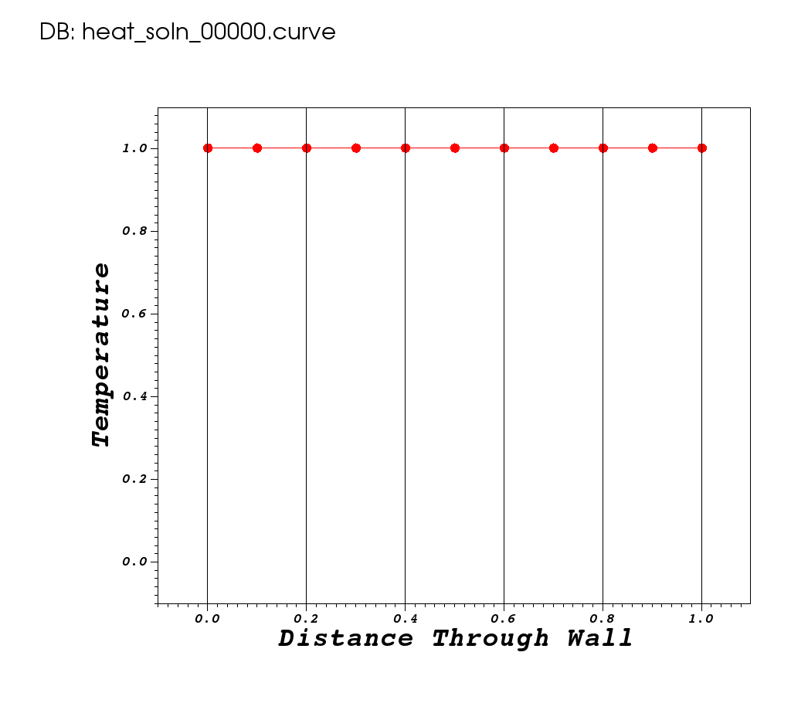
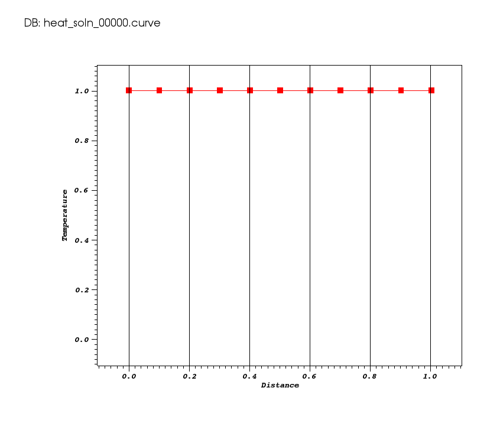

## At a Glance

* **Questions** are the those things we want learners to know the answers to by the end of the lesson.
We don't have to list all possible questions here...only the two or three _most_ important.
* **Objectives** are those things we want learners to actually do or observe during the lesson. Again,
only list here the ones that are _most_ important.
* **Key Points** are those things we want learners to take-away from the lesson.

A lesson can have any number of these but its best to keep the number small and its ok to have only
one of each.

|Questions|Objectives|Key Points|
|Key question #1?|Objective #1|Key point #1|
|Key question #2?|Objective #2|Key point #2|
|Key question #3?|Objective #3|Key point #3|

Example...

|Questions|Objectives|Key Points|
|1. What is a numerical algorithm?|Understand performance metrics|HPC numerical software involves complex<br>algorithms and data structures|
|2. What is discretization?|Understand algorithmic trade-offs|Robust software requires significant<br>software quality engineering (SQE).|
|What is stability?|Understand value of software packages|Numerical packages simplify application development,<br>offer efficient & scalable performance,<br>and enable app-specific customization.|

### To begin this lesson

* [Open the Answers Form](https://docs.google.com/forms/d/e/1FAIpQLSet4PY6wpTjGwAbo-fywgo7muexTE_Q9blWBMTBVV0vVwzejQ/viewform?usp=sf_link){:target="_blank"}

## The Problem Being Solved

Describe the problem(s) that will be solved in this lesson.
If possible, include a picture or graphic here describing the physical problem setup. If the application
or tool being used can deal with a variety of input physical problems, its fine to mention
that but here just include a cool or motivating picture of the problem they will be running in the _runs_
below. Maybe include the equation(s) being solved as well.

Including [LaTeX](https://www.latex-project.org)
equations is easy. Below are examples of block-displayed equations. Introduce and terminate
equations with the `$$` delimiter like so..
```
$$\frac{\partial u}{\partial t} = \alpha \frac{\partial^2 u}{\partial x^2}$$
```
which yields

$$\frac{\partial u}{\partial t} = \alpha \frac{\partial^2 u}{\partial x^2}$$

Surround equations with blank lines to format them is independent paragraphs. Otherwise,
they will be rendered in-line with the current paragraph.


If you want to refer to the equation in text, add a label like so...

```
$$\label{foo} \frac{\partial u}{\partial t} = \alpha \frac{\partial^2 u}{\partial x^2}$$
```

Now, you can refer to the a labeled equation like so, using `see \ref{foo}`.

Equations are automatically numbered and references are updated when the pages are
regenerated.

## The Example Source Code

Describe the application, its command-line arguments, have a link to view the actual source code
or, if you prefer, include snipits of the source code here in a code-highlighted box as below

```c++
Geometry::~Geometry()
{
   for (int i = 0; i < NumGeom; i++)
   {
      delete PerfGeomToGeomJac[i];
      delete GeomVert[i];
   }
}
```

## Running the Example

### Run 1 (Problem Name)

Give the command-line to run the example

#### Expected Behavior/Output

Include here what learner should expect to happen

* How long might it take to run
* How long might they have to wait for resources before it can run
* What should they seen on their terminal

#### Examining Results

Include here examples of either plots or data you expect learners to observe.



Or, if you need to control the size, or have multiple images next to each other
use a Markdown table and raw html...

|||

**Note:** You can create [gif animations](https://www.tjhsst.edu/~dhyatt/supercomp/n401a.html)
with ImageMagick tool available on most systems as `convert` command as in...

```
convert -delay 20 -loop 0 image*.<ext> animation.gif
```



Alternatively, you can upload videos to YouTube and embed them here

<iframe width="560" height="315" src="https://www.youtube.com/embed/bsSFYrDXK0k" frameborder="0" allowfullscreen></iframe>

#### Question and Answer Boxes

We use a custom [Liquid](https://shopify.github.io/liquid/) include macro to handle
question and answer boxes. To use it...


```liquid

```


Be sure, however, not to include any single quote characters (e.g. apostrophe) in the string
assigned to either parameter.

You may include standard [GitHub Markdown](https://guides.github.com/features/mastering-markdown/)
styling within the quoted text to both the _question_ and _answer_ parameters of the Liquid
include macro.

which then renders as...


---

### Run 2 (Problem Name)

#### Expected Behavior/Output

#### Examining Results

Include here examples of either plots or data you expect learners to observe.

#### Questions





---

### Run 3

#### Expected Behavior/Output

#### Examining Results

Include here examples of either plots or data you expect learners to observe.

#### Questions





---

## Out-Brief

Here, re-emphasize the lesson objectives and key points.

Its fine to go into greater detail about questions or objectives this lesson
did not fully cover.

### Further Reading

Include links to other online sources you might want to include.
