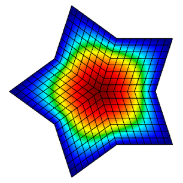
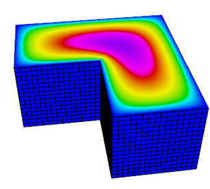
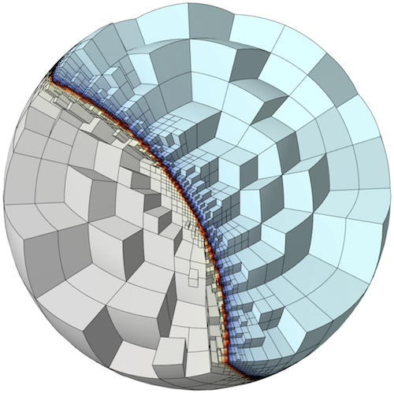

## At A Glance

|Questions|Objectives|Key Points|
|What is a finite element method?|Understand basic finite element machinery.|Basis functions determine<br>the quality of the solution.|
|What is a high order method?|Understand how polynomial<br>order affects simulations.|High order methods add more<br>unknowns on the same mesh<br>for more precise solutions.|
|What is _convergence_?|Understand how convergence and<br>convergence rate are calculated.|High order methods converge<br>faster for smooth solutions.|

**Note:** To begin this lesson...
- [Open the Answers Form](https://docs.google.com/forms/d/e/1FAIpQLScs9reOCfuD1CfbQ-m458MDyvwiTCRXEcp1XCQukaf5tP_uSQ/viewform?usp=sf_link){:target="_blank"}
- Get into the directory containing the MFEM [convergence](https://github.com/mfem/mfem/blob/atpesc-dev/examples/atpesc/mfem/convergence.cpp) example:
```
cd {{site.handson_root}}/mfem_convergence
```

## A Widely Applicable Equation

In this lesson, we demonstrate the discretization of a simple Poisson problem using
the [MFEM library](http://mfem.org) and examine the finite element approximation error
under uniform refinement. An example of this equation is steady-state [heat](../hand_coded_heat/)
[conduction](../time_integrators/).

|[](ex8.png)| [](diffusion.png)|

### Governing Equation

The [_Poisson Equation_](https://en.wikipedia.org/wiki/Poisson's_equation) is a partial
differential equation (PDE) that can be used to model steady-state heat conduction,
electric potentials and gravitational fields. In mathematical terms ...

$$-\nabla^2u = f$$

where _u_ is the potential field and _f_ is the source function. This PDE is a generalization
of the [_Laplace Equation_](https://en.wikipedia.org/wiki/Laplace%27s_equation).

### Finite Element Basics

To solve the above continuous equation using computers we need to
[discretize](https://en.wikipedia.org/wiki/Discretization) it by introducing a finite
(discrete) number of unknowns to compute for.
In the [_Finite Element Method_](https://en.wikipedia.org/wiki/Finite_element_method) (FEM), this is
done using the concept of _basis functions_.

Instead of calculating the exact analytic solution _u_, consider approximating it by

$$u \approx \sum_{j=1}^n c_j \phi_j$$

where $$c_j$$ are scalar unknown coefficients and $$\phi_j$$ are known _basis functions_.
They are typically piecewise-polynomial functions which are only non-zero on small portions of the
computational mesh.

|[](phi.png)|

With finite elements, the mesh can be totally unstructured, curved and
non-conforming.

|[](mesh.png)|

To solve for the unknown coefficients, we multiply Poisson's equation by another (test)
basis function $$\phi_i$$ and integrate by parts to obtain

$$\sum_{j=1}^n\int_\Omega c_j \nabla \phi_j \cdot \nabla \phi_i dV = \int_\Omega f \phi_i$$

for every basis function $$\phi_i$$. (Here we are assuming homogeneous Dirichlet boundary
conditions corresponding, for example, to zero temperature on the whole boundary.)

Since the basis functions are known, we can rewrite (3) as

$$\mathbf{Ax} = \mathbf{b}$$

where

$$A_{ij} = \int_\Omega \nabla \phi_i \cdot \nabla \phi_j dV$$

$$b_i = \int_\Omega f \phi_i dV$$

$$x_j = c_j$$


This is a $$n \times n$$ linear system that can be solved [directly](../superlu_mfem/) or
[iteratively](../krylov_amg/) for the unknown coefficients. Note that we are free
to choose the basis functions $$\phi_i$$ as we see fit.

---

## Convergence Study Source Code

The `mfem_convergence/` directory contains the `convergence.cpp` source code for solving the
Poisson problem using a variety of grids and orders. You can also view the code online on
[GitHub](https://github.com/mfem/mfem/blob/atpesc-dev/examples/atpesc/mfem/convergence.cpp).

To define the system we need to solve, we need three things. First, we need to define our
basis functions which live on the computational mesh.

```cpp
   // order is the FEM basis functions polynomial order
   FiniteElementCollection *fec = new H1_FECollection(order, dim);

   // pmesh is the parallel computational mesh
   ParFiniteElementSpace *fespace = new ParFiniteElementSpace(pmesh, fec);
```

This defines a collection of H1 functions (meaning they have well-defined gradient) of
a given polynomial order on a parallel computational mesh `pmesh`. Next, we need to define
the integrals in Equation (5)

```cpp
   ParBilinearForm *a = new ParBilinearForm(fespace);
   ConstantCoefficient one(1.0);
   a->AddDomainIntegrator(new DiffusionIntegrator(one));
   a->Assemble();
```

and Equation (6)

```cpp
   // f_exact is a C function defining the source
   FunctionCoefficient f(f_exact);
   ParLinearForm *b = new ParLinearForm(fespace);
   b->AddDomainIntegrator(new DomainLFIntegrator(f));
   b->Assemble();
```

This defines the matrix A and the vector b. We then solve the linear
system for our solution vector x using [AMG-preconditioned](../krylov_amg/) PCG iteration.

```cpp
   // FEM -> Linear System
   HypreParMatrix A;
   Vector B, X;
   a->FormLinearSystem(ess_tdof_list, x, *b, A, X, B);

   // AMG preconditioner
   HypreBoomerAMG *amg = new HypreBoomerAMG(A);
   amg->SetPrintLevel(0);

   // PCG Krylov solver
   HyprePCG *pcg = new HyprePCG(A);
   pcg->SetTol(1e-12);
   pcg->SetMaxIter(200);
   pcg->SetPrintLevel(0);
   pcg->SetPreconditioner(*amg);

   // Solve the system A X = B
   pcg->Mult(B, X);

   // Linear System -> FEM
   a->RecoverFEMSolution(X, *b, x);
```

In this lesson we know what the exact solution is, so we can measure the amount of
error in our approximate solution in two ways:

$$\left \| u_{\mbox{exact}} - u_{\mbox{h}} \right \|_{L_2}^2 = \int_\Omega \left| u_{\mbox{exact}} - u_{\mbox{h}} \right |^2$$

$$\left \| u_{\mbox{exact}} - u_{\mbox{h}} \right \|_{H^1}^2 = \left \| u_{\mbox{exact}} - u_{\mbox{h}} \right \|_{L_2}^2 + \left \| \nabla u_{\mbox{exact}} - \nabla u_{\mbox{h}} \right \|_{L_2}^2$$

We expect the error to behave like

$$\left \| u_{\mbox{exact}} - u_{\mbox{h}} \right \|_{L_2} \leq Ch^{r}$$

where $$h$$ is the mesh size, $$C$$ is a mesh-independent constant and $$r$$
is the [_convergence rate_](https://en.wikipedia.org/wiki/Rate_of_convergence).

Given approximations at two different mesh resolutions, we can  estimate the convergence rate as
follows ($$C$$ doesn't change when we refine the mesh and compare runs):

$$r \approx \frac{\log\ \frac{ \left \| u_{\mbox{exact}} - u_{h_{\mbox{new}}} \right \|_{L_2}}{\left \| u_{\mbox{exact}} - u_{h_{\mbox{old}}} \right \|_{L_2}}}{ \log \frac{h_{\mbox{new}}}{h_{\mbox{old}}}}$$

In code, this is implemented in a refinement loop as follows:

```cpp
   double l2_err = x.ComputeL2Error(u);
   double h1_err = x.ComputeH1Error(&u, &u_grad, &one, 1.0, 1);
   pmesh->GetCharacteristics(h_min, h_max, kappa_min, kappa_max);

   l2_rate = log(l2_err/l2_err_prev) / log(h_min/h_prev);
   h1_rate = log(h1_err/h1_err_prev) / log(h_min/h_prev);
```

---

## Running the Convergence Study

The convergence study has the following options.

```
./convergence --help

Usage: ./convergence [options] ...
Options:
   -h, --help
	Print this help message and exit.
   -m <string>, --mesh <string>, current value: star.mesh
	Mesh file to use.
   -o <int>, --order <int>, current value: 1
	Finite element order (polynomial degree).
   -sc, --static-condensation, -no-sc, --no-static-condensation, current option: --no-static-condensation
	Enable static condensation.
   -r <int>, --refinements <int>, current value: 4
	Number of total uniform refinements
   -sr <int>, --serial-refinements <int>, current value: 2
	Maximum number of serial uniform refinements
   -f <double>, --frequency <double>, current value: 1
	Set the frequency for the exact solution.
```

### Run 1 (Low order)

In this run, we will examine the error after seven uniform refinements in both the L2 and H1 norms using
first order (linear) basis functions. We use the `star.mesh` 2D mesh file.

```
./convergence -r 7
Options used:
   --mesh star.mesh
   --order 1
   --no-static-condensation
   --refinements 7
   --serial-refinements 2
   --frequency 1
----------------------------------------------------------------------------------------
DOFs            h               L^2 error       L^2 rate        H^1 error       H^1 rate
----------------------------------------------------------------------------------------
31              0.4876          0.3252          0               2.631           0
101             0.2438          0.09293         1.807           1.387           0.9229
361             0.1219          0.02393         1.957           0.7017          0.9836
1361            0.06095         0.006027        1.989           0.3518          0.996
5281            0.03048         0.00151         1.997           0.176           0.999
20801           0.01524         0.0003776       1.999           0.08803         0.9997
82561           0.007619        9.441e-05       2               0.04402         0.9999
```

Note that the L2 error is converging at a rate of 2 while the H1 error is only converging at a rate of 1.

### Run 2 (High order)

Now consider the same run, only we are using 3rd order (cubic) basis functions instead.

```
./convergence -r 7 -o 3
Options used:
   --mesh star.mesh
   --order 3
   --no-static-condensation
   --refinements 7
   --serial-refinements 2
   --frequency 1
----------------------------------------------------------------------------------------
DOFs            h               L^2 error       L^2 rate        H^1 error       H^1 rate
----------------------------------------------------------------------------------------
211             0.4876          0.004777        0               0.118           0
781             0.2438          0.0003178       3.91            0.01576         2.905
3001            0.1219          2.008e-05       3.984           0.001995        2.982
11761           0.06095         1.258e-06       3.997           0.0002501       2.996
46561           0.03048         7.864e-08       4               3.129e-05       2.999
185281          0.01524         4.915e-09       4               3.912e-06       3
739201          0.007619        3.072e-10       4               4.891e-07       3
```

The L2 error is now converging at a rate of 4, and the H1 error is converging at a rate of 3.
This is because the exact solution in these runs is smooth, so higher-order methods
approximate it better.

#### Questions





### Run 3 (3D example)
The previous two runs used a 2D mesh in serial, but the same code can be used to run a 3D problem in parallel.

```
mpiexec -n 4 ./convergence -r 4 -o 2 -m inline-hex.mesh
Options used:
   --mesh inline-hex.mesh
   --order 2
   --no-static-condensation
   --refinements 4
   --serial-refinements 2
   --frequency 1
----------------------------------------------------------------------------------------
DOFs            h               L^2 error       L^2 rate        H^1 error       H^1 rate
----------------------------------------------------------------------------------------
729             0.25            0.001386        0               0.02215         0
4913            0.125           0.0001772       2.967           0.005532        2.002
35937           0.0625          2.227e-05       2.993           0.001377        2.007
274625          0.03125         2.787e-06       2.998           0.0003441       2
```

#### Questions

Experiment with different orders in 2D and 3D.



---

## Out-Brief

We demonstrated the ease of implementing a order- and dimension-independent finite element
code in MFEM. We discussed the basics of the finite element method as well as demonstrated
the effect of the polynomial order of the basis functions on convergence rates.

### Further Reading

For more information, visit the MFEM website, [http://mfem.org](http://mfem.org), including the

- [Features](http://mfem.org/features),
- [Examples](http://mfem.org/examples/),
- [Publications](http://mfem.org/publications/)
- [Finite Elements](http://mfem.org/fem/), and
- [Meshing](http://mfem.org/meshing) pages.

You may also be interested in visiting the websites of the related [GLVis](http://glvis.org),
[CEED](http://ceed.exascaleproject.org), and [BLAST](https://computation.llnl.gov/projects/blast) projects.

---

### Evening Hands On

The evening hands on exercise will be dedicated on getting more experience with MFEM and on reviewing
finite element discretization methods for additional physics.

##### (Bonus #1) Install MFEM + GLVis On Your Laptop
- Follow the building instructions here: [http://mfem.org/building/](http://mfem.org/building/).
- You should be able to download & install serial version of MFEM in 5min (there are no external dependencies).
- Parallel versions of MFEM requires installing hypre and METIS (also discussed above).
- Alternatively, if you already have Spack, you can build with: `spack install mfem glvis`.
- GLVis requires a recent version of XQuartz on Mac laptops.

##### Review And Run Additional Example Codes & Miniapps

MFEM includes a number of well-documented [example codes & miniapps](http://mfem.org/examples) that can be
used as tutorials, as well as simple starting points for user applications.

These examples and miniapps are available in the `mfem/` subdirectory of your copy of
`{{site.handson_root}}/mfem_convergence` or as top-level sub-directories in the MFEM
source code.

The full list of examples is below. Feel free to explore any of them depending on your interests, but we
recommend starting with the ones marked with a "⭐"

 - [Example 1](http://mfem.github.io/doxygen/html/ex1_8cpp_source.html): nodal H1 FEM for the Laplace problem. ⭐
 - [Example 2](http://mfem.github.io/doxygen/html/ex2_8cpp_source.html): vector FEM for linear elasticity.
 - [Example 3](http://mfem.github.io/doxygen/html/ex3_8cpp_source.html): Nedelec H(curl) FEM for the definite Maxwell problem.
 - [Example 4](http://mfem.github.io/doxygen/html/ex4_8cpp_source.html): Raviart-Thomas H(div) FEM for the grad-div problem.
 - [Example 5](http://mfem.github.io/doxygen/html/ex5_8cpp_source.html): mixed pressure-velocity FEM for the Darcy problem.
 - [Example 6](http://mfem.github.io/doxygen/html/ex6_8cpp_source.html): non-conforming adaptive mesh refinement (AMR) for the Laplace problem.
 - [Example 7](http://mfem.github.io/doxygen/html/ex7_8cpp_source.html): Laplace problem on a surface (the unit sphere). ⭐
 - [Example 8](http://mfem.github.io/doxygen/html/ex8_8cpp_source.html): Discontinuous Petrov-Galerkin (DPG) for the Laplace problem.
 - [Example 9](http://mfem.github.io/doxygen/html/ex9_8cpp_source.html): Discontinuous Galerkin (DG) time-dependent advection. ⭐
 - [Example 10](http://mfem.github.io/doxygen/html/ex10_8cpp_source.html): time-dependent implicit nonlinear elasticity. ⭐
 - [Example 11](http://mfem.github.io/doxygen/html/ex11p_8cpp_source.html): parallel Laplace eigensolver.
 - [Example 12](http://mfem.github.io/doxygen/html/ex12p_8cpp_source.html): parallel linear elasticity eigensolver.
 - [Example 13](http://mfem.github.io/doxygen/html/ex13p_8cpp_source.html): parallel Maxwell eigensolver.
 - [Example 14](http://mfem.github.io/doxygen/html/ex14_8cpp_source.html): Discontinuous Galerkin (DG) for the Laplace problem.
 - [Example 15](http://mfem.github.io/doxygen/html/ex15_8cpp_source.html): dynamic AMR for Laplace with prescribed time-dependent source. ⭐
 - [Example 16](http://mfem.github.io/doxygen/html/ex16_8cpp_source.html): time-dependent nonlinear heat equation.
 - [Example 17](http://mfem.github.io/doxygen/html/ex17_8cpp_source.html): Discontinuous Galerkin (DG) for linear elasticity.
 - [Example 18](http://mfem.github.io/doxygen/html/ex18_8cpp_source.html): Discontinuous Galerkin (DG) for the Euler equations.
 - [Example 19](http://mfem.github.io/doxygen/html/ex19_8cpp_source.html): incompressible nonlinear elasticity.

Most of the examples have a serial and a parallel version, illustrating the ease of transition and the minimal code changes between the two.

Many of the examples also have modifications that take advantage of optional third-party libraries such as [PETSc](http://mfem.github.io/doxygen/html/petsc_8hpp.html), [SUNDIALS](http://mfem.github.io/doxygen/html/sundials_8hpp.html) and [PUMI](http://mfem.github.io/doxygen/html/pumi_8hpp.html).

Beyond the examples, a number of miniapps are available that are more representative of the advanced usage of the library in physics/application codes. Some of the included miniapps are:

 - [Volta](http://mfem.github.io/doxygen/html/volta_8cpp_source.html): simple electrostatics simulation code.
 - [Tesla](http://mfem.github.io/doxygen/html/tesla_8cpp_source.html): simple magnetostatics simulation code.
 - [Maxwell](http://mfem.github.io/doxygen/html/maxwell_8cpp_source.html): transient electromagnetics simulation code.
 - [Joule](http://mfem.github.io/doxygen/html/joule_8cpp_source.html): transient magnetics and Joule heating miniapp.
 - [Shaper](http://mfem.github.io/doxygen/html/shaper_8cpp.html): resolve material interfaces by mesh refinement. ⭐
 - [Mesh Explorer](http://mfem.github.io/doxygen/html/mesh-explorer_8cpp_source.html): visualize and manipulate meshes.
 - [Mesh Optimizer](http://mfem.github.io/doxygen/html/mesh-optimizer_8cpp_source.html): optimize high-order meshes.

In addition, the sources for several external benchmark/proxy-apps build on top of MFEM are available:

- [Laghos](https://github.com/CEED/Laghos): high-order Lagrangian hydrodynamics miniapp. ⭐
- [Mulard](https://codesign.llnl.gov/mulard.php): multigroup thermal radiation diffusion mini application.

##### (Bonus #2) Create Your Own Simple Simulation

Modify the miniapps and example codes, either in your local copy on Cooley, or on your laptop to
create a simple simulation of your own. In both cases you should be able to edit the source code
and rebuild the binary simply with `make`.

For example, you can solve a steady-state [heat conduction](../hand_coded_heat/) problem in 2D
and 3D using the `shaper` miniapp (modified for the cable shape) to define the mesh and `ex1`
or `ex1p` to solve it (modified to include separate coefficients for air and cable).

*We want to see your creativity -- the best simulations will enter for a chance to be
featured on MFEM's [gallery](http://mfem.org/gallery/) page!*

Please consult the MFEM [code documentation](http://mfem.github.io/doxygen/html/index.html) and
don't hesitate to ask if you have any implementation questions.

#### To Get Credit / Points

To get points, please submit screenshots, simulation images and any additional material you have
generated via _[Show Your Work](https://goo.gl/forms/B7UFpBvEOJbC58oJ2)_
using the hands-on activity name `MFEM_HandsOn`.
