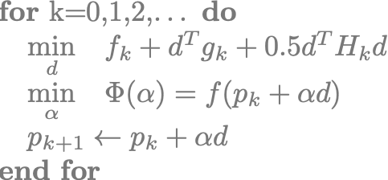
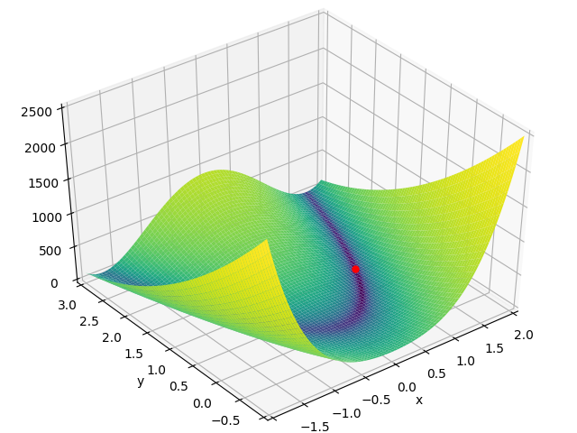

## At a Glance

|**Questions**|**Objectives**|**Key Points**|
|1. What is optimization?|Understand the basic principles|Optimization seeks the inputs of a function that minimizes it|
|2. Why use gradient-based methods?|Learn about trade-offs in algorithm choice|Gradient-based methods find local minimums with the fewest number of function evaluations|
|3. How can we compute gradients?|Evaluate different sensitivity analysis methods|Applications should provide analytical gradients whenever they can|

**Note:** To run the application in this lesson
```
cd {{site.handson_root}}/multidim_rosenbrock_tao
make multidim_rosenbrock
./multidim_rosenbrock -tao_monitor
```

## Brief Introduction to Optimization

Optimization algorithms seek to find the input variables or parameters (referred to as "control", 
"design" or "optimization" variables) that minimize (or maximize) a function of interest.

$$
\underset{p}{\text{minimize}} \quad f(p),
$$

where $$p \in \mathbb{R}^n$$ are the optimization variables and $$f(p): \mathbb{R}^{n} \rightarrow \mathbb{R}$$ is the 
objective function. In this lesson, we focus on gradient-based optimization methods -- methods that utilize information 
about the sensitivity of the objective function with respect to its inputs. 

Solutions to this problem are found where the gradient of the objective function is zero, $$\nabla_p f(p) = 0$$. 
However, this is only a *necessary* but not sufficient condition for optimality given that other stationary points 
(e.g. maxima) also satisfy this condition.

## Sequential Quadratic Programming

To find local minima for the above problems, we replace the original problem with a sequence of quadratic subproblems,

$$
\underset{d}{\text{minimize}} \quad f_k + d^Tg_k + \frac{1}{2}d^TH_kd^T,
$$

where $$g_k = \nabla_p f(p_k)$$ is the gradient, $$H_k = \nabla_p^2 f(p_k)$$ is the Hessian, $$d \in \mathbb{R}^n$$ is 
the search direction, and the $$k$$ subscript denotes evaluation at the iterate $$p_k$$. The exact solution to this 
quadratic subproblem is the inversion of the Hessian onto the negative gradient, $$d = -H_k^{-1} g_k$$. This can also be viewed as the application of the Newton root-finding method to the system of nonlinear equations defined by the optimality condition $$\nabla_p f(p) = 0$$.

In order to avoid non-minimum stationary points, we also seek to find a step length $$\alpha$$ that approximately 
minimizes the objective function along the line defined by the search direction,

$$
\underset{\alpha}{\text{minimize}} \quad \Phi(\alpha) = f(p_k + \alpha d).
$$

This scalar minimization problem is called a "line search", and is categorized as a "globalization" method because it helps 
maintain consistency between the local quadratic model and the global nonlinear function.

The SQP class of algorithms can be summarized with the pseudocode:

{:width="25%"}

In this approach, different approximations to the search direction solution yield different members of the SQP family:

+ **Truncated Newton:** $$d = -H_k^{-1} g_k$$ with Hessian inverted iteratively (e.g. Krylov methods) using dynamic tolerances
+ **Quasi-Newton:** $$d = -B_k g_k$$ where $$B_k \approx H_k^{-1}$$ with low-rank updates based on the Secant condition
+ **Conjugate Gradient:** $$d_k = -g_k + \beta d_{k-1}$$ with $$\beta$$ defining different CG update formulas
+ **Gradient Descent:** $$d = g_k$$ with Hessian replaced with the identity matrix

Further variations exist in combination with other globalization methods such as trust region and filter methods. In 
the present lecture, however, we only consider line search versions.

<div style="border: solid #8B8B8B 2px; padding: 10px;">
<details>
<summary><h4 style="margin: 0 0 0 0; display: inline">Notes on PDE-constrained Optimization (Click to expand!)</h4></summary>

Oftentimes we are interested in solving optimization problems where the evaluation of the objective function depends on 
the solution of a partial-differential-equation (PDE). These problems are represented in the most general case by

$$
\underset{p, u}{\text{minimize}} \quad f(p, u) \quad \text{subject to} \quad R(p, u) = 0,
$$

where $$u \in \mathbb{R}^m$$ are the state or solution variables for the PDE and 
$$R: \mathbb{R}^{n+m} \rightarrow \mathbb{R}^m$$ are the state equations (e.g. discretized PDE residual).

A common and convenient way to recast this problem is to represent the state variables as implicit functions of the 
optimization variables,

$$
\underset{p}{\text{minimize}} \quad f(p, u(p)).
$$

This eliminates the PDE constraint, converting the problem to an unconstrained version that can be solved by many 
popular unconstrained optimization algorithms. This comes at the cost of performing a complete PDE solution for every 
evaluation of the objective function, as well as an adjoint solution to efficiently compute gradients.

For more detail on PDE-constrained optimization, please refer to the <a href="https://xsdk-project.github.io/MathPackagesTraining/lessons/boundary_control_tao/">"Boundary Control with PETSc/TAO and AMReX" 
lecture from ATPESC 2019</a>.
</details>
</div>

## Sensitivity Analysis


## Using TAO

Toolkit for Advanced Optimization (TAO) is a package of optimization algorithms and tools developed at Argonne National 
Laboratory and distributed with the [Portable Extensible Toolkit for Scientific Computing (PETSc)][4] library. It is 
primarily intended for continuous gradient-based optimization, and supports PDE-constrained problems using the 
reduced-space formulation.

Below is a TAO main file template that can be adapted to any PDE-constrained problem:

```c
#include "petsc.h"

typedef struct {
  int n; /* number of optimization variables */
} AppCtx;

PetscErrorCode FormFunction(Tao tao, Vec P, PetscReal *fcn, void *ptr)
{
  PetscErrorCode ierr;
  AppCtx *user = (AppCtx*)ptr;

  /* Compute the objective function at point P and store in fcn */

  return 0;
}

PetscErrorCode FormGradient(Tao tao, Vec P, Vec G, void *ptr)
{
  PetscErrorCode ierr;
  AppCtx *user = (AppCtx*)ptr;

  /* Compute the gradient at point P and store in vector G */

  return 0;
}

PetscErrorCode FormHessian(Tao tao, Vec P, Mat H, Mat Hpre, void *ptr)
{
  PetscErrorCode ierr;
  AppCtx *user = (AppCtx*)ptr;

  /* Compute the Hessian at point P and store in matrix H */
  /* Note: Hpre is an OPTIONAL preconditioner for inverting the Hessian */

  return 0;
}

int main(int argc, char *argv[])
{
  PetscErrorCode ierr;
  AppCtx user;
  Tao tao;
  Vec X;
  Mat H;

  /* Initialize the PETSc library */
  ierr = PetscInitialize( &argc, &argv, (char *)0, (char *)0);if (ierr) return ierr;

  /* Create solution vector and Hessian matrix */
  ierr = VecCreate(PETSC_COMM_WORLD, &X);CHKERRQ(ierr);
  ierr = VecSetSizes(X, PETSC_DECIDE, user.n);CHKERRQ(ierr);
  ierr = VecSet(X, 0.0);CHKERRQ(ierr);
  ierr = MatCreate(PETSC_COMM_WORLD, &H);CHKERRQ(ierr);
  ierr = MatSetSizes(H, PETSC_DECIDE, PETSC_DECIDE, user.n, user.n);CHKERRQ(ierr);
  ierr = MatSetUp(H);CHKERRQ(ierr);

  /* Create Tao solver and configure */
  ierr = TaoCreate(PETSC_COMM_WORLD, &tao);CHKERRQ(ierr);
  ierr = TaoSetType(tao, TAOBQNLS);CHKERRQ(ierr);
  ierr = TaoSetInitialVector(tao, X);CHKERRQ(ierr);
  ierr = TaoSetObjectiveRoutine(tao, FormFunction, &user);CHKERRQ(ierr);
  ierr = TaoSetGradientRoutine(tao, FormGradient, &user);CHKERRQ(ierr);
  ierr = TaoSetHessianRoutine(tao )
  ierr = TaoSetFromOptions(tao);CHKERRQ(ierr);

  /* Trigger the solution */
  ierr = TaoSolve(tao);CHKERRQ(ierr);

  /* Clean up PETSc objects and finalize */
  ierr = VecDestroy(&X);CHKERRQ(ierr);
  ierr = MatDestroy(&H);CHKERQ(ierr);
  ierr = TaoDestroy(&tao);CHKERRQ(ierr);
  ierr = PetscFinalize();

  return 0;
}
```

TAO calls the user-provided ``FormFunction()``, ``FormGradient()`` and ``FormHessian()`` routine whenever the 
optimization algorithm needs to evaluate the objective, its gradient and Hessian. The ``AppCtx`` structure contains 
any data the user has to preserve and propagate through for these computations.

Applications where it is more efficient to evaluate the objective function together with the gradient can use 
an alternative ``TaoSetObjectiveAndGradientRoutine()`` interface to provide TAO a single ``FormFunctionGradient()`` 
callback that evaluates both at the same time.

TAO implements several bound-constrained algorithm types that can also solve unconstrained problems when there are no 
bounds defined in the problem setup. Algorithm types can be changed either via the `TaoSetType()` interface using the 
solver names given in the first column below, or changed at runtume with the option flag `-tao_type <solver>` using the 
string arguments given in the second column.

|**Solver Type**|**Option Flag**|**Description**|
|`TAOBNLS`|`bnls`|Bound-constrained Newton Line Search|
|`TAOBNTR`|`bntr`|Bound-constrained Newton Trust Region|
|`TAOBQNLS`|`bqnls`|Bound-constrained Quasi-Newton Line Search|
|`TAOBNCG`|`bncg`|Bound-constrained Nonlinear Conjugate Gradient|

The TAO solution can also be configured with additional runtime flags and corresponding code interfaces shown below.

|**Option Flag**|**Code API**|**Description**|
|`-tao_monitor`|`TaoSetMonitor()` with `TaoMonitorDefault()`|Enable the iteration monitor for the solution|
|`-tao_view`|`TaoView()`|Display useful information about the solution after completion|
|`-tao_max_it <integer>`|`TaoSetMaximumIterations()`|Change the maximum iteration limit|
|`-tao_max_funcs <integer>`|`TaoSetMaximumFunctionEvaluations()`|Change the maximum number of function evaluations|
|`-tao_gatol <float>`|`TaoSetTolerances()`|Change the absolute convergence tolerance|
|`-tao_test_gradient`|`TaoTestGradient()`|Validate the analytical gradient with finite differences at every iteration|
|`-tao_test_hessian`|`TaoTestHessian()`|Validate the analytical Hessian with finite differences at every iteration|

## Example Problem: Multidimensional Rosenbrock



[The Rosenbrock function][1], also called a "banana function", is a canonical nonconvex test problem created by 
Howard H. Rosenbrock in 1960 and used extensively to evaluate the performance of optimization algorithms. The 
original function is defined as

$$
f(p_1, p_2) = (1 - p_1)^2 + 100(p_2 - p_1^2)^2,
$$

with a global minimum at $$(1, 1)$$.

In this lecture, we will be using a multidimensional generalization of this problem is given by

$$
f(p) = f(p_1, p_2, \dots, p_N) = \sum_{i=1}^{N-1} \left[ (1 - p_i)^2 + 100(p_{i+1} - p_i^2)^2 \right],
$$

with a global minimum at $$p_i = 1$$.

<div style="border: solid #8B8B8B 2px; padding: 10px;">
<details>
<summary><h4 style="margin: 0 0 0 0; display: inline">Gradient and Hessian Definitions (Click to expand!)</h4></summary>
The gradient of the multidimensional Rosenbrock problem is given as

$$
\frac{df}{dp_1} = -400p_1(p_2 - p_1^2) -2(1 - p_1),
$$

$$
\frac{df}{dp_j} = 200(p_j - p_{j-1}^2) - 400p_j(p_{j+1} - p_j^2) - 2(1 - p_j) \quad \forall \; j = 2, 3, \dots, N-1,
$$

$$
\frac{df}{dp_N} = 200(p_N - p_{N-1}^2).
$$

The Hessian is a tridiagonal sparse matrix with nonzero elements given as

$$
\frac{d^2f}{dp_1^2} = 1200p_1^2 - 400p_2 + 2,
$$

$$
\frac{d^2f}{dp_i dp_{i-1}} = -400p_{i-1} \quad \forall \; i= 2, 3, \dots, N-1,
$$

$$
\frac{d^2f}{dp_i dp_i} = 202 + 1200p_i^2 - 400p_{i+1} \quad \forall \; i= 2, 3, \dots, N-1,
$$

$$
\frac{d^2f}{dp_i dp_{i+1}} = -400p_i \quad \forall \; i= 2, 3, \dots, N-1,
$$

$$
\frac{d^2f}{dp_N^2} = 200.
$$
</details>
</div>

The hands-on example implements the multidimensional Rosenbrock with an analytical gradient and Hessian. However, 
TAO also provides [``TaoDefaultComputeGradient()``][2] and [``TaoDefaultComputeHessian()``][3] callbacks that utilize finite-differencing to generate the required sensitivities.

Get the [makefile](makefile) and [source](multidim_rosenbrock.c) files. Making sure that the `PETSC_DIR` and 
`PETSC_ARCH` environment variables are set correctly, compile and run the problem as below to solve the default 2-dimensional case.
```
$ make multidim_rosenbrock
$ ./multidim_rosenbrock -tao_monitor
  0 TAO,  Function value: 1.,  Residual: 2. 
  1 TAO,  Function value: 0.774343,  Residual: 6.13432 
  2 TAO,  Function value: 0.650088,  Residual: 3.17699 
  3 TAO,  Function value: 0.559353,  Residual: 5.42469 
  4 TAO,  Function value: 0.3851,  Residual: 3.23695 
  5 TAO,  Function value: 0.282163,  Residual: 1.71921 
  6 TAO,  Function value: 0.244212,  Residual: 4.48633 
  7 TAO,  Function value: 0.13797,  Residual: 7.96088 
  8 TAO,  Function value: 0.0828213,  Residual: 0.422896 
  9 TAO,  Function value: 0.0552284,  Residual: 0.722561 
 10 TAO,  Function value: 0.0387923,  Residual: 2.7757 
 11 TAO,  Function value: 0.0245732,  Residual: 3.24021 
 12 TAO,  Function value: 0.00930132,  Residual: 0.106282 
 13 TAO,  Function value: 0.00549438,  Residual: 2.74682 
 14 TAO,  Function value: 0.00220124,  Residual: 0.288169 
 15 TAO,  Function value: 0.000797288,  Residual: 0.138221 
 16 TAO,  Function value: 0.000118687,  Residual: 0.447673 
 17 TAO,  Function value: 7.30857e-06,  Residual: 0.0158896 
 18 TAO,  Function value: 4.98542e-08,  Residual: 0.00401749 
 19 TAO,  Function value: 3.33403e-11,  Residual: 0.000194926 
 20 TAO,  Function value: 7.51502e-15,  Residual: 3.26958e-06 

TaoSolve() time: 0.021143

Solution correct!
```

In this output, the `Residual` indicates the L2-norm of the gradient, $$\|g_k\|_2$$, at every iteration. The problem 
file is configured to terminate the solution when this gradient norm drops below the absolute tolerance of $$10^{-5}$$.

The problem can be modified with various option flags:

|**Option Flag**|**Description**|
|`-n <integer>`|Change the problem size (default: 2)|
|`-fd`|Use finite-difference gradients instead of analytical|

### Hands-on Activities

1. Increase the problem size with the `-n <size>` argument (default size is 2) and evaluate its impact on convergence. 

2. Solve the problem with the finite difference gradient using the `-fd` argument. Change problem size again and 
evaluate both convergence and iteration speed.

3. Change the TAO algorithm to nonlinear conjugate gradient method using `-tao_type bncg` and to truncated Newton 
using `-tao_type bnls`. Compare convergence against the default quasi-Newton method (`-tao_type bqnls`). 

4. Try running the problem in parallel with `mpirun -np <# of processes> ./multidim_rosenbrock ...`. Why does running 
in parallel slow the solution down at small problem sizes? How large should the problem be to observe a speedup in 
parallel runs?

5. Repeat Activity 4 with different TAO algorithms. Are the break-even points for size vs. performance the same?

6. Consider adding bounds to the problem using the ``TaoSetVariableBounds()` interface.

## Take-Away Messages

* PETSc/TAO offers parallel optimization algorithms for large-scale problems.
* Analytical derivatives are ideal for best results.
* Second-order methods don't always achieve faster/better solutions.
* When analytical derivatives are not available, PETSc/TAO can compute gradients automatically with finite differencing.
* PETSc/TAO can validate your analytical derivatives using finite differencing.

## Further Reading

- [PETSc manual](https://www.mcs.anl.gov/petsc/petsc-current/docs/manual.pdf)  
- [TAO manual](https://www.mcs.anl.gov/petsc/petsc-current/docs/tao_manual.pdf)
- [PETSc/TAO website](https://www.mcs.anl.gov/petsc)

## Previous Optimization Lectures
- [ATPESC 2019](https://xsdk-project.github.io/MathPackagesTraining/lessons/boundary_control_tao/)
- [ATPESC 2018](https://xsdk-project.github.io/ATPESC2018HandsOnLessons/lessons/obstacle_tao/)

[1]: https://en.wikipedia.org/wiki/Rosenbrock_function
[2]: https://www.mcs.anl.gov/petsc/petsc-current/docs/manualpages/Tao/TaoDefaultComputeGradient.html)
[3]: https://www.mcs.anl.gov/petsc/petsc-current/docs/manualpages/Tao/TaoDefaultComputeHessian.html)
