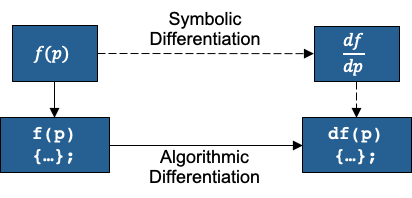

## At a Glance

|**Questions**|**Objectives**|**Key Points**|
|1. What is optimization?|Understand the basic principles|Optimization seeks the inputs of a function that minimizes it|
|2. Why use gradient-based methods?|Learn about trade-offs in algorithm choice|Gradient-based methods find local minima with the fewest number of function evaluations|
|3. How can we compute gradients?|Evaluate different sensitivity analysis methods|Applications should provide analytical gradients whenever they can|

**Note:** To run the application in this lesson
```
cd {{site.handson_root}}/multidim_rosenbrock_tao
make multidim_rosenbrock
./multidim_rosenbrock -tao_monitor
```

## Introduction to Optimization

Optimization algorithms seek to find the input variables or parameters (referred to as "control", 
"design" or "optimization" variables) that minimize (or maximize) a function of interest.

$$
\underset{p}{\text{minimize}} \quad f(p),
$$

where $$p \in \mathbb{R}^n$$ are the optimization variables and $$f(p): \mathbb{R}^{n} \rightarrow \mathbb{R}$$ is the 
objective function. In this lesson, we focus on gradient-based optimization methods -- methods that utilize information 
about the sensitivity of the objective function with respect to its inputs. 

Solutions to this problem are found where the gradient of the objective function is zero, $$\nabla_p f(p) = 0$$. 
However, this is only a *necessary* but not sufficient condition for optimality given that other stationary points 
(e.g., maxima) also satisfy this condition.

### Sequential Quadratic Programming (SQP)

To find local minima for the above problems, we replace the original problem with a sequence of quadratic subproblems,

$$
\underset{d}{\text{minimize}} \quad f_k + d^Tg_k + \frac{1}{2}d^TH_kd^T,
$$

where $$g_k = \nabla_p f(p_k)$$ is the gradient, $$H_k = \nabla_p^2 f(p_k)$$ is the Hessian, $$d \in \mathbb{R}^n$$ is 
the search direction, and the $$k$$ subscript denotes evaluation at the iterate $$p_k$$. The exact solution to this 
quadratic subproblem is the inversion of the Hessian onto the negative gradient, $$d = -H_k^{-1} g_k$$. This can also be viewed as the application of the Newton root-finding method to the system of nonlinear equations defined by the optimality condition $$\nabla_p f(p) = 0$$.

In order to avoid non-minimum stationary points, we also seek to find a step length $$\alpha$$ that approximately 
minimizes the objective function along the line defined by the search direction,

$$
\underset{\alpha}{\text{minimize}} \quad \Phi(\alpha) = f(p_k + \alpha d).
$$

This scalar minimization problem is called a "line search", and is categorized as a "globalization" method because it helps 
maintain consistency between the local quadratic model and the global nonlinear function.

The SQP class of algorithms can be summarized with the pseudocode:

{:width="25%"}

In this approach, different approximations to the search direction solution yield different members of the SQP family:

+ **Truncated Newton:** $$d = -H_k^{-1} g_k$$ with Hessian inverted iteratively (e.g., Krylov methods) using dynamic tolerances
+ **Quasi-Newton:** $$d = -B_k g_k$$ where $$B_k \approx H_k^{-1}$$ with low-rank updates based on the Secant condition
+ **Conjugate Gradient:** $$d_k = -g_k + \beta d_{k-1}$$ with $$\beta$$ defining different CG update formulas
+ **Gradient Descent:** $$d = g_k$$ with Hessian replaced with the identity matrix

Truncated Newton is considered a second-order method because it utilizes full second-order derivative information in 
the solution of the search direction. Meanwhile, Gradient Descent and Conjugate Gradient methods are clear first-order 
methods as they only use the gradient of the objective. The Quasi-Newton method, although technically a first-order 
method, typically exhibits performance closer to Newton's method by utilizing a Secant approximation to estimate 
second-order information.

{::options parse_block_html="true" /}
<div style="border: solid #8B8B8B 2px; padding: 10px;">
<details>
<summary><h4 style="margin: 0 0 0 0; display: inline">Notes on PDE-constrained Optimization (Click to expand!)</h4></summary>
Oftentimes we are interested in solving optimization problems where the evaluation of the objective function depends on 
the solution of a partial-differential-equation (PDE). These problems are represented in the most general case by

$$
\underset{p, u}{\text{minimize}} \quad f(p, u) \quad \text{subject to} \quad R(p, u) = 0,
$$

where $$u \in \mathbb{R}^m$$ are the state or solution variables for the PDE and 
$$R: \mathbb{R}^{n+m} \rightarrow \mathbb{R}^m$$ are the state equations (e.g., discretized PDE residual).

A common and convenient way to recast this problem is to represent the state variables as implicit functions of the 
optimization variables,

$$
\underset{p}{\text{minimize}} \quad f(p, u(p)).
$$

This eliminates the PDE constraint, converting the problem to an unconstrained version that can be solved by many 
popular unconstrained optimization algorithms. This comes at the cost of performing a complete PDE solution for every 
evaluation of the objective function, as well as an adjoint solution to efficiently compute gradients.

For more detail on PDE-constrained optimization, please refer to the 
<a href="https://xsdk-project.github.io/MathPackagesTraining/lessons/boundary_control_tao/">"Boundary Control with 
PETSc/TAO and AMReX" lecture from ATPESC 2019</a>.
</details>
</div>
{::options parse_block_html="false" /}

### Sensitivity Analysis

Sequential Quadratic Programming is a gradient-based approach -- i.e., it uses information about the sensitivity of the 
objective function output to changes in the input (optimization) parameters to iteratively search for the nearest local 
minimum. In order to use SQP algorithms, the applications must, at minimum, provide first-order derivative information.

In the broadest sense, there are two generalized ways to compute gradients.

**Numerical Differentiation** approximates the derivative of a function using numerical methods. In the current 
lecture, we will evaluate the finite difference (FD) method and specifically use the forward difference formulation 
given by

$$
\frac{df}{dp_i} = \frac{f(p + he_i) + f(p)}{h} + \mathcal{O}(h) \quad \forall \; i = 1, 2, \dots, N,
$$

where $$h$$ is the finite perturbation, $$e_i$$ is the standard basis vector for the $$i^{th}$$ coordinate, and 
$$\mathcal{O}(h)$$ is truncation error for the approximation.

The FD method allows us to compute the gradient for any function easily, using only the function output, without 
requiring information about the function itself. However, computing each element of the gradient requires a separate 
function evaluation, causing the computational cost of the method to scale up rapidly with increasing problem sizes.

Furthermore, the FD method also presents a step size dilemma in choosing the numerical magnitude of the perturbation 
$$h$$. The step size must be chosen sufficiently small to minimize truncation error, but also sufficiently large to 
ensure that subtractive cancellation error does not dominate. Since this cancellation error is problem-dependent, 
the ideal value of $$h$$ differs for each application and may leave the user no choice but to accept the presence of 
a large error in the gradient.

**Analytical Differentiation** computes the exact derivative by generating a stand-alone mathematical or algorithmic 
expression for the gradient.



For simpler problems with objective functions that have human-readable closed-form expressions, this approach can be 
thought of as manually differentiating the expression on paper and implementing a dedicated subroutine to evaluate it. 
Although the hands-on example problem below is implemented with this approach, it is not suitable for most real-world 
applications. Practical problems in many scientific disciplines are too complex to be differentiated by hand.

For problems where the objective function depends on a complex subroutine (e.g., the discretized residual for a partial 
differential equation), algorithmic or automatic differentiation (AD) applies the chain rule to the sequence of 
elementary operations performed by the function. This is typically done with an AD tool that transforms the source code 
to generate a new subroutine for the derivative before compile time, or an AD library that overloads the elementary 
operations in the source code at compile time to generate compiled code for the derivative.

This approach produces accurate gradients at a computational cost that is largely insensitive to the size of the 
optimization problem. However, the FD methods remain an easy alternative for rapid prototyping and testing, especially 
when the problem size is small and objective function evaluations are not expensive.

## Using TAO

Toolkit for Advanced Optimization (TAO) is a package of optimization algorithms and tools developed at Argonne National 
Laboratory and distributed with the [Portable Extensible Toolkit for Scientific Computing (PETSc)][4] library. TAO is 
primarily intended for continuous gradient-based optimization and supports PDE-constrained problems using the 
reduced-space formulation.

Below is a TAO main file template that can be adapted to any gradient-based optimization problem:

```c
#include "petsc.h"

typedef struct {
  int n; /* number of optimization variables */
} AppCtx;

PetscErrorCode FormFunction(Tao tao, Vec P, PetscReal *fcn, void *ptr)
{
  PetscErrorCode ierr;
  AppCtx *user = (AppCtx*)ptr;

  /* Compute the objective function at point P and store in fcn */

  return 0;
}

PetscErrorCode FormGradient(Tao tao, Vec P, Vec G, void *ptr)
{
  PetscErrorCode ierr;
  AppCtx *user = (AppCtx*)ptr;

  /* Compute the gradient at point P and store in vector G */

  return 0;
}

PetscErrorCode FormHessian(Tao tao, Vec P, Mat H, Mat Hpre, void *ptr)
{
  PetscErrorCode ierr;
  AppCtx *user = (AppCtx*)ptr;

  /* Compute the Hessian at point P and store in matrix H */
  /* Note: Hpre is an OPTIONAL preconditioner for inverting the Hessian */

  return 0;
}

int main(int argc, char *argv[])
{
  PetscErrorCode ierr;
  AppCtx user;
  Tao tao;
  Vec X;
  Mat H;

  /* Initialize the PETSc library */
  ierr = PetscInitialize( &argc, &argv, (char *)0, (char *)0);if (ierr) return ierr;

  /* Create solution vector and Hessian matrix */
  ierr = VecCreate(PETSC_COMM_WORLD, &X);CHKERRQ(ierr);
  ierr = VecSetSizes(X, PETSC_DECIDE, user.n);CHKERRQ(ierr);
  ierr = VecSet(X, 0.0);CHKERRQ(ierr);
  ierr = MatCreate(PETSC_COMM_WORLD, &H);CHKERRQ(ierr);
  ierr = MatSetSizes(H, PETSC_DECIDE, PETSC_DECIDE, user.n, user.n);CHKERRQ(ierr);
  ierr = MatSetUp(H);CHKERRQ(ierr);

  /* Create Tao solver and configure */
  ierr = TaoCreate(PETSC_COMM_WORLD, &tao);CHKERRQ(ierr);
  ierr = TaoSetType(tao, TAOBQNLS);CHKERRQ(ierr);
  ierr = TaoSetInitialVector(tao, X);CHKERRQ(ierr);
  ierr = TaoSetObjectiveRoutine(tao, FormFunction, &user);CHKERRQ(ierr);
  ierr = TaoSetGradientRoutine(tao, FormGradient, &user);CHKERRQ(ierr);
  ierr = TaoSetHessianRoutine(tao )
  ierr = TaoSetFromOptions(tao);CHKERRQ(ierr);

  /* Trigger the solution */
  ierr = TaoSolve(tao);CHKERRQ(ierr);

  /* Clean up PETSc objects and finalize */
  ierr = VecDestroy(&X);CHKERRQ(ierr);
  ierr = MatDestroy(&H);CHKERQ(ierr);
  ierr = TaoDestroy(&tao);CHKERRQ(ierr);
  ierr = PetscFinalize();

  return 0;
}
```

TAO calls the user-provided ``FormFunction()``, ``FormGradient()`` and ``FormHessian()`` routine whenever the 
optimization algorithm needs to evaluate the objective, its gradient and Hessian. The ``AppCtx`` structure contains 
any data the user has to preserve and propagate through for these computations.

Applications where it is more efficient to evaluate the objective function together with the gradient can use 
an alternative [``TaoSetObjectiveAndGradientRoutine()``][5] interface to provide TAO a single ``FormFunctionGradient()`` 
callback that evaluates both at the same time.

TAO implements several bound-constrained algorithm types that can also solve unconstrained problems when there are no 
bounds defined in the problem setup. Algorithm types can be changed either via the `TaoSetType()` interface using the 
solver names given in the first column below, or changed at runtume with the option flag `-tao_type <solver>` using the 
string arguments given in the second column.

|**Solver Type**|**Option Flag**|**Description**|
|`TAOBNLS`|`bnls`|Bound-constrained Newton Line Search|
|`TAOBNTR`|`bntr`|Bound-constrained Newton Trust Region|
|`TAOBQNLS`|`bqnls`|Bound-constrained Quasi-Newton Line Search|
|`TAOBNCG`|`bncg`|Bound-constrained Nonlinear Conjugate Gradient|

The TAO solution can also be configured with additional runtime flags and corresponding code interfaces shown below.

|**Option Flag**|**Code API**|**Description**|
|`-tao_monitor`|`TaoSetMonitor()` with `TaoMonitorDefault()`|Enable the iteration monitor for the solution|
|`-tao_view`|`TaoView()`|Display useful information about the solution after completion|
|`-tao_max_it <integer>`|`TaoSetMaximumIterations()`|Change the maximum iteration limit|
|`-tao_max_funcs <integer>`|`TaoSetMaximumFunctionEvaluations()`|Change the maximum number of function evaluations|
|`-tao_gatol <float>`|`TaoSetTolerances()`|Change the absolute convergence tolerance|
|`-tao_test_gradient`|`TaoTestGradient()`|Validate the analytical gradient with finite differences at every iteration|
|`-tao_test_hessian`|`TaoTestHessian()`|Validate the analytical Hessian with finite differences at every iteration|

## Example Problem: Multidimensional Rosenbrock


[The Rosenbrock function][1], also called a "banana function", is a canonical nonconvex test problem created by 
Howard H. Rosenbrock in 1960 and used extensively to evaluate the performance of optimization algorithms. The 
original function is defined as

$$
f(p_1, p_2) = (1 - p_1)^2 + 100(p_2 - p_1^2)^2,
$$

with a global minimum at $$(1, 1)$$.

In this lecture, we will be using a multidimensional generalization of this problem is given by

$$
f(p) = f(p_1, p_2, \dots, p_N) = \sum_{i=1}^{N-1} \left[ (1 - p_i)^2 + 100(p_{i+1} - p_i^2)^2 \right],
$$

with a global minimum at $$p_i = 1$$.

{::options parse_block_html="true" /}
<div style="border: solid #8B8B8B 2px; padding: 10px;">
<details>
<summary><h4 style="margin: 0 0 0 0; display: inline">Gradient and Hessian Definitions (Click to expand!)</h4></summary>
The gradient of the multidimensional Rosenbrock problem is given as

$$
\begin{align}
  \frac{df}{dp_1} &= -400p_1(p_2 - p_1^2) -2(1 - p_1), \\
  \frac{df}{dp_j} &= 200(p_j - p_{j-1}^2) - 400p_j(p_{j+1} - p_j^2) - 2(1 - p_j) \quad \forall \; j = 2, 3, \dots, N-1, \\
  \frac{df}{dp_N} &= 200(p_N - p_{N-1}^2).
\end{align}
$$

The Hessian is a tridiagonal sparse matrix with nonzero elements given as

$$
\begin{align}
  \frac{d^2f}{dp_1^2} &= 1200p_1^2 - 400p_2 + 2, \\
  \frac{d^2f}{dp_i dp_{i-1}} &= -400p_{i-1} \quad \forall \; i= 2, 3, \dots, N-1, \\
  \frac{d^2f}{dp_i dp_i} &= 202 + 1200p_i^2 - 400p_{i+1} \quad \forall \; i= 2, 3, \dots, N-1, \\
  \frac{d^2f}{dp_i dp_{i+1}} &= -400p_i \quad \forall \; i= 2, 3, \dots, N-1, \\
  \frac{d^2f}{dp_N^2} &= 200.
\end{align}
$$

</details>
</div>
{::options parse_block_html="false" /}

The hands-on example implements the multidimensional Rosenbrock with an analytical gradient and Hessian. However, 
TAO also provides [``TaoDefaultComputeGradient()``][2] and [``TaoDefaultComputeHessian()``][3] callbacks that utilize 
finite-differencing to generate the required sensitivities.

Compile and run the [source code](multidim_rosenbrock.c) as below to solve the default two-dimensional case. If running 
on a different machine than ALCF Cooley, the `PETSC_DIR` variable in the [makefile](makefile) must be changed to 
reflect the local PETSc/TAO installation.
```
$ make multidim_rosenbrock
$ ./multidim_rosenbrock -tao_monitor
  0 TAO,  Function value: 404.,  Residual: 898.007 
  1 TAO,  Function value: 42.0053,  Residual: 137.579 
  2 TAO,  Function value: 21.4395,  Residual: 93.4591 
  3 TAO,  Function value: 1.29526,  Residual: 8.84583 
  4 TAO,  Function value: 1.10483,  Residual: 2.10624 
  5 TAO,  Function value: 1.09413,  Residual: 2.09722 
  6 TAO,  Function value: 0.679131,  Residual: 1.61169 
  7 TAO,  Function value: 0.619293,  Residual: 5.66362 
  8 TAO,  Function value: 0.544341,  Residual: 3.59878 
  9 TAO,  Function value: 0.40599,  Residual: 7.09875 
 10 TAO,  Function value: 0.28305,  Residual: 1.78344 
 11 TAO,  Function value: 0.207769,  Residual: 6.58653 
 12 TAO,  Function value: 0.171403,  Residual: 1.03714 
 13 TAO,  Function value: 0.120615,  Residual: 1.16209 
 14 TAO,  Function value: 0.0900102,  Residual: 3.77324 
 15 TAO,  Function value: 0.0570418,  Residual: 3.63326 
 16 TAO,  Function value: 0.0314325,  Residual: 1.75564 
 17 TAO,  Function value: 0.0147773,  Residual: 1.4513 
 18 TAO,  Function value: 0.0113421,  Residual: 3.18789 
 19 TAO,  Function value: 0.00505631,  Residual: 1.1248 
 20 TAO,  Function value: 0.00128326,  Residual: 0.471036 
 21 TAO,  Function value: 0.000277795,  Residual: 0.461864 
 22 TAO,  Function value: 0.000125482,  Residual: 0.0790872 
 23 TAO,  Function value: 3.07726e-06,  Residual: 0.0430425 
 24 TAO,  Function value: 5.0341e-08,  Residual: 0.00861699 
 25 TAO,  Function value: 1.45626e-10,  Residual: 0.000355917 
 26 TAO,  Function value: 6.57342e-13,  Residual: 1.75767e-05 
 27 TAO,  Function value: 6.67913e-20,  Residual: 4.6819e-09 

TaoSolve() time: 0.001774

Solution correct!
```

In this output, the `Residual` indicates the L2-norm of the gradient, $$\|g_k\|_2$$, at every iteration. The problem 
file is configured to terminate the solution when this gradient norm drops below the absolute tolerance of $$10^{-5}$$.

The problem can be modified with various option flags:

|**Option Flag**|**Description**|
|`-n <integer>`|Change the problem size (default: 2)|
|`-fd`|Use finite-difference gradients instead of analytical|

### Hands-on Activities

1. Change the TAO algorithm to nonlinear conjugate gradient method using `-tao_type bncg` and to truncated Newton 
using `-tao_type bnls`. Compare convergence against the default quasi-Newton method (`-tao_type bqnls`).

2. Increase the problem size with the `-n <size>` argument (default size is 2) and evaluate its impact on convergence.
  * Repeat Activity 2 with different TAO algorithms. Do they all exhibit the same scaling?  
<br>

3. Solve the problem with the finite difference gradient using the `-fd` argument. Evaluate convergence and solution 
time with increasing problem size.

4. Try running the problem in parallel with `mpiexec -n <# of processes> ./multidim_rosenbrock ...`. Why does running 
in parallel slow the solution down at small problem sizes? How large should the problem be to observe a speedup in 
parallel runs?
  * Repeat Activity 4 with different TAO algorithms. Are the break-even points in size vs. performance the same?  
<br>

5. ADVANCED: Add bound constraints to the problem! You must first create two vectors of the same size/distribution as the 
solution vector using `VecDuplicate()`. You can then set these vectors to be equal to the lower and upper bound values 
using `VecSet()`. Once defined, these vectors can be given to the TAO solver as bound constraints using the 
[`TaoSetVariableBounds()`][6] interface.

{::options parse_block_html="true" /}
<div style="border: solid #8B8B8B 2px; padding: 10px;">
<details>
<summary><h4 style="margin: 0 0 0 0; display: inline">Notes on Hands-on Activities (Click to expand!)</h4></summary>
The original Rosenbrock function is a challenging optimization problem to solve despite its small size. The minimum 
lies in a banana shaped valley that is easy to find for most methods but difficult to traverse through.

The multidimensional variant presents an additional challenge because the numerical magnitude of the sensitivity terms 
rapidly scale up with the size of the problem and lead to ill-conditioning in the Hessian. This property causes the 
convergence of second-order methods to a-typically degrade at particularly large problem sizes.

Similar pathologies present themselves often in practical applications. In many cases, simply adding second-order 
information does not result in improved ``time-to-solution''. Even though second-order algorithms such as truncated 
Newton methods may converge to the specified tolerance in fewer iterations, each iteration may take significantly 
more time than first-order methods due to the expensive assembly and/or inversion of a Hessian matrix.

The hands-on activities above are intended to reveal these interactions and trade-offs between problem size, 
algorithm choice, application-specific pathologies, and parallelization.
</details>
</div>
{::options parse_block_html="false" /}

## Take-Away Messages

* PETSc/TAO offers parallel optimization algorithms for large-scale problems.
* Applications should provide efficient gradient evaluations for best results (e.g., algorithmic differentiation).
* Second-order optimization methods don't always achieve faster/better solutions. Sometimes "less is more".
* When applications provide only function evaluations, PETSc/TAO can automatically compute gradients with finite differencing.
* PETSc/TAO can also use finite differencing to validate application-provided gradients and Hessians.

## Further Reading

- [PETSc manual](https://www.mcs.anl.gov/petsc/petsc-current/docs/manual.pdf)  
- [TAO manual](https://www.mcs.anl.gov/petsc/petsc-current/docs/tao_manual.pdf)
- [PETSc/TAO website](https://www.mcs.anl.gov/petsc)

## Previous Optimization Lectures
- [ATPESC 2019](https://xsdk-project.github.io/MathPackagesTraining/lessons/boundary_control_tao/)
- [ATPESC 2018](https://xsdk-project.github.io/ATPESC2018HandsOnLessons/lessons/obstacle_tao/)

[1]: https://en.wikipedia.org/wiki/Rosenbrock_function
[2]: https://www.mcs.anl.gov/petsc/petsc-current/docs/manualpages/Tao/TaoDefaultComputeGradient.html)
[3]: https://www.mcs.anl.gov/petsc/petsc-current/docs/manualpages/Tao/TaoDefaultComputeHessian.html)
[4]: https://www.mcs.anl.gov/petsc
[5]: https://www.mcs.anl.gov/petsc/petsc-current/docs/manualpages/Tao/TaoSetObjectiveAndGradientRoutine.html
[6]: https://www.mcs.anl.gov/petsc/petsc-current/docs/manualpages/Tao/TaoSetVariableBounds.html