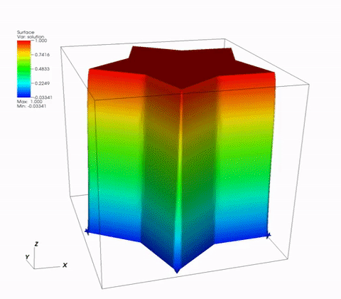
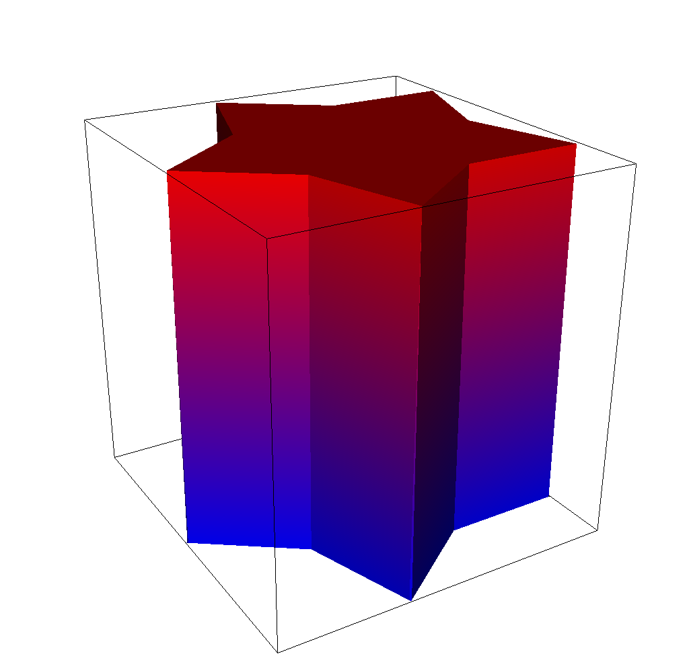
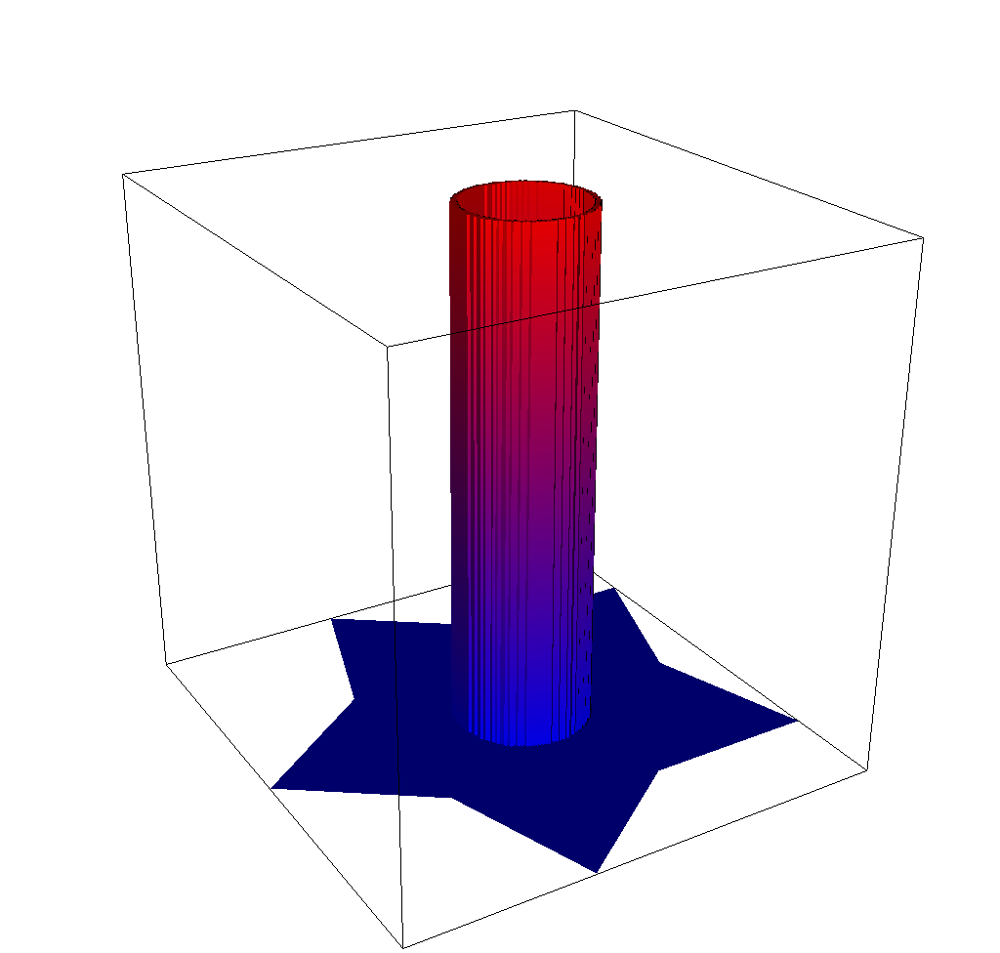
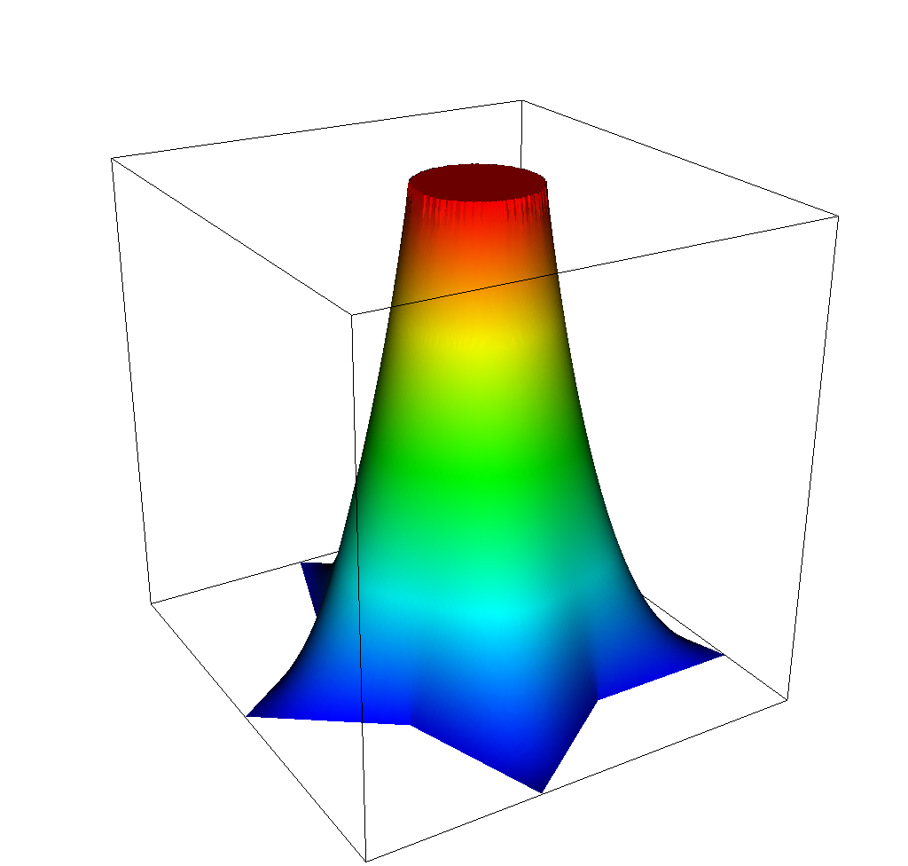

## At a Glance
<!-- (Expected # minutes to complete) %% temporarily omit -->

|Questions|Objectives|Key Points|
|1. What is optimization?|Understand the basic principles|Optimization seeks to minimize or maximize a cost function with respect to its inputs|
|2. How to use TAO for derivative-based optimization?|Understand the basic TAO interfaces|TAO is a PETSc subpackage for numerical optimization|
|3. What is the effect of second-order information in derivative-based optimization?|Understand how second-derivatives improve performance of optimization algorithms|Hessian information helps the optimization converge to a local optimum rapidly|

**Note:** To run the application in this lesson
```
cd {{site.handson_root}}/obstacle_tao
make obstacle
./obstacle -tao_monitor -tao_view
```

## Brief Introduction to Optimization

Numerical optimization algorithms seek to find the input variables (referred to as "control" or "design" variables) that minimize (or maximize) a quantity of interest (such as cost or performance) subject to constraints (such as bounds on resources). A general numerical optimization problems is stated as

$$
\min_u \quad f(u) \quad \text{subject to} \quad c(u) \leq 0, \quad h(u) = 0
$$

In this lesson, we will focus on derivative-based optimization algorithms -- methods that utilize information about the sensitivity of the objective function $$f(u): \in \mathbb{R}^n \rightarrow \mathbb{R}$$ to its inputs $$x \in \mathbb{R}^n$$. In the convex unconstrained case, the derivative of the objective function with respect to the parameters, $$\nabla f(u)$$, is zero at the every minimum of $$f(u)$$.  Therefore, we can apply a Newton to solve the system of equations $$\nabla f(u) = 0$$. Consequently, we solve the system $$\nabla^2 f(u^k) p=-\nabla f(u^k)$$ at every Newton iteration for the step direction $$p$$, where $$\nabla^2 f(u^k)$$ is the Hessian at $$x^k$$ and $$\nabla f(u^k)$$ is the gradient of the objective function. When the Hessian is not available directly, it can be approximated from gradient information by using finite differences or by using [quasi-Newton methods][1]. The Newton method is augmented with a globalization technique (such as a line search or a trust region) to ensure that the algorithm converges.

For more information on the subject, we refer the reader to [_Linear and Nonlinear Optimization_ by Igor Griva, Stephen G. Nash and Ariela Sofer][2] and [_Numerical Optimization_ by Jorge Nocedal and Stephen Wright][3]. 

## Problem Formulation

The obstacle problem aims to find the equilibrium of an elastic membrane with a fixed boundary that is stretched over a given obstacle. The mathematical formulation seeks to minimize the Dirichlet energy functional subject to constraints associated with the Dirichlet boundary and the obstacle, 

$$
\min_u \quad J(u) = \int_\Omega |\nabla u|^2 dx \quad \text{subject to} \quad u(x) = 0 \; \text{on} \; \partial\Omega, \quad u(x) \geq \phi(x) \; \text{elsewhere}
$$

where $$u$$ represents the control variables, $$x$$ represents the discrete nodal coordinates in the domain $$\Omega$$, and $$\phi(x)$$ is the obstacle function. This problem is equivalent to a variational inequality involving the Laplace equation $$\Delta u = 0$$ and the obstacle.

In this lesson, we will solve the obstacle problem with the numerical optimization formulation using algorithms in [PETSc/TAO][4].  Calculation of the objective (the Dirichlet energy function) and its gradient and Hessian will be performed using [MFEM][5]. We will use two gradient-based algorithms available in TAO, one requiring only gradient information and the other requiring both the gradient and the Hessian. We will then examine the improvement in convergence achieved by utilizing second-order information into the problem.

Source code for this problem is available in [obstacle.cpp]({{ site.baseurl }}) and the accompanying makefile in [makefile]({{ site.baseurl }}).  The mesh file used in this lesson is available in [star.mesh]({{ site.baseurl }}). All problem files are also hosted under `examples/atpesc/tao` directory of the MFEM `atpesc-dev` branch [here](https://github.com/mfem/mfem/tree/atpesc-dev/examples/atpesc/tao).

## The Obstacle Function

The C++ function representing the obstacle in the problem is written as an MFEM `FunctionCoefficient` object. We first define a simple function that takes an MFEM `Vector` defining the $$(x, y, z)$$ coordinates of a single point in the domain and returns the corresponding obstacle value at that location. 

In this test case, we define a ring-shaped obstacle centered at the origin of the domain, with a height of 1.0, an outer radius of 4.0, and a ring thickness of 0.05. The ring must have a finite thickness in order to capture sufficient quadrature points in the finite-element space. Outside of the ring itself, the obstacle function returns a value of "negative infinity" (as defined by a PETSc constant `PETSC_NINFINITY`). This will help produce a lower-bound vector for TAO that will effectively treat the degrees of freedom outside the obstacle as unbounded below.

```cpp
// Define a ring-shaped obstacle function centered at the origin with radius 0.4
double RingObstacle(const Vector &x) 
{
  double t = 0.05;                            // thickness
  double r = pow(x(0), 2) + pow(x(1), 2);     // radial location of the point from the origin
  double rad = 0.4;                           // outer radius 
  double ul = pow(rad, 2);                    
  double ll = pow(rad-t, 2);
  if ((ll <= r) && (r <= ul)) {
    // point is inside the ring
    return 1.0;
  } else {
    // point is outside the ring
    return PETSC_NINFINITY;
  }
}
```

This ring shaped obstacle function is then converted into a `FunctionCoefficient` object and projected onto a `GridFunction`. Additionally, we also project a zero `ConstantCoefficient` onto the Dirichlet boundary.

```cpp
ConstantCoefficient zero(0.0);
FunctionCoefficient obs(RingObstacle);

GridFunction lb(fespace);                      // grid function for the lower bound in the optimization
lb.ProjectCoefficient(obs);                    // project the obstacle onto the grid
lb.ProjectBdrCoefficient(zero, ess_tdof_list); // project the zero Dirichlet bound onto the grid
```

In this lesson, you can define a new obstacle function of your choice and re-run the problem to see how the obstacle changes the solution and the convergence of the optimization algorithms.

## Using TAO

Creating, setting up, and using a TAO optimization algorithm is similar to using SNES solvers in PETSc. 

First, we implement a `FormFunctionGradient()` function that is given a design vector `X` and computes the cost function value and its gradient vector. This function is sufficient for quasi-Newton algorithms that require only gradient information.  For Newton methods that require the Hessian, we also provide the `FormHessian()` function that computes the Hessian matrix as a PETSc `Mat` object.  For matrix-free Hessian implementations, this `Mat` object can be a `MATSHELL` type that provide the matrix-free `MatMult` operation. Examples of these functions are available in [obstacle.cpp](./obstacle.cpp).

With these functions defined, we can now create the TAO solver, configure it, and apply the numerical optimization
algorithm.

```c
ierr = TaoCreate(PETSC_COMM_WORLD, &tao);CHKERRQ(ierr);
ierr = TaoSetType(tao, TAOBNLS);CHKERRQ(ierr);
ierr = TaoSetInitialVector(tao, X);CHKERRQ(ierr);
ierr = TaoSetObjectiveAndGradientRoutine(tao, FormFunctionGradient, (void*) &user);CHKERRQ(ierr);
ierr = TaoSetHessianRoutine(tao, user.H, user.H, FormHessian, (void*) &user);CHKERRQ(ierr);
ierr = TaoSetVariableBounds(tao, XL, XU);CHKERRQ(ierr);
ierr = TaoSetMonitor(tao, Monitor, &user, NULL);CHKERRQ(ierr);
ierr = TaoSetFromOptions(tao);CHKERRQ(ierr);
ierr = TaoSolve(tao);CHKERRQ(ierr);
```

Note that these operations must be preceded by `PetscInitialize()` and `PetscFinalize()` must be called after the solution is computed and all PETSc objects are destroyed.

## Results

Once compiled with `make obstacle`, the problem can be run with `./obstacle -tao_monitor -tao_view`.

Adding the `-tao_type bqnls` flag uses the bounded quasi-Newton line-search algorithm in TAO to solve the problem. In this algorithm, the Hessian of the objective function is approximated using the [Broyden-Fletched-Goldfarb-Shanno (BFGS) approximation][6]. The TAO implementation is a limited-memory quasi-Newton algorithm, where only a limited number of previous steps are used to construct the approximate Hessian (default: 5 steps). This limited-memory quasi-Newton algorithm converges in 293 nonlinear iterations on the obstacle problem. The animation below shows the shape of the solution during the optimization.

[](bqnls.gif)

Running with the `-tao_type bnls` flag uses the bounded Newton line-search algorithm where the exact Hessian is provided by the MFEM implementation instead of being approximated. Linear solves involving this Hessian matrix are performed to compute the Newton direction by applying the preconditioned conjugate gradient method with an inexact Cholesky preconditioner available in PETSc. In contrast with the quasi-Newton method, the Newton algorithm converges in 3 iterations.

|Iteration 1|Iteration 2|Iteration 3|
|:---:|:---:|:---:|
|[](bnls_init.png)|[](bnls_mid.png)|[](blns_final.gif)|

## Further Reading

[PETSc Manual](http://www.mcs.anl.gov/petsc/petsc-current/docs/manual.pdf)  
[TAO Manual](http://www.mcs.anl.gov/petsc/petsc-current/docs/tao_manual.pdf)

[1]: https://en.wikipedia.org/wiki/Quasi-Newton_method
[2]: https://books.google.com/books/about/Linear_and_Nonlinear_Optimization.html?id=uOJ-Vg1BnKgC
[3]: https://books.google.com/books?id=VbHYoSyelFcC&dq=Nonlinear+Optimization+Nocedal&source=gbs_navlinks_s
[4]: http://www.mcs.anl.gov/petsc
[5]: http://mfem.org
[6]: https://en.wikipedia.org/wiki/Broyden–Fletcher–Goldfarb–Shanno_algorithm
