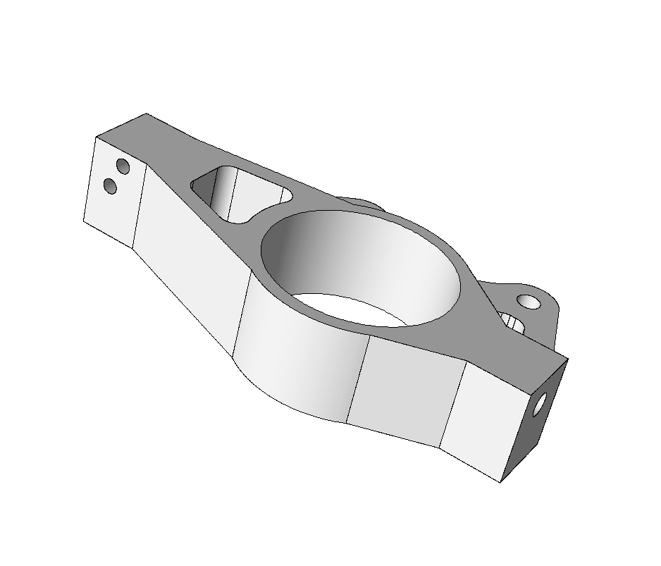

## At A Glance

| Questions                                                   | Objectives                                                             | Key Points                                                                                                                                                                            |
| How can I define a simulation on a complex geometric model? | Demonstrate model defeaturing and mesh generation pre-processing tools | Complex models require robust pre-processing tools!                                                                                                                                   |
|                                                             | Demonstrate the power of geometric model classification                | Automated simulation tools designed for scientists and engineers working with real CAD models problem definition information must be specified on the geometric model - not the mesh. |
| How can I reliably and efficiently execute simulations?     | Demonstrate an adaptive MFEM+PUMI elastic analysis                     | Adaptation is critical to automated, robust, and efficient simulation of simulations with transient behavior in which a static mesh defined a-priori will fail.                       |

Before you begin, first [Open the Answers Form](https://goo.gl/forms/HmuX6HrT0Yfoz7ny2){:target="\_blank"}
in a separate browser tab/window.
We will be entering responses to questions here that are placed throughout the
lesson.

The MFEM+PUMI examples are prepared for execution on Cooley at ALCF.
Except where noted, all commands shown below should be executed in a terminal
logged into Cooley.
In each new terminal first prepare your environment by running the commands
listed in the following section.

Note, each step can be performed independently; we encourage you to go
through them in order though.  If there are issues running the examples, or you
wish to skip ahead you will find the execution output in the `expectedOutput`
directory.

## To begin this lesson


- Copy the example directory to your home directory
```
rsync -aP {{site.handson_install_root}}/HandsOnLessons/mfem-pumi-lesson ~/.
```

- Enter the lesson directory
```
cd ~/mfem-pumi-lesson
```

- Setup your environment (ensures that your environment is using the `@default` + `+mvapich2-2.3rc1` dotkit pacakges)
```
source setup.sh
```

## Geometric Model Defeaturing

Geometric models are often provided by design engineers and include many
features that are not required for simulation.
The left side of Figure 1 depicts the geometric model of a Tokamak fusion
reactor that has multiple bolts, nuts, and brackets that have no influence on
the frequency analysis.
These features are removed from the Parasolid CAD model by the Simmetrix
SimModSuite tools by calling Parasolid kernel APIs to delete the faces and
'heal' the remaining hole via extensions of the bounding edges and faces.
The right side of Figure 1 depicts the defeatured Tokamak model.
In a model with this level of complexity that engineers and scientists running
the simulation often must coordinate to create the `as-simulated' model.

[](antenna.png)
[](antenna_defeatured.png)

*Figure 1. Initial (left) and defeatured (right) Tokamak antenna geometric model*

For this hands-on we removed a few small faces on the RPI Formula Hybrid
suspension upright shown in Figure 2 to illustrate a few key characteristics of
the mesh generation procedures.

[](figs/upright/all_zmin.png)
[](figs/upright/all_zmax.png)

*Figure 2. RPI Formula Hybrid suspension upright*

[](figs/upright_defeatured/all_zmin.png)
[](figs/upright_defeatured/all_zmax.png)

*Figure 3. RPI Formula Hybrid suspension upright with small faces removed*

In the Mesh Generation step we will generate and compare meshes of the initial
and defeatured geometric models.


### Optional - Run SimModeler to defeature the upright.
[Launch the VNC](https://www.alcf.anl.gov/user-guides/remote-visualization-cooley-using-vnc)

The [Setup page](https://xsdk-project.github.io/ATPESC2018HandsOnLessons/setup_instructions/)
has more detailed, and scripted, instructions to launch the VNC.

Run SimModeler:

```
cd ~/mfem-pumi-lesson/SimModeler6.0-180525/
./simmodeler
```

Remove a small face
- click 'File->Import Geometry' and select the `upright.x_t` model
- click the 'Modeling' tab
- click a small geometric model face
- click 'Delete Faces and Heal' then click 'Apply' to remove the face

Try removing the ring inside the hub by selecting all three of its faces, clicking the
'+' symbol to add them to the list, then clicking 'Apply'.

## Problem Definition Introduction {#probdefintro}

The boundary conditions, initial conditions, material parameters, etc. are
specified on the geometric model - not the mesh.
In the [Problem Definition Section](#probdef) we will describe the mechanism
that supports this and the specific boundary conditions for this problem.

## Mesh Generation

Now that we have prepared the model and defined the boundary conditions we can
proceed with mesh generation using the Simmetrix SimModSuite library APIs.
The mesh generation procedures are driven by size controls defined by the user
on geometric model entities or defined within geometric primitives that
intersect the model (e.g., cubes, spheres, cylinders, etc.).
In this example we generate a coarse mesh using a single relative size control
applied to the entire model.
This control guides the generation procedures to create edges whose lengths are
proportional, using our prescribed value, to the length of local geometric model
features.

The mesh generator is automated, which in the domain of mesh generation means
that it will always produce a valid mesh while doing its best to respect the
user specified controls.
Note, the features of the geometric model highly dictate what mesh sizes are
possible.
Specifically:
- the mesh topology must exactly respect the geometric model topology,
i.e., each geometric model edge has a set of meshes edges classified on it
that cover the entire model edge.
- in the case of problems on curved domains, the geometry of the typical
interpolating point mesh (even using higher-order curved elements) is
only an approximation to the original geometric model.

Once the mesh is generated we convert it, in-memory (i.e., using PUMI and
SimModSuite APIs), to a PUMI mesh and then write the PUMI mesh to file.



```
qsub -I -n 1 -t 30 -A ATPESC2018 -q training
cd ~/mfem-pumi-lesson/meshGeneration
# generate the mesh on the initial geometric model and create paraview vtu files
./generate --native-model=upright.x_t upright.smd 5kg1
./render upright.x_t 5kg1/ 5kg1_initial_vtu
# generate the mesh on the defeatured model and create paraview vtu files
./generate upright_defeatured_geomsim.smd 5kg1
./render upright_defeatured_geomsim.smd 5kg1/ 5kg1_defeatured_vtu
```

[](figs/upright/5kg1_all_zmax.png)
[](figs/upright/5kg1_all_zmin.png)

*Figure 4. Mesh of initial upright model*

[](figs/upright_defeatured/5kg1_all_zmax.png)
[](figs/upright_defeatured/5kg1_all_zmin.png)

*Figure 5. Mesh of defeatured upright model*

### Optional - Visualize the Initial Meshes
Download the `.*vtu` files from
[Here](https://github.com/xsdk-project/ATPESC2018HandsOnLessons/raw/gh-pages/_lessons/pumi/paraview.tar.gz), or
use a file transfer utility (e.g., `scp`, `rsync`, `putty`, etc.)
to copy the ones you generated to your local machine.

---

This concludes the day time hands-on.
In the evening you'll have an opportunity to repeat these steps and follow two
additional steps before running the adaptive analysis.

---

## Partitioning

Efficient parallel execution requires equally distributing the units of work among the
processing resources while keeping communication costs low.
The multi-level graph and recursive sectioning geometric methods are among the
most commonly available and used methods for partitioning unstructured meshes.
In this lesson we will exercise the multi-level graph partitioner (referred to as
'graph' below) provided by the Zoltan interface and implemented by ParMETIS.
We will then run recursive coordinate bisection ('RCB') and recursive inertial
bisection ('RIB') to produce meshes of with the same part count (number of
sub-domains), and compare the results.
All three partitioners are targeting an imbalance of 5%; defined as
the max element count on any part divided by the average element count across
all parts.

```
qsub -I -n 1 -t 30 -A ATPESC2018 -q training
cd ~/mfem-pumi-lesson/partition
runParma=0
isLocal=0
render=1
mdl=upright_defeatured_geomsim.smd
mesh=5kg1_defeatured/
mpirun -np 4 ./ptnParma $mdl $mesh 5kg1_p4_parmetis/ 4 pmetis kway $isLocal $runParma $render &> graph.out
mpirun -np 4 ./ptnParma $mdl $mesh 5kg1_p4_rcb/ 4 rcb ptn $isLocal $runParma $render &> rcb.out
mpirun -np 4 ./ptnParma $mdl $mesh 5kg1_p4_rib/ 4 rib ptn $isLocal $runParma $render &> rib.out
```

The entity imbalance information is listed on the lines containing `entity
imbalance <v e f r>:`.
The `grep` command to extract these lines from the outputs is:

```
       grep 'afterSplit entity imbalance' *.out
```

The imbalance values follow the definition given above (`max count/avg count`);
i.e., 5% imbalance will be listed as `1.05`.

The number mesh entities that are shared with other processes is indirectly
indicated on the lines containing `weighted TYPE <tot max min avg>` where `TYPE`
is `vtx`, `edge`, or `face`.
The `grep` command to extract these lines from the outputs is:

```
grep 'afterSplit weighted vtx' *.out
```

If the total (`tot`) or average (`avg`) number of entities of a given TYPE is
larger relative to another partition then that partition has more replicated
entities.

Given the values of the imbalance and shared entity count for each partition
(graph, RCB, RIB) above and the content of the `[graph|rcb|rib].out` files,








The partitioning decisions of RIB and RCB are based on the centroid of mesh
elements while the multi-level graph partitioner is using mesh adjacency
information (graph vertex = mesh element, graph edge = mesh face shared by
two mesh elements).

{% include qanda
    question='
     5) What causes the boundaries of the RIB and RCB partitions to look jagged
        relative to the multi-level graph partition boundaries?
        a) the placement of the cutting plane versus the coordinates of
        the mesh elements
        b) the intersection of the cutting planes used by the recursive
        sectioning procedures form angular multi-part junctions whereas the multi-level
        graph procedures produce more rounded parts and thus smoother junctions
        c) the multi-level graph procedure uses mesh adjacency information to reduce the
        number of mesh faces on the partition boundaries'
    answer='All of the above.'
%}

[](figs/pmetis-rcb-rib.png)

*Figure 6. Partitions created with multi-level graph (left), RCB (middle), and RIB (right)*

### Optional - Visualize the Partitioned Meshes
Download the `.*vtu` files from
[Here](https://github.com/xsdk-project/ATPESC2018HandsOnLessons/raw/gh-pages/_lessons/pumi/paraview.tar.gz), or
use a file transfer utility (e.g., `scp`, `rsync`, `putty`, etc.)
to copy the ones you generated to your local machine.

## Problem Definition {#probdef}

We will define a tensile loading on the upright by applying a uniform force on
one end (min Y face) and fixing the displacements on the other end (max Y face);
as depicted in Figure 7.
All other geometric model faces will be unconstrained.  No body forces are
applied.

[](figs/upright_defeatured/boundaryConditions.png)

*Figure 7. Boundary conditions*

Using geometric classification of the mesh we can define the boundary conditions
on the geometric model without having any knowledge/consideration of the mesh.
Geometric classification defines the equal, or greater, order association of
mesh entities to geometric model entities.
Specifically, a mesh region can only be classified on a geometric model region,
a mesh face on a geometric face or region, and so on.
Geometric classification is used throughout the set of unstructured mesh tools.
For example, in mesh adaptation, classification (along with knowledge of the
geometries parametric shape information) is critical for improving the meshes
approximation to the geometric model when moving, adding, or removing mesh
entities.
Further reading on the use of classification is available in [Beall et al. 1999
and Ibanez 2016](#refs).

A very simple text based interface was defined for this demonstration example to
define the two boundary conditions.
  To specify the geometric model faces with
the load applied we add one line with `Load` followed by another line with the
number of faces with that load applied.  The geometric model face ids, one per
line, are then listed. Using the same convention we define the fixed faces using
the string `Dirichlet`, the number of listed faces, then the list of face ids.
The boundary condition specification for this example is listed below.
Using the geometric model classification mechanism supports creation of more
feature-rich interfaces (command line, file, GUI).

```
$ cat upright.def
Dirichlet
1
43

Load
1
344
```



## Adaptive Simulation

This problem solves a linear elasticity model on a cantilever beam.
Specifically, we approximate the weak form of

$$-div(\sigma(u))=0$$

where

$$\sigma(u)=\lambda*div(u)*I+\mu*(\nabla*u+u*\nabla)$$

is the stress tensor corresponding to displacement field $$u$$,
and $$\lambda=1$$ and $$\mu=1$$ are the material Lame constants.

[Figure 7](#probdef) depicts the applied boundary conditions; a fixed displacement
$$u=0$$ on the max Y face and pull force $$f=1.0e-2$$ on the min Z face.
The specification of these boundary conditions using geometric model entity
ids is described in the [Problem Definition](#probdef) section.

To control the error without a-priori knowledge of solution we will run this
example using mesh adaptation.
The adaptive cycle:
- solves the problem on an initial uniform coarse mesh,
- estimates the discretization error,
- defines an isotropic size field from the error estimate,
- adapts the mesh using the size field, and
- solves the problem on the adapted mesh.

Multiple methods are available for error estimation (see the [Further Reading](#refs)
section) and the subsequent size field computation.
In this example a patch recovery approach is used.

Given the structure of the geometric model and the specified boundary
conditions, we expect that the upper portion (positive Z) of the main hub
experiences higher stresses as the lower part is much stiffer.
Given this intuition we would expect higher error there and therefore a finer
mesh is expected as the result of the meshAdapt.

Run the adaptive simulation:

```
cd ~/mfem-pumi-lesson/analysis
mpirun -np 2 ./pumi_upright_ex2p -p upright_defeatured_geomsim.smd -bf upright.def -m 2p5kg1/
```

[](figs/analysis/initialAndFinalMesh.png)

*Figure 8. Initial mesh (left) and final mesh with displacement field (right).

The requested isotropic (same in all directions) edge length is specified
with a scalar value at each mesh vertex.  In
[Section 2.1 of Li et al.](https://www.scorec.rpi.edu/REPORTS/2005-31.pdf)
edge lengths that vary with direction, anisotropic, are specified.



### Optional - Visualize the analysis results
Download the `.*vtu` files from
[Here](https://github.com/xsdk-project/ATPESC2018HandsOnLessons/raw/gh-pages/_lessons/pumi/paraview.tar.gz), or
use a file transfer utility (e.g., `scp`, `rsync`, `putty`, etc.)
to copy the ones you generated to your local machine.

#### Get Credit / Points

Be sure to submit a [Show Your Work](https://goo.gl/forms/B7UFpBvEOJbC58oJ2) using the hands-on
activity name, `PUMI_Partitioning` or `PUMI_Adaptive_Simulation`.

## Out-Brief

We have exercised a workflow using PUMI and MFEM software components that is
based on a high level definition of the problem domain; the geometric model.
The PUMI and MFEM software components exchange information on the geometric
model, the mesh, and fields on the mesh to provide a robust and extensible set
of functionalities that support the needs of multiple applications.

### Further Reading {#refs}

* SCOREC tools
  * C. W. Smith, M. Rasquin, D. Ibanez, K. E. Jansen, and M. S. Shephard **Improving Unstructured Mesh Partitions for Multiple Criteria Using Mesh Adjacencies**,  SIAM Journal on Scientific Computing, 2018. DOI: 10.1137/15M1027814
  * D.A. Ibanez, E.S. Seol, C.W. Smith and M.S. Shephard, **PUMI: Parallel Unstructured Mesh Infrastructure**, ACM Transactions on Mathematical Software, 42(3): Article 17 (28 pages), 2016. DOI: 10.1145/2814935.
  * M. Zhou, O. Sahni, T. Xie, M.S. Shephard and K.E. Jansen, **Unstructured Mesh Partition Improvement for Implicit Finite Element at Extreme Scale**, Journal of Supercomputing, 59(3): 1218-1228, 2012. DOI 10.1007s11227-010-0521-0
  * M. Zhou, T. Xie, S. Seol, M.S. Shephard, O. Sahni and K.E. Jansen, **Tools to Support Mesh Adaptation on Massively Parallel Computers**, Engineering with Computers, 28(3):287-301, 2012. DOI: 10.1007s00366-011-0218-x
  * M. Zhou, O. Sahni, M.S. Shephard, K.D. Devine and K.E. Jansen, **Controlling unstructured mesh partitions for massively parallel simulations**, SIAM J. Sci. Comp., 32(6):3201-3227, 2010. DOI: 10.1137090777323
  * M. Zhou, O. Sahni, H.J. Kim, C.A. Figueroa, C.A. Taylor, M.S. Shephard, and K.E. Jansen, **Cardiovascular Flow Simulation at Extreme Scale**, Computational Mechanics, 46:71-82, 2010. DOI: 10.1007s00466-009-0450-z

* Partitioning
  * K. Devine, E. Boman, R. Heaphy, B. Hendrickson, and C. Vaughan, **Zoltan data management services for parallel dynamic applications**,  Computing in Science & Engineering, Volume: 4, Issue: 2, 2002, DOI: 10.1109/5992.988653.
  * G. Karypis and V. Kumar, **Parallel Multilevel k-way Partitioning Scheme for Irregular Graphs**, SIAM Review, Vol. 41, No. 2, pp. 278 - 300, 1999, DOI: 10.1137/S0036144598334138.

* Mesh data and geometry interactions
  * Seol, E.S. and Shephard, M.S., **Efficient distributed mesh data structure for parallel automated adaptive analysis**, Engineering with Computers, 22(3-4):197-213, 2006, DOI: 10.1007s00366-006-0048-4
  * Beall, M.W., Walsh, J. and Shephard, M.S, **A comparison of techniques for geometry access related to mesh generation**, Engineering with Computers, 20(3):210-221, 2004, DOI: 10.1007s00366-004-0289-z.
  * Beall, M.W.. and Shephard, M.S., **An Object-Oriented Framework for Reliable Numerical Simulations**, Engineering with Computers, 15(1):61-72, 1999, DOI: 10.1007/s003660050005.
  * Beall, M.W. and Shephard, M.S., **A general topology-based mesh data structure**, Int. J. Numer. Meth. Engng., 40(9):1573-1596, 1997, DOI: 10.1002(SICI)1097-0207(19970515)40:9<1573::AID-NME128>3.0.CO;2-9.

* Adaptivity
  * "Aleksandr Ovcharenko, **Parallel Anisotropic Mesh Adaptation with Boundary Layers**, Ph.D. Dissertation, RPI, 2012":http://www.scorec.rpi.edu/REPORTS/2012-20.pdf
  * Q. Lu, M.S. Shephard, S. Tendulkar and M.W. Beall, **Parallel Curved Mesh Adaptation for Large Scale High-Order Finite Element Simulations**, Proc. 21 Roundtable, Springer, NY, pp. 419-436, 2012, DOI 10.1007978-3-642-33573-0.
  * A. Ovcharenko, K. Chitale, O. Sahni, K.E. Jansen and M.S. Shephard, S. Tendulkar and M.W. Beall, **Parallel Adaptive Boundary Layer Meshing for CFD Analysis**, Proc. 21st International Meshing Roundtable, Springer, NY, pp. 437-455, 2012, DOI 10.1007978-3-642-33573-0
  * X.-J. Luo, M.S. Shephard, L.-Q. Lee and C. Ng, **Moving Curved Mesh Adaption for Higher Order Finite Element Simulations**, Engineering with Computers, 27(1):41-50, 2011. DOI: 10.1007/s00366-010-0179-5
  * O. Sahni, X.J. Luo, K.E. Jansen, M.S. Shephard, **Curved Boundary Layer Meshing for Adaptive Viscous Flow Simulations**, Finite Elements in Analysis and Design, 46:132-139, 2010. DOI: 10.1007/s00366-008-0095-0
  * Alauzet, F., Li, X., Seol, E.S. and Shephard, M.S., **Parallel Anisotropic 3D Mesh Adaptation by Mesh Modification**, Engineering with Computers, 21(3):247-258, 2006, DOI: 10.1007s00366-005-0009-3
  * Li, X., Shephard, M.S. and Beall, M.W., **3-D Anisotropic Mesh Adaptation by Mesh Modifications**, Comp. Meth. Appl. Mech. Engng., 194(48-49):4915-4950, 2005, doi:10.1016/j.cma.2004.11.019
  * Li, X., Shephard, M.S. and Beall, M.W., **Accounting for curved domains in mesh adaptation**, International Journal for Numerical Methods in Engineering, 58:246-276, 2003, DOI: 10.1002/nme.772
