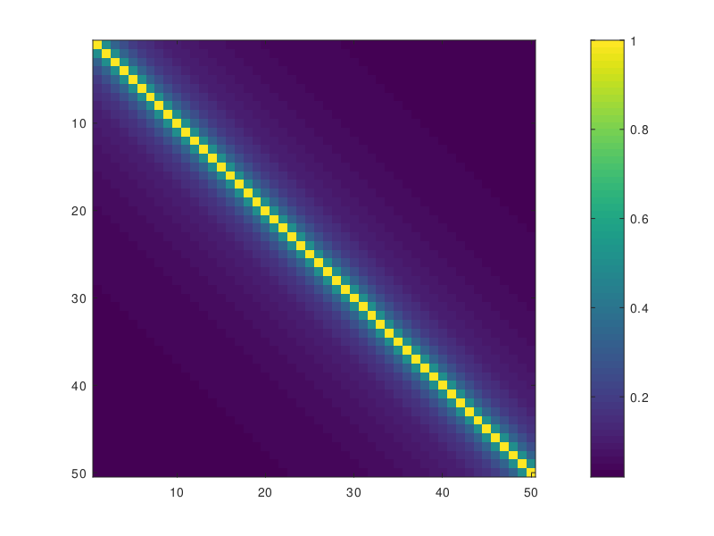
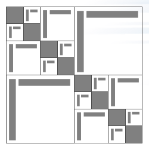

## To begin this lesson

- Get into the correct directory
```
cd {{site.handson_root}}/strumpack
```

## The problem being solved: Toeplitz matrix compression

The run_testHODLR example application constructs a compressed
representation of a Toeplitz matrix

$$T_{i,j} = \frac{1}{1 + | i - j|}$$

using the Hierarchically Off-Diagonal Low Rank format.

|T|
|:---:|
|[](T.png)|

The matrix _T_ is constant along the diagonals and values decay
rapidly going further away from the main diagonal. Off-diagonal blocks
can be approximated well using low-rank. A 4-level HODLR representation
looks schematically as follows:

|HODLR matrix representation|
|:---:|
|[](HODLR.png)|

where the smallest diagonal blocks are stored as dense, and all
off-diagonal blocks are compressed using low-rank.


## Running the Example

### Run 1: Create a HODLR representation of a _20000 x 20000_ matrix

```
$ ./run_testHODLR 20000 | tail -n 3
 Matrix construction finished
 BPACK_CheckError: fnorm: 1.7079418E+00 1.7079418E+00 acc:  1.68E-06 time:  7.37E-03
# H has max rank 12 and takes 68.2033 MByte (compared to 3200 MByte for dense storage)
```

Check the maximum off-diagonal block rank, the memory usage and the
accuray.

---

### Run 2: change the leaf size, and the compression tolerance

Change the compression tolerance, used for the low-rank approximation
of the off-diagonal blocks

```
$ ./run_testHODLR 20000 --hodlr_rel_tol 1e-2 | tail -n 3
 Matrix construction finished
 BPACK_CheckError: fnorm: 2.1917744E+00 2.1917607E+00 acc:  1.09E-03 time:  7.09E-03
# H has max rank 7 and takes 60.2931 MByte (compared to 3200 MByte for dense storage)
$ ./run_testHODLR 20000 --hodlr_rel_tol 1e-8 | tail -n 3
 Matrix construction finished
 BPACK_CheckError: fnorm: 2.2692508E+00 2.2692508E+00 acc:  3.62E-10 time:  2.25E-02
# H has max rank 21 and takes 81.9533 MByte (compared to 3200 MByte for dense storage)
```

Note how the tolerance impacts the memory usage, the maximum rank and
the accuracy of the approximation.

```
$ ./run_testHODLR 20000 --hodlr_leaf_size 8 | tail -n 3
 Matrix construction finished
 BPACK_CheckError: fnorm: 1.9329823E+00 1.9329820E+00 acc:  2.90E-06 time:  1.75E-02
# H has max rank 12 and takes 30.9037 MByte (compared to 3200 MByte for dense storage)
$ ./run_testHODLR 20000 --hodlr_leaf_size 128 | tail -n 3
 Matrix construction finished
 BPACK_CheckError: fnorm: 2.3231555E+00 2.3231554E+00 acc:  1.69E-06 time:  9.30E-03
# H has max rank 12 and takes 46.2892 MByte (compared to 3200 MByte for dense storage)
```

Check also the impact of the leaf size, the smallest blocks on the
diagonal of the HODLR representation.

You can run with the _--help_ command line option to see further
tunable parameters.

---


## 3D Poisson with a fast direct solver

Next we solve the 3-dimensional Poisson equation

$$\nabla^2 u = f$$

on a regular 3-dimemsional grid using an approximate sparse
factorization solver.

### Run 1: Exact sparse solver
```
$ mpiexec -n 1 ./run_testPoisson3d 40
# Initializing STRUMPACK
# using 12 OpenMP thread(s)
# number of tasking levels = 6 = log_2(#threads) + 3
# initial matrix:
#   - number of unknowns = 64000
#   - number of nonzeros = 438400
# nested dissection reordering:
#   - Geometric reordering
#   - strategy parameter = 8
#   - number of separators = 5545
#   - number of levels = 13
#   - nd time = 0.0120502
#   - symmetrization time = 2.45706e-06
# symbolic factorization:
#   - nr of dense Frontal matrices = 5545
#   - symb-factor time = 0.0133843
# multifrontal factorization:
#   - estimated memory usage (exact solver) = 350.843 MB
#   - factor time = 6.45393
#   - factor nonzeros = 43855344
#   - factor memory = 350.843 MB
#   - factor memory/nonzeros = 100 % of multifrontal
#   - compression = none
REFINEMENT it. 0	res =      102.762	rel.res =            1	bw.error =            1
REFINEMENT it. 1	res =  7.40334e-13	rel.res =  7.20437e-15	bw.error =  3.30291e-15
# DIRECT/GMRES solve:
#   - abs_tol = 1e-10, rel_tol = 1e-06, restart = 30, maxit = 5000
#   - number of Krylov iterations = 1
#   - solve time = 0.343346
# COMPONENTWISE SCALED RESIDUAL = 3.28441e-15
```

Note the factorization statistics, such as memory usage and time. The
solve performs forward and backward substitution with the lower and
upper sparse triangular factors respectively. Since no low-rank
compression is used, the solver converges in a single iteration of
iterative refinement, i.e., it acts as a direct solver.


### Run 2: Enable Block Low Rank (BLR) compression

```
$ ./run_testPoisson3d 40 --sp_compression BLR
# Initializing STRUMPACK
# using 12 OpenMP thread(s)
# number of tasking levels = 6 = log_2(#threads) + 3
# initial matrix:
#   - number of unknowns = 64000
#   - number of nonzeros = 438400
# nested dissection reordering:
#   - Geometric reordering
#   - strategy parameter = 8
#   - number of separators = 5545
#   - number of levels = 13
#   - nd time = 0.0104044
#   - symmetrization time = 2.34321e-06
# symbolic factorization:
#   - nr of dense Frontal matrices = 5521
#   - nr of BLR Frontal matrices = 24
#   - symb-factor time = 0.0153996
#   - sep-reorder time = 0.0558912
# multifrontal factorization:
#   - estimated memory usage (exact solver) = 350.843 MB
#   - factor time = 3.70802
#   - factor nonzeros = 30415917
#   - factor memory = 243.327 MB
#   - factor memory/nonzeros = 69.3551 % of multifrontal
#   - compression = blr
#   - relative compression tolerance = 0.0001
#   - absolute compression tolerance = 1e-10
GMRES it. 0	res =      252.857	rel.res =            1	 restart!
GMRES it. 1	res =     0.104278	rel.res =    0.0004124
GMRES it. 2	res =  2.19998e-05	rel.res =  8.70049e-08
# DIRECT/GMRES solve:
#   - abs_tol = 1e-10, rel_tol = 1e-06, restart = 30, maxit = 5000
#   - number of Krylov iterations = 2
#   - solve time = 0.487943
# COMPONENTWISE SCALED RESIDUAL = 1.35614e-07
```

Now with Block Low Rank compression enabled, note again the
factorization info, and see how the time and memory usage is reduced
compared to the direct solver.

However, since the sparse triangular factorization is longer exact,
the approximate factorization is now used as a preconditioner for the
GMRES iterative solver. With the current settings, GMRES converges in
only 2 iterations, illustrating the robustness of the preconditioner.
The solution phase now takes longer than it took for the direct solver
setup. This illustrates the trade-off between time spent in
factorization (preconditioner setup) and solve.

Now experiment with different BLR parameters

```
$ ./run_testPoisson3d 40 --sp_compression BLR --blr_rel_tol 1e-1
$ ./run_testPoisson3d 40 --sp_compression BLR --blr_rel_tol 1e-6
$ ./run_testPoisson3d 40 --sp_compression BLR --blr_leaf_size 16
$ ./run_testPoisson3d 40 --sp_compression BLR --blr_leaf_size 512
$ ./run_testPoisson3d 40 --sp_compression BLR --blr_rel_tol 1e-6 --help
```

### Run 3: Enable HSS or HODLR compression, run in parallel

Now we switch to parallel, and enable Hierarchically Semi-Separable
(HSS) or Hierarchically Off-Diagonal Low Rank approximations.

```
$ mpiexec -n 12 ./run_testPoisson3dMPIDist 60 --sp_compression HSS \
   --sp_compression_min_sep_size 1000 --hss_rel_tol 1e-2
$ mpiexec -n 12 ./run_testPoisson3dMPIDist 40 --sp_compression HODLR \
--sp_compression_min_sep_size 1000 --hodlr_leaf_size 128
```

This will run a larger problem and enable HSS compression.  HSS
compression is applied to dense sub-blocks, called frontal matrices,
in the sparse triangular factors. However, this compression is only
beneficial for large enough blocks, and for has too much overhead for
smaller blocks. This minimum size can be tuned with the
_--sp_compression_min_sep_size 1000_ parameter.


---

## Out-Brief

In this lesson, we have used
[STRUMPACK](https://github.com/pghysels/STRUMPACK) to illustrate
compression of dense rank-structured matrices. The example used was a
Toeplitz matrix. Other applications are dense linear systems arising
from the boundary element method for integral equations, covariance
matrices, kernel matrices, etc.

We also illustrated the use of rank-structured matrix compression,
such as block low rank (BLR), hierarchically off-diagonal low rank
(HODLR) and hierarchically semi-separable (HSS) in sparse
factorization based solvers solver. This compression asymptotically
reduces the memory requirements and number of floating point
operations in sparse direct solver. However, the resulting
factorization is inexact, and is typically used as a preconditioner.


