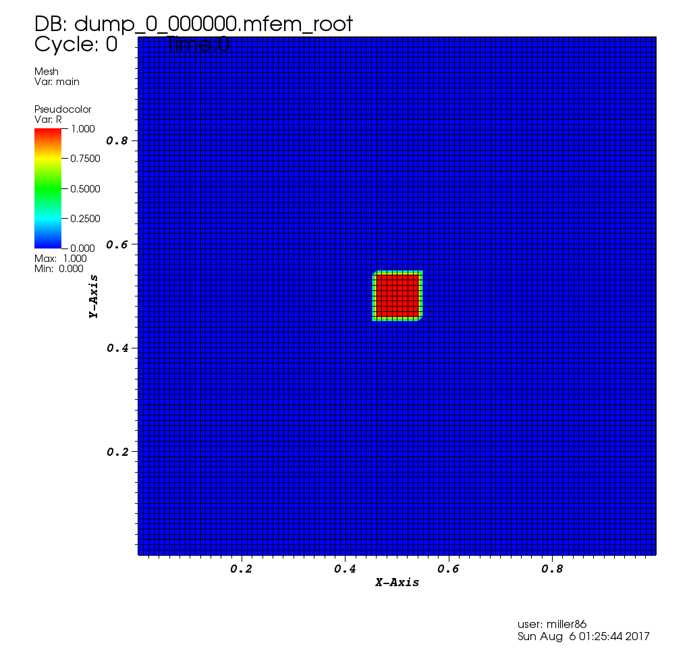
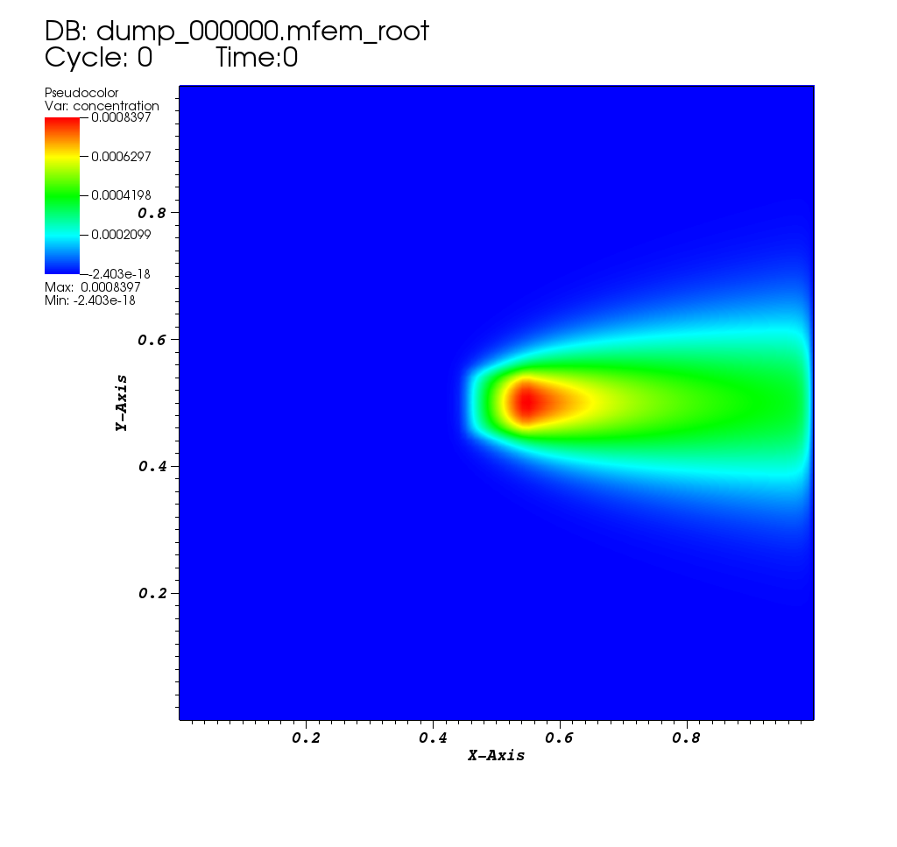
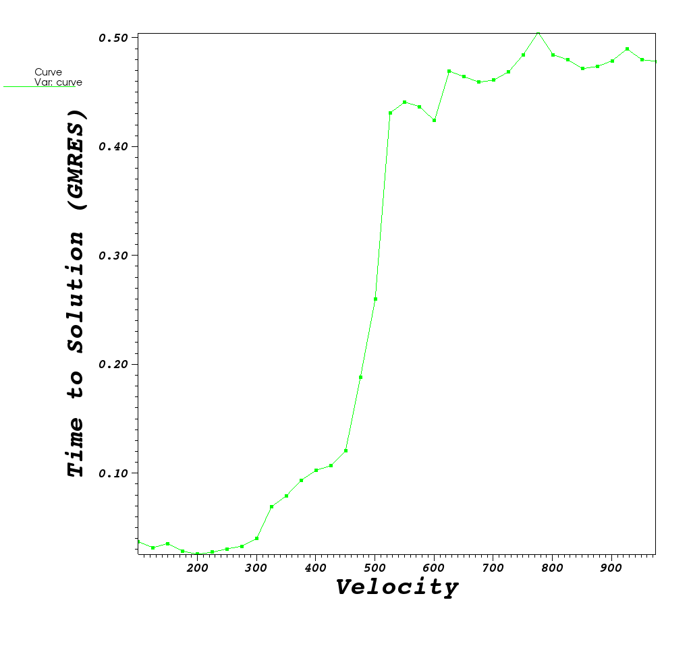
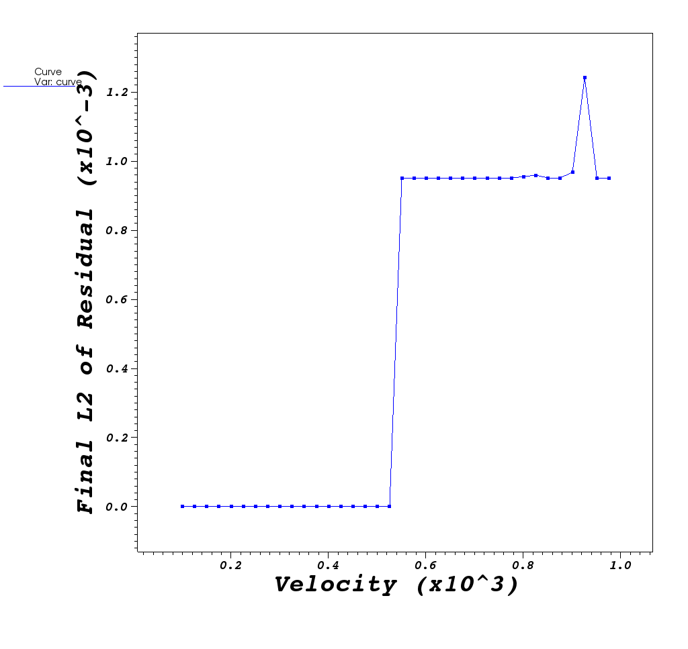

## At A Glance

|Questions|Objectives|Key Points|
|1. Why use a direct solver?|Understand accuracy|Direct solvers are robust<br>for difficult problems|
|2. What effects direct solve performance ?|Understand ordering options|Time & space performance<br>can vary a lot.|

## To begin this lesson

- [Open the Answers Form](https://docs.google.com/forms/d/e/1FAIpQLSfxlKXG74hffseYxc52l7p7DALHk-WTiZXQmdT6WGMVBRw7Sg/viewform?usp=sf_link){:target="_blank"}
- Get into the correct directory
```
cd {{site.handson_root}}/superlu_mfem
```
## The problem being solved

The [convdiff.c](https://github.com/mfem/mfem/blob/atpesc-dev/examples/atpesc/superlu/convdiff.cpp)
application is modeling the steady state convection-diffusion equation in 2D
with a constant velocity.  This equation is used to model the concentration
of something like a _die_ in a _moving_ fluid as it diffuses and flows through
he fluid.  The equation is as follows:

$$\nabla \cdot (\kappa \nabla u) - \nabla \cdot (\overrightarrow{v}u)+R=0$$

Where _u_ is the concentration that we are tracking, $$\kappa$$, is the diffusion rate,
_v_ is the velocity of the flow and _R_ is a concentration source.

In the application we use here, the velocity vector _direction_ is fixed in the _+x_
direction. However, the _magnitude_ is set by the user (default of 100), $$\kappa$$,
is fixed at 1.0, and the source is 0.0 everywhere except for a small square centered at
the middle of the domain where it is 1.0.

|Initial Condition|
|:---:|
|[](mfem-superlu0000.png)|

Solving this PDE is well known to cause convergence problems for iterative solvers,
for larger _v_. We use MFEM as a vehicle to demonstrate the use of a distributed,
direct solver, [SuperLU_DIST](http://crd-legacy.lbl.gov/~xiaoye/SuperLU/),
to solve very ill-conditioned linear systems.

## Running the Example

### Run 1: default setting with GMRES solver, preconditioned by hypre, velocity = 100

```
$ ./convdiff | tail -n 3
Time required for first solve:  0.0408995 (s)
Final L2 norm of residual: 2.43686e-16
```

|Steady State|
|:---:|
|[](mfem-superlu0005.png)|

---

### Run 2: increase velocity to 1000, GMRES does not converge anymore

```
$ ./convdiff --velocity 1000 | tail -n 3
Time required for first solve:  0.47337 (s)
Final L2 norm of residual: 0.00095
```



Below, we plot behavior of the GMRES method for velocity values in the
range [100,1000] at increments, _dv_, of 25 and also show an animation
of the solution GMRES gives as velocity increases

|Solutions @_dv_=25 in [100,1000]|Contours of Solution @ _vel=1000_|
|:---:||:---:|
|<video src="gmres.mpg" width="400" height="300" controls preload></video>|[](mfem-superlu0003.png)|

|Time to Solution|L2 norm of final residual|
|:---:||:---:|
|[](gmres_time.png)|[](gmres_residual.png)|




   
---

### Run 3: Now use SuperLU_DIST, with "natural ordering"
```
$  ./convdiff --velocity 1000 -slu -cp 0  
Options used:
   --refine 0
   --order 1
   --velocity 1000
   --no-visit
   --superlu
   --slu-colperm 0
   --slu-rowperm 1
   --slu-parsymbfact 0
   --one-matrix
   --one-rhs
Number of unknowns: 10201
	Nonzeros in L       1040781
	Nonzeros in U       1045632
	nonzeros in L+U     2076212
	nonzeros in LSUB    1040215

** Memory Usage **********************************
** NUMfact space (MB): (sum-of-all-processes)
    L\U :           41.12 |  Total :    50.74
** Total highmark (MB):
    Sum-of-all :    50.74 | Avg :    50.74  | Max :    50.74
**************************************************
Time required for first solve:  19.0018 (s)
Final L2 norm of residual: 1.62703e-18

**************************************************
**** Time (seconds) ****
	EQUIL time             0.00
	ROWPERM time           0.01
	SYMBFACT time          0.04
	DISTRIBUTE time        0.11
	FACTOR time           18.52
	Factor flops	1.958603e+08	Mflops 	   10.58
	SOLVE time             0.10
	Solve flops	5.167045e+06	Mflops 	   52.21
	REFINEMENT time        0.20	Steps       2

**************************************************
```

|Stead State For _vel=1000_|
|:---:|
|[](mfem-superlu0004.png)|

### Run 4: Now use SuperLU_DIST, with MMD(A'+A) ordering.
```
$ ./convdiff --velocity 1000 -slu -cp 2
Options used:
   --refine 0
   --order 1
   --velocity 1000
   --no-visit
   --superlu
   --slu-colperm 2
   --slu-rowperm 1
   --slu-parsymbfact 0
   --one-matrix
   --one-rhs
Number of unknowns: 10201
	Nonzeros in L       594238
	Nonzeros in U       580425
	nonzeros in L+U     1164462
	nonzeros in LSUB    203857

** Memory Usage **********************************
** NUMfact space (MB): (sum-of-all-processes)
    L\U :           10.07 |  Total :    15.52
** Total highmark (MB):
    Sum-of-all :    15.52 | Avg :    15.52  | Max :    15.52
**************************************************
Time required for first solve:  0.111105 (s)
Final L2 norm of residual: 1.53726e-18

**************************************************
**** Time (seconds) ****
	EQUIL time             0.00
	ROWPERM time           0.01
	COLPERM time           0.04
	SYMBFACT time          0.01
	DISTRIBUTE time        0.02
	FACTOR time            0.05
	Factor flops	1.063303e+08	Mflops 	 2045.75
	SOLVE time             0.00
	Solve flops	2.367059e+06	Mflops 	  779.35
	REFINEMENT time        0.01	Steps       2

**************************************************
```
NOTE: the number of nonzeros in L+U is much smaller than natural ordering.
This affects the memory usage and runtime.

### Run 5: Now use SuperLU_DIST, with Metis(A'+A) ordering.
```
$ ./convdiff --velocity 1000 -slu -cp 4
Options used:
   --refine 0
   --order 1
   --velocity 1000
   --no-visit
   --superlu
   --slu-colperm 4
   --slu-rowperm 1
   --slu-parsymbfact 0
   --one-matrix
   --one-rhs
Number of unknowns: 10201
	Nonzeros in L       522306
	Nonzeros in U       527748
	nonzeros in L+U     1039853
	nonzeros in LSUB    218211

** Memory Usage **********************************
** NUMfact space (MB): (sum-of-all-processes)
    L\U :            9.24 |  Total :    14.96
** Total highmark (MB):
    Sum-of-all :    14.96 | Avg :    14.96  | Max :    14.96
**************************************************
Time required for first solve:  0.152424 (s)
Final L2 norm of residual: 1.51089e-18

**************************************************
**** Time (seconds) ****
	EQUIL time             0.00
	ROWPERM time           0.01
	COLPERM time           0.05
	SYMBFACT time          0.01
	DISTRIBUTE time        0.02
	FACTOR time            0.05
	Factor flops	7.827314e+07	Mflops 	 1717.18
	SOLVE time             0.00
	Solve flops	2.120276e+06	Mflops 	  606.75
	REFINEMENT time        0.01	Steps       2

**************************************************
```

|Solutions @_dv_=25 in [100,1000]|Steady State Solution @ _vel=1000_|
|:---:||:---:|
|<video src="slu_metis.mpg" width="400" height="300" controls preload></video>|[](mfem-superlu0004.png)|

### Run 5.5: Now use SuperLU_DIST, with Metis(A'+A) ordering, using 1 MPI tasks, on a larger problem.
By adding `--refine 3`, each element in the mesh is subdivided twice yielding a 64x larger problem.
But, we'll run it on only one processor.

```
$ mpiexec -n 1 ./convdiff --refine 3 --velocity 1000 -slu -cp 4
Options used:
   --refine 3
   --order 1
   --velocity 1000
   --no-visit
   --superlu
   --slu-colperm 4
   --slu-rowperm 1
   --slu-parsymbfact 0
   --one-matrix
   --one-rhs
Number of unknowns: 641601
	Nonzeros in L       40412796
	Nonzeros in U       40412796
	nonzeros in L+U     80183991
	nonzeros in LSUB    15748820

** Memory Usage **********************************
** NUMfact space (MB): (sum-of-all-processes)
    L\U :          701.82 |  Total :   758.92
** Total highmark (MB):
    Sum-of-all :   786.78 | Avg :   786.78  | Max :   786.78
**************************************************
Time required for first solve:  18.8951 (s)
Final L2 norm of residual: 5.99013e-18

**************************************************
**** Time (seconds) ****
	EQUIL time             0.03
	ROWPERM time           0.29
	COLPERM time           4.83
	SYMBFACT time          0.32
	DISTRIBUTE time        1.58
	FACTOR time            9.87
	Factor flops	2.326266e+10	Mflops 	 2357.24
	SOLVE time             0.41
	Solve flops	1.604473e+08	Mflops 	  395.95
	REFINEMENT time        0.90	Steps       2
**************************************************
```

### Run 6: Now use SuperLU_DIST, with Metis(A'+A) ordering, using 16 MPI tasks, on a larger problem.

Here, we'll re-run the above except on 16 tasks and just grep the output form some key values of interest.

```
$ ${MPIEXEC_OMPI} -n 16 ./convdiff --refine 3 --velocity 1000 -slu --slu-colperm 4 >& run6.out
Options used:
   --refine 3
   --order 1
   --velocity 1000
   --no-visit
   --superlu
   --slu-colperm 4
   --slu-rowperm 1
   --slu-parsymbfact 0
   --one-matrix
   --one-rhs
Number of unknowns: 641601
	Nonzeros in L       40340620
	Nonzeros in U       40340620
	nonzeros in L+U     80039639
	nonzeros in LSUB    15901421

** Memory Usage **********************************
** NUMfact space (MB): (sum-of-all-processes)
    L\U :          705.31 |  Total :   974.93
** Total highmark (MB):
    Sum-of-all :  2888.58 | Avg :   180.54  | Max :   180.54
**************************************************
Time required for first solve:  9.10544 (s)
Final L2 norm of residual: 2.29801e-39

**************************************************
**** Time (seconds) ****
	EQUIL time             0.03
	ROWPERM time           0.36
	COLPERM time           5.57
	SYMBFACT time          0.37
	DISTRIBUTE time        0.30
	FACTOR time            1.62
	Factor flops	2.301228e+10	Mflops 	14226.55
	SOLVE time             0.14
	Solve flops	1.623936e+08	Mflops 	 1148.60
	REFINEMENT time        0.30	Steps       2
```



### Run 7: Now use SuperLU_DIST, solve the systems with same A, but different right-hand side b.
Here, we solve a different linear system but with the same coefficient matrix A. We tell  SuperLU to re-use the exisiting LU factors, but only give a different right-hand side.
Notice the improvement in solve time when re-using the factors.

```
$ mpiexec -n 16 ./convdiff --refine 3 --velocity 1000 -slu -cp 4 -2rhs
Options used:
   --refine 3
   --order 1
   --velocity 1000
   --no-visit
   --superlu
   --slu-colperm 4
   --slu-rowperm 1
   --slu-parsymbfact 0
   --one-matrix
   --two-rhs
Number of unknowns: 641601
	Nonzeros in L       40340620
	Nonzeros in U       40340620
	nonzeros in L+U     80039639
	nonzeros in LSUB    15901421

** Memory Usage **********************************
** NUMfact space (MB): (sum-of-all-processes)
    L\U :          705.31 |  Total :   974.93
** Total highmark (MB):
    Sum-of-all :  2888.58 | Avg :   180.54  | Max :   180.54
**************************************************
Time required for first solve:  9.11672 (s)
Final L2 norm of residual: 2.14235e-39

**************************************************
**** Time (seconds) ****
	EQUIL time             0.04
	ROWPERM time           0.36
	COLPERM time           5.64
	SYMBFACT time          0.38
	DISTRIBUTE time        0.23
	FACTOR time            1.61
	Factor flops	2.301228e+10	Mflops 	14307.11
	SOLVE time             0.14
	Solve flops	1.623936e+08	Mflops 	 1147.81
	REFINEMENT time        0.30	Steps       2

**************************************************
Time required for second solve (new rhs):  0.46439 (s)
Final L2 norm of residual: 1.95236e-39

	SOLVE time             0.14
	Solve flops	1.623936e+08	Mflops 	 1202.77
	REFINEMENT time        0.29	Steps       2

**************************************************
```

---

## Out-Brief

In this lesson, we have used [MFEM](http://mfem.org) as a vehicle to demonstrate
the value of direct solvers from the [SuperLU_DIST](http://crd-legacy.lbl.gov/~xiaoye/SuperLU/)
numerical package.

### Further Reading

To learn more about sparse direct solver, see Gene Golub SIAM Summer School
course materials:
[Lecture Notes](http://www.siam.org/students/g2s3/2013/lecturers/XSLi/Lecture-Notes/sherry.pdf),
[Book Chapter](http://crd-legacy.lbl.gov/~xiaoye/g2s3-summary.pdf), and
[Video](http://www.siam.org/students/g2s3/2013/course.html)
