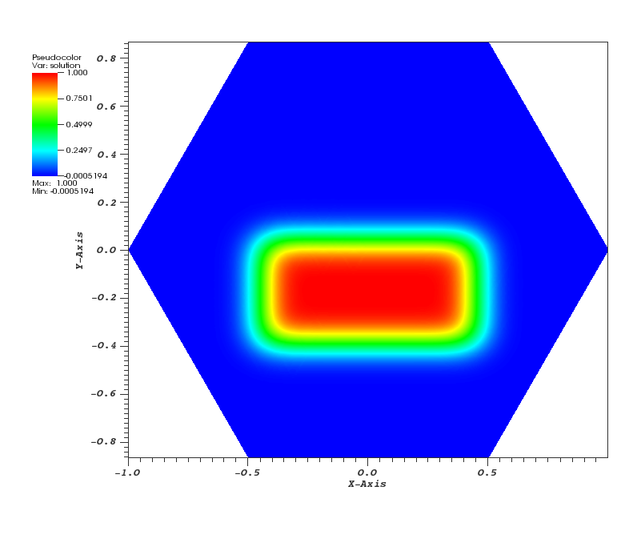

## At a Glance

|Questions|Objectives|Key Points|
|How does the choice of<br>explicit vs. implicit impact step size.|Compare performance of explicit<br>and implicit methods at step<br>sizes near the stability limit.|Time integration considerations<br>play a role in time to solution.|
|What is the impact of an<br>adaptive time integrator?|Compare fixed and adaptive time<br>integrator techniques.|The PETSc package has robust<br>and flexible methods for time integration.|
|How does time integration<br>order impact cost?|Observe impact of order<br>on time to solution/flop<br>and number of steps.|In well-designed packages, changing<br>between methods does not require a lot of effort.|
|Observe quadratic convergence <br> of Newton's method| Observe mesh independent convergence <br> of Newton's method |||

**Note:** To begin this lesson...

```
cd {{site.handson_root}}/time_integrators/petsc
```

## The problem being solved

The example application here, [advection-ode.cpp][3] uses
a discontinuous Galerkin discretization from [MFEM][2] and the ODE solvers from [PETSc][1]
to demonstrate the use of [PETSc][1] in both serial and parallel for more robust and flexible control
over _time integration_ (e.g. discretization in time) of PDEs.

The first application has been designed to solve  the
[_Advection Equation_](https://en.wikipedia.org/wiki/Heat_equation) in 1, 2 or
3 dimensions as well as to work in a scalable, parallel way.

$$\frac{\partial u}{\partial t} + \vec{v} \cdot \nabla u = 0$$

where $$v$$ is a given fluid velocity and $$u(t=0,x)=u_0(x)$$ is a given initial condition.

Here, all the runs solve a problem on a periodic, hexagonally bounded mesh with an initial
rounded step function of amplitude 1.0 slightly off-center as pictured in Figure 1.

|Figure 1|Figure 2|Figure 3|
|:---:|:---:|:---:|
|[](advection-ode-initial.png)|[](advection-ode-2.5D.png)|[](advection-ode-animation.gif)|


### Getting Help

You can get help on all the command-line options to this application like so...

```
./advection-ode  --help

Usage: ./advection-ode [options] ...
Options:
   -h, --help
	Print this help message and exit.
   -m <string>, --mesh <string>, current value: ../../../data/periodic-hexagon.mesh
	Mesh file to use.
   -p <int>, --problem <int>, current value: 0
	Problem setup to use. See options in velocity_function().
   -rs <int>, --refine-serial <int>, current value: 2
	Number of times to refine the mesh uniformly in serial.
   -rp <int>, --refine-parallel <int>, current value: 0
	Number of times to refine the mesh uniformly in parallel.
   -o <int>, --order <int>, current value: 3
	Order (degree) of the finite elements.
   -s <int>, --ode-solver <int>, current value: 4
	ODE solver: 1 - Forward Euler,
	            2 - RK2 SSP, 3 - RK3 SSP, 4 - RK4, 6 - RK6.
   -tf <double>, --t-final <double>, current value: 10
	Final time; start time is 0.
   -dt <double>, --time-step <double>, current value: 0.01
	Time step.
   -vis, --visualization, -no-vis, --no-visualization, current option: --visualization
	Enable or disable GLVis visualization.
   -visit, --visit-datafiles, -no-visit, --no-visit-datafiles, current option: --visit-datafiles
	Save data files for VisIt (visit.llnl.gov) visualization.
   -vs <int>, --visualization-steps <int>, current value: 50
	Visualize every n-th timestep.
   -usestep, --usestep, -no-step, --no-step, current option: --usestep
	Use the Step() or Run() method to solve the ODE system.
   -implicit, --implicit, -no-implicit, --no-implicit, current option: --no-implicit
	Use or not an implicit method in PETSc to solve the ODE system.
```

### Run 1: Explicit Method Default Options

```
PETSC_OPTIONS="-ts_view -ts_adapt_monitor no" ./advection-ode -no-vis
```


---

The L2 error at the final timestep is printed for each run below.

### Run 2: Explicit, with Euler and fixed timestep $$\Delta t$$ of 0.001

```
PETSC_OPTIONS="-ts_view -ts_monitor :/dev/null -ts_type euler -ts_dt .001" ./advection-ode -no-vis
```


---

### Run 3: Explicit, with Euler and fixed timestep $$\Delta t$$ of .01

```
PETSC_OPTIONS="-ts_view -ts_adapt_monitor no  -ts_type euler -ts_dt .01" ./advection-ode -no-vis
```






### Run 4: Implicit, Fixed $$\Delta t$$ at 0.01

Now, lets switch to an _implicit_ method and see how that effects behavior of the numerical algorithms.

```
PETSC_OPTIONS="-ts_view -ts_adapt_monitor no -ts_dt .01" ./advection-ode -implicit -no-vis
```

### Run 5: Implicit, Fixed $$\Delta t$$ at 0.1

Now, use a very large time-step and note the scheme remains stable.

```
PETSC_OPTIONS="-ts_view -ts_adapt_monitor no  -ts_dt .1 -log_view :/dev/null" ./advection-ode -implicit -no-vis
```


---

### Run 6: Implicit, Adaptive $$\Delta t$$, Tolerances 1e-4, 4th Order

In this run, we'll combine **both** the advantages of an _implicit_ algorithm and an _adaptive_ time step.

```
PETSC_OPTIONS="-ts_view -ts_adapt_monitor no  -ts_type arkimex  -ts_dt .1 -log_view :/dev/null" ./advection-ode -implicit -no-vis
```


---

### Run 7: View a summary of the operations for Implicit, Adaptive $$\Delta t$$, Tolerances 1e-4, 4th Order

The `-log_view` option

```
PETSC_OPTIONS="-ts_view -ts_adapt_monitor no -ts_type arkimex -ts_dt .1 -log_view " ./advection-ode -implicit -no-vis
```

## The problem being solved

The example application here, [elasticity-snes.cpp][4] uses MFEM and the ODE solvers from PETSc to solve a time-dependent nonlinear elasticity problem.


### Run 8: Quadratic convergence of Newton's method


```
make elasticity-snes
./elasticity-snes
```
### Run 9: Mesh independent convergence of Newton's method

```
./elasticity-snes -rs 2
./elasticity-snes -rs 4
```

## Out-Brief

We have used MFEM and PETSc as a demonstration vehicle for illustrating the value in robust,
time integration methods in numerical algorithms. In particular, we have used
the [PETSc][1] integrators to compare and contrast both the effects of _adaptive_ time
stepping as well as the role the order of the time integration plays in time to
solution and number of time steps in the adaptive case.  In addition, we have
demonstrated the ability of implicit methods to run at higher time steps than
explicit and also demonstrated the cost of nonlinear solvers in implicit approaches.

The use of _adaptation_ here was confined to _discretization_ of time. Other lessons
here demonstrate the advantages _adaptation_ can play in the _discretization_ of
_space_ (e.g. meshing).


Finally, it is worth reminding the learner that the application demonstrated here can
be run on 1, 2 and 3 dimensional meshes and in scalable, parallel settings and on meshes
of extremely high spatial resolution if so desired.

----

## Evening Hands On Session

Run the two examples with a different number of levels of refinement using `-rs n` and the `-log_view` option introduced above to explore the scalability of the algorithms. For example

```
PETSC_OPTIONS="-ts_adapt_monitor no -ts_type arkimex -ts_monitor :/dev/null -log_view " ./elasticity-snes -rs 2 -no-vis
```

then again

```
PETSC_OPTIONS="-ts_adapt_monitor no -ts_type arkimex -ts_monitor :/dev/null -log_view " mpiexec -n 4 ./elasticity-snes -rs 2 -no-vis
```

Try other combinations of levels of refinement and number of processes. Produce a small
_scaling_ plot showing scaling of algorithms from say 1..32 mpi ranks.

When you are done, be sure to submit a [Show Your Work](https://goo.gl/forms/B7UFpBvEOJbC58oJ2)
 using the hands-on activity name _Time Integrators Scalability_ and upload evidence of your completed solutions.

### Further Reading

[PETSc Manual](http://www.mcs.anl.gov/petsc/petsc-current/docs/manual.pdf)

[Publications](http://www.mcs.anl.gov/petsc/publications/index.html)

[1]: http://www.mcs.anl.gov/petsc
[2]: http://mfem.org
[3]: https://github.com/mfem/mfem/blob/atpesc-dev/examples/atpesc/petsc/advection-ode.cpp
[4]: https://github.com/mfem/mfem/blob/atpesc-dev/examples/atpesc/petsc/elasticity-snes.cpp
