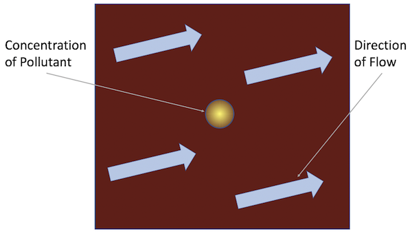

## At a glance

|Questions|Objectives|Key Points|
|How do explicit, implicit or IMEX <br>methods impact step size?|Compare methods at step sizes <br>near the stability limit.|Choose time integration method <br>to match the problem.|
|What is the impact of an <br>*adaptive* technique?|Compare fixed and adaptive techniques.|Adaptive techniques can be robust <br>reliable and reduce computational cost.|
|How does integration *order* <br>impact cost?|Observe impact of order on time <br>to solution and number of steps.|Changing integration order is simple <br>allowing optimization for a given problem.|
|What is the role and benefit of <br>preconditioning?|Compare integration methods with <br>and without preconditioning.|Preconditioning is critical for scalability.|

**Note:** To begin this lesson...

```bash
cd {{site.handson_root}}/time_integrators/sundials
source source_cooley_plotfile_tools.sh
```
(note: you should be able to recompile these executables with a simple
`make`)

Also, if you do not already have the `anaconda3-4.0.0` SoftEnv module
loaded, please do so now,
```bash
soft add +anaconda3-4.0.0
```

## The problem being solved

In this problem, we model the transport of a pollutant that
has been released into a flow in a two dimensional domain.
We want to determine both where the pollutant goes, and when it
has diffused sufficiently to be of no further harm.

[](sundials/sundials_amrex_setup.png)

This is an example of a scalar-valued advection-diffusion problem for
chemical transport. The governing equation is:

$$\frac{\partial u}{\partial t} + \vec{a} \cdot \nabla u -  \nabla \cdot ( D \nabla u ) = 0$$

where $$u = u(t,x,y)$$ is the chemical concentration, $$\vec{a}$$ is
the advection vector, $$D$$ is a diagonal matrix containing
anisotropic diffusion coefficients, and $$u(0,x,y)=u_0(x,y)$$ is a
given initial condition.  The spatial domain is $$(x,y) \in
[-1,1]^2$$, and the time domain is $$t \in (0,10^4]$$.

## The Application Models
The example applications here ([HandsOn1.cpp][3], [HandsOn2.cpp][4]
and [HandsOn3.cpp][5]) use a finite volume spatial discretization with
[AMReX][2] and the ODE solvers from [SUNDIALS][1], specifically
SUNDIALS' [ARKODE][0] package for one-step time integration methods, to
demonstrate the use of [SUNDIALS][1] in both serial and parallel for
more robust and flexible control over _time integration_
(e.g., discretization in time) of PDEs.

All the runs solve a problem on a periodic, cell-centered,
uniform mesh with an initial Gaussian bump:

$$u_0(x,y) = \frac{10}{\sqrt{2\pi}} e^{-50(x^2+y^2)}$$

Snapshots of the solution for advection [flow] vector
$$\vec{a}=\left[ 0.0005,\, 0.00025\right]$$,
and diffusion coefficient matrix
$$D = \operatorname{diag}\left(\, \left[10^{-6},\, 10^{-6}\right]\,\right)$$
at the times $$t = \left\{0, 1000, 2000, 3000\right\}$$ are shown in Figures 1-4 below:

|Figure 1|Figure 2|Figure 3|Figure 4|
|:---:|:---:|:---:|:---:|
|[](sundials/advection-diffusion-u0.png)|[](sundials/advection-diffusion-u1000.png)|[](sundials/advection-diffusion-u2000.png)|[](sundials/advection-diffusion-u3000.png)|

We will break apart our investigation of this problem into the following three phases:

1. Explicit time integration (`HandsOn1.exe`)

2. Implicit / IMEX time integration (`HandsOn2.exe`)

3. Preconditioning (`HandsOn3.exe`)


### Getting help

You can get help on all the command-line options to these applications
with the `help=1` argument for any of these executables, e.g.,

```
./HandsOn1.exe help=1
MPI initialized with 1 MPI processes
AMReX (19.07) initialized

Usage: HandsOn1.exe [fname] [options]
Options:
  help=1
    Print this help message and exit.
  plot_int=<int>
    enable (1) or disable (0) plots [default=0].
  arkode_order=<int>
    ARKStep method order [default=4].
  fixed_dt=<float>
    use a fixed time step size (if value > 0.0) [default=-1.0].
  rtol=<float>
    relative tolerance for time step adaptivity [default=1e-4].
  atol=<float>
    absolute tolerance for time step adaptivity [default=1e-9].
  tfinal=<float>
    final integration time [default=1e4].
  dtout=<float>
    time between outputs [default=tfinal].
  max_steps=<int>
    maximum number of internal steps between outputs [default=10000].
  write_diag=<int>
    output ARKStep time step adaptivity diagnostics to a file [default=1].
  n_cell=<int>
    number of cells on each side of the square domain [default=128].
  max_grid_size=<int>
    max size of boxes in box array [default=64].
  advCoeffx=<float>
    advection speed in the x-direction [default=5e-4].
  advCoeffy=<float>
    advection speed in the y-direction [default=2.5e-4].
  diffCoeffx=<float>
    diffusion coefficient in the x-direction [default=1e-6].
  diffCoeffy=<float>
    diffusion coefficient in the y-direction [default=1e-6].

If a file name 'fname' is provided, it will be parsed for each of the above
options.  If an option is specified in both the input file and on the
command line, then the command line option takes precedence.
```


### Cleaning up

At any time, you can remove all of the solution output files and ARKODE
temporal adaptivity diagnostics files with the command
```
make pltclean
```

----

## Hands-on lesson 1 -- Explicit time integration (`HandsOn1.exe`)

This lesson will explore the following topics:

a. Problem specification -- vector wrapper and right-hand side
   functions

b. Fixed time-stepping (exploration of linear stability)

c. Adaptive time-stepping

d. Time integrator order of accuracy


### Problem specification

There are essentially only three steps required to use SUNDIALS with
an existing simulation code:

1. Create a thin `N_Vector` wrapper for your existing data structures,
   so that SUNDIALS can think of them as "vectors," and perform
   standard algebraic operations directly on your data:

   * clone a vector to create work arrays

   * linear combination: $$\vec{z} \gets a\vec{x} + b\vec{y}$$

   * fill with constant: $$z_i \gets c, \; i=0,\ldots,N-1$$

   * componentwise multiplication: $$\vec{z} \gets \vec{x} .* \vec{y}$$

   * vector scale: $$\vec{z} \gets c \vec{x}$$

   * norm and inner-product computations: $$\|\vec{x}\|_\infty$$,
     $$\left<\vec{x},\vec{y}\right>$$, etc.

   * ...

   An example of this for the native AMReX `MultiFab` data structure
   may be found in the files [shared/NVector_Multifab.h][6] and
   [shared/NVector_Multifab.cpp][7].

2. Create a function that computes the problem-defining ODE right-hand
   side function on your `N_Vector` data (or for KINSOL, the
   problem-defining nonlinear residual function).  Here, we implement the
   advection-diffusion right-hand side function,

   $$f(t,u) = -\vec{a} \cdot \nabla u + \nabla \cdot ( D \nabla u )$$

   in
   ```C
   int ComputeRhsAdvDiff(Real t, N_Vector nv_sol, N_Vector nv_rhs, void* data)
   ```
   found in the file [shared/Utilities.cpp][8].

3. Use SUNDIALS to integrate your ODE/DAE or solve your nonlinear
   system:

   1. Instantiate and fill an `N_Vector` for your initial conditions,
      $$u_0(x,y)$$ or your initial guess to the nonlinear solve.  In
      our example this is done [here][9].

   2. Create the time integrator memory structure, providing both the
      initial condition vector $$u_0(x,y)$$ and the problem-defining
      function $$f(t,u)$$. In our example, these are done [here][10].

   3. Call the SUNDIALS solver to evolve the problem over a series of
      time sub-intervals, or to solve the nonlinear problem.  Our
      example does this in a loop [here][11].


### Linear stability

Run the first hands-on code using its default parameters (note that
this uses a mesh size of $$128^2$$ and fixed time step size of 5.0),
```bash
./HandsOn1.exe inputs-1
```
and compare the final result against a stored reference solution (on a
$$128^2$$ grid),
```bash
fcompare.gnu.ex plt00001/ reference_solution/
```
Notice that the computed solution error is rather small (since the
solution has magnitude $$\mathcal{O}(1)$$, errors should be less than
0.1).

Now re-run this hands-on code using a larger time step size of 100.0,
```bash
./HandsOn1.exe inputs-1 fixed_dt=100.0
```
_see how much faster the code ran!_  However, now check the accuracy
of the computed solution,
```bash
fcompare.gnu.ex plt00001/ reference_solution/
```
and note the reported error of $$10^{98}$$.



Run the code a few more times -- what is the largest stable time step
size that you can find?


### Temporal adaptivity

With this executable, we may switch to adaptive time-stepping (with
the default tolerances, $$rtol=10^{-4}$$ and $$atol=10^{-9}$$) by
specifying `fixed_dt=0`,
```bash
./HandsOn1.exe inputs-1 fixed_dt=0
fcompare.gnu.ex plt00001/ reference_solution/
```
_note how rapidly the executable finishes, providing a solution that
is both stable and accurate to within the specified tolerances!_

Run the accompanying Python script `process_ARKStep_diags.py` to view
some overall time adaptivity statistics and generate plots of the time
step size history,
```bash
./process_ARKStep_diags.py HandsOn1_diagnostics.txt
display h_vs_iter.png
```
_notice how rapidly the adaptive time-stepper finds the CFL stability
limit_.  Also notice that the adaptivity algorithm periodically
attempts to increase the time step size to investigate whether this
stability limit has changed; however, the raw percentage of these
failed steps remains rather small.

Run the code a few more times with various values of `rtol` -- how
well does the adaptivity algorithm produce solutions within the
desired tolerances?  How do the number of time steps change as
different tolerances are requested?


### Integrator order and efficiency

ARKODE defaults to a fourth-order accurate Runge--Kutta method,
but many others are included (explicit methods have available orders 2
through 8).  Alternate orders of accuracy may be run with the
`arkode_order` option, e.g.,
```bash
./HandsOn1.exe inputs-1 fixed_dt=0 arkode_order=8
fcompare.gnu.ex plt00001/ reference_solution/
```
_note the dramatic decrease in overall time steps (457 vs 258), but
the accompanying increase in total RHS evaluations (2865 vs 3773)._
Although higher-order methods may indeed utilize larger step sizes
(both for accuracy and frequently stability), those come at
the cost of increased work per step.

Run the code a few more times with various values of `arkode_order`
for a fixed value of `rtol` -- what is the most "efficient" overall
method for this problem at this tolerance?


----

## Hands-on lesson 2 -- Implicit / IMEX time integration (`HandsOn2.exe`)

This lesson will explore the following topics:

a. Specification of algebraic solver algorithms (nonlinear and linear)

b. Fixed time-stepping (exploration of linear stability)

c. Adaptive time-stepping

d. Implicit-explicit partitioning


### Specification of algebraic solvers

Once your code is set up to run an explicit method, it is not
difficult to switch to an implicit or IMEX solver.  All of the
relevant changes for this in our examples today are in the file
[HandsOn2.cpp][4], and are indicated by the comment
`***** UPDATED FROM HandsOn1 *****`. The main steps are:

1. Move specification of the ODE right-hand side function to the
   *implicit* argument when creating the integrator, or supply
   separate routines that should be used for the IMEX splitting of the
   ODE right-hand side.

   This is done [here][12] in our example, where we either supply
   `ComputeRhsAdvDiff()` for *fully implicit* integration, or
   specifies two routines `ComputeRhsAdv()` and `ComputeRhsDiff()` for
   an IMEX splitting of the ODE right-hand side.

2. To use the default Newton nonlinear solver, you must specify which
   linear solver module should be used to solve the inner linear
   systems of equations.

   In our example, we create and attach an un-preconditioned GMRES
   iterative linear solver for this purpose [here][13].

3. Alternately, you may select an alternate nonlinear solver module to
   use instead of Newton.

   In our example, if requested we attach an accelerated fixed-point
   nonlinear solver (with no inner linear solver needed) [here][14].


### Linear stability revisited

Run the second hands-on code using its default parameters (note that
this also uses a mesh size of $$128^2$$ and fixed time step size of 5.0),
```bash
./HandsOn2.exe inputs-2
fcompare.gnu.ex plt00001/ reference_solution/
```
_note that this takes significantly longer than `HandsOn1.exe` with
the same time step size_

Now re-run using the larger time step size of 100.0,
```bash
./HandsOn2.exe inputs-2 fixed_dt=100.0
fcompare.gnu.ex plt00001/ reference_solution/
```
_again this version runs much more quickly, but now the results are usable!_



Run the code a few more times with larger time step sizes, checking
the overall solution error each time -- can you find an unstable step
size?  Are there step sizes where the code may be stable, but are
so large that the nonlinear and/or linear solver fails to converge?


### Temporal adaptivity revisited

As with the previous hands-on exercise, we may switch to adaptive
time-stepping (with the default tolerances, $$rtol=10^{-4}$$ and
$$atol=10^{-9}$$) by specifying `fixed_dt=0`,
```bash
./HandsOn2.exe inputs-2 fixed_dt=0
```
Compute the solution error, and determine the adaptive time-stepping
statistics as before,
```bash
fcompare.gnu.ex plt00001/ reference_solution/
./process_ARKStep_diags.py HandsOn2_diagnostics.txt
display h_vs_iter.png
```
How does that average step size for this tolerance compare against the
average step size of `HandsOn1.exe` for the same tolerances?



Run the code a few more times with various values of `rtol` -- how
well does the adaptivity algorithm produce solutions within the
desired tolerances?  How do the number of time steps change as
different tolerances are requested?  Is this algorithm more useful
than the fully explicit approach when loose tolerances (e.g.,
`rtol=1e-1`) are requested?


### IMEX partitioning

By default, `HandsOn2.exe` uses a fully implicit formulation of the
problem.  However, this can instead be run with the advection terms
$$\vec{a} \cdot \nabla u$$ treated explicitly by specifying
`rhs_adv=2`,
```bash
./HandsOn2.exe inputs-2 rhs_adv=2
fcompare.gnu.ex plt00001/ reference_solution/
```
For comparison, re-run an identical test but with fully-implicit
treatment,
```bash
./HandsOn2.exe inputs-2
fcompare.gnu.ex plt00001/ reference_solution/
```
Do you notice any efficiency or accuracy differences between fully
implicit and IMEX formulations with these fixed time-step tests?



Now that we again have an explicit portion of the problem, we should
expect the time step size to be CFL-limited.  Run the IMEX version a few times
with various fixed time step sizes (the `fixed_dt` argument), checking
the overall solution error each time -- can you find an unstable step size?




----

## Hands-on lesson 3 -- Preconditioning (`HandsOn3.exe`)

This lesson will explore the following topics:

a. Preconditioner specification

b. Performance for IMEX time integrators

c. Performance for fully implicit time integrators


The file `HandsOn3.cpp` is nearly identical to the previous versions
(with relevant changes indicated by the comment `***** UPDATED FROM
HandsOn2 *****`).  We note, however, that it's default parameters
differ slightly from the previous versions:

* it defaults to adaptive time-stepping (with the same default
  tolerances)

* it defaults to IMEX mode, with advection treated explicitly

* it defaults to using the preconditioner (discussed below).


### Preconditioner specification

Perhaps the most challenging (and most critical) component for a
scalable implicit or IMEX time integrator is the creation of an
effective, efficient, and scalable preconditioner to accelerate the
iterative linear solvers (more on this by the next speakers).  This
requires three steps:

1. Create preconditioner "setup" and "solve" routines that prepare any
   data structures necessary to perform preconditioning (called
   infrequently) and apply the preconditioner (called frequently),
   respectively.

   Here, we create the routines [precondition_setup][15] and
   [preconditioner_solve][16], that employ a scalable geometric
   multigrid solver for only the diffusion portion of the problem,
   $$\nabla \cdot ( D \nabla u )$$.  This should be a perfect
   preconditioner when running in IMEX mode, but will only be
   approximate when running a fully implicit formulation of the
   problem.

2. Supply the preconditioning routines to the integrator.

   In our example, when creating the GMRES linear solver, we notify it
   to use left preconditioning [here][17].  We then attach the
   `precondition_setup` and `precondition_solve` routines to the
   integrator [here][18].


### Performance with IMEX integration

Run `HandsOn3.exe` using the default parameters,
```bash
./HandsOn3.exe inputs-3
```
and again with preconditioning disabled,
```bash
./HandsOn3.exe inputs-3 use_preconditioner=0
```
_note that the preconditioned version takes longer to run on this
coarse problem, but shows significant improvements in the overall
number of linear solver iterations._

{% include qanda
    question='Given that the above test resulted in a _slower_ code
    when using preconditioning, then why is preconditioning used in
    large-scale simulation?'
    answer='We only ran this code on a very coarse problem, where the
    un-preconditioned GMRES solver proved "sufficient" for solving the
    Newton linear systems; however at larger scales the linear system
    becomes "ill-conditioned," requiring a preconditioner for
    convergence.  Related -- the preconditioned solver should be
    algorithmically scalable, so at some point we should expect the
    preconditioned version to out-perform the unpreconditioned
    version.' %}


### Performance with fully implicit integration

Re-run `HandsOn3.exe` using a fully-implicit problem formulation,
```bash
./HandsOn3.exe inputs-3 rhs_adv=1
```
Recall that this preconditioner only 'preconditions' the diffusion
portion of the problem, so when run in a fully-implicit manner the
implicit advection terms are left un-preconditioned.  Is this
discrepancy noticeable when comparing the solver statistics (number of
time steps, total linear iterations, etc.)?

In the evening hands-on session (below), you can explore the
scalability and efficiency of both the un-preconditioned and
preconditioned versions of this hands-on lesson.


----

## Out-brief

We have used AMReX and SUNDIALS as a demonstration vehicle for
illustrating the value of robust time integration methods in numerical
algorithms. In particular, we have used the ARKODE's `ARKStep` time
integration module from [SUNDIALS][1] to explore a range of questions
related to time integration and nonlinear solvers:

1. the benefits of _adaptive_ (vs _fixed_) time stepping for both
   performance and robustness of a simulation code,

2. the effects of the order of the time integration method on method
   efficiency,

3. the increased cost but increased scalability offered through use of
   advanced preconditioning methods, and

4. the choice of IMEX partitioning in time discretization.

We note that our use of _adaptivity_ here was confined to the
_time discretization_ only. Other lessons here demonstrate the
advantages of spatial adaptation as well (e.g., AMR).

We further note that we have barely scratched the surface of linear
solver algorithms; while GMRES with geometric multigrid
preconditioning remains a top choice of many large-scale applications,
other lessons here will focus on alternatives that can work for much
broader classes of problems.

Finally, we note that the application demonstrated here can be run on
much larger spatial meshes and parallel architectures than those
tested here.

----

## Evening hands-on session

Each of the following tasks are independent of one another.  Choose
one to explore in detail during this evening session (or if
interested, you may do multiple).

1. (10 points) Examine the explicit stability boundary for
   `HandsOn1.exe` as the mesh size `n_cell` is changed to 256 and 512.
   Do the same for `HandsOn2.exe` when running in IMEX mode (with
   explicit advection).  Determine whether the stability boundaries
   for these problems are $$\Delta t_n \propto \Delta x$$ or
   $$\Delta t_n \propto \Delta x^2$$.

2. (5 points) Explore the weak scalability of `HandsOn3.exe` both with
   and without preconditioning.  Here, use from 1 to 36 MPI tasks,
   with a base grid of $$128^2$$ per MPI task, and retain the default
   temporal adaptivity.  The choice of IMEX vs fully implicit is
   yours.  It is recommended that you use the batch queue instead of
   running interactively. Produce a weak scaling plot with these
   results.

3. (10 points) Add a simple 'reaction' term to the problem, e.g.

   $$\frac{\partial u}{\partial t} + \vec{a} \cdot \nabla u -  \nabla \cdot ( D \nabla u ) = -u^2$$

   You may add this to either the explicit or implicit portions of the
   right-hand side; how well does the existing preconditioner do after
   this is added?

When you are done, be sure to submit a [Show Your Work](https://goo.gl/forms/B7UFpBvEOJbC58oJ2)
using the hands-on activity name _Time Integrators_ and upload
evidence of your completed solutions.


### Further reading

[ARKODE Manual -- PDF](https://computation.llnl.gov/sites/default/files/public/ark_guide.pdf)

[ARKODE Manual -- HTML](http://runge.math.smu.edu/arkode_dev/doc/guide/build/html/index.html)

[0]: http://faculty.smu.edu/reynolds/ARKODE
[1]: https://computation.llnl.gov/projects/sundials
[2]: https://amrex-codes.github.io/amrex
[3]: https://github.com/AMReX-Codes/ATPESC-codes/blob/master/SUNDIALS%2BAMReX/HandsOn1.cpp
[4]: https://github.com/AMReX-Codes/ATPESC-codes/blob/master/SUNDIALS%2BAMReX/HandsOn2.cpp
[5]: https://github.com/AMReX-Codes/ATPESC-codes/blob/master/SUNDIALS%2BAMReX/HandsOn3.cpp
[6]: https://github.com/AMReX-Codes/ATPESC-codes/blob/master/SUNDIALS%2BAMReX/shared/NVector_Multifab.h#L34
[7]: https://github.com/AMReX-Codes/ATPESC-codes/blob/master/SUNDIALS%2BAMReX/shared/NVector_Multifab.cpp
[8]: https://github.com/AMReX-Codes/ATPESC-codes/blob/master/SUNDIALS%2BAMReX/shared/Utilities.cpp#L147
[9]: https://github.com/AMReX-Codes/ATPESC-codes/blob/master/SUNDIALS%2BAMReX/HandsOn1.cpp#L350
[10]: https://github.com/AMReX-Codes/ATPESC-codes/blob/master/SUNDIALS%2BAMReX/HandsOn1.cpp#L66
[11]: https://github.com/AMReX-Codes/ATPESC-codes/blob/master/SUNDIALS%2BAMReX/HandsOn1.cpp#L97
[12]: https://github.com/AMReX-Codes/ATPESC-codes/blob/master/SUNDIALS%2BAMReX/HandsOn2.cpp#L76
[13]: https://github.com/AMReX-Codes/ATPESC-codes/blob/master/SUNDIALS%2BAMReX/HandsOn2.cpp#L110
[14]: https://github.com/AMReX-Codes/ATPESC-codes/blob/master/SUNDIALS%2BAMReX/HandsOn2.cpp#L118
[15]: https://github.com/AMReX-Codes/ATPESC-codes/blob/master/SUNDIALS%2BAMReX/shared/Utilities.cpp#L322
[16]: https://github.com/AMReX-Codes/ATPESC-codes/blob/master/SUNDIALS%2BAMReX/shared/Utilities.cpp#L329
[17]: https://github.com/AMReX-Codes/ATPESC-codes/blob/master/SUNDIALS%2BAMReX/HandsOn3.cpp#L117
[18]: https://github.com/AMReX-Codes/ATPESC-codes/blob/master/SUNDIALS%2BAMReX/HandsOn3.cpp#L129
